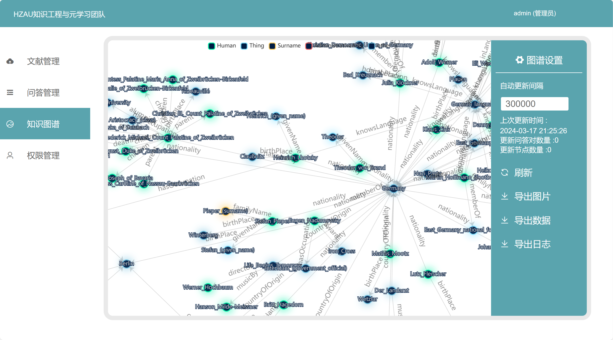
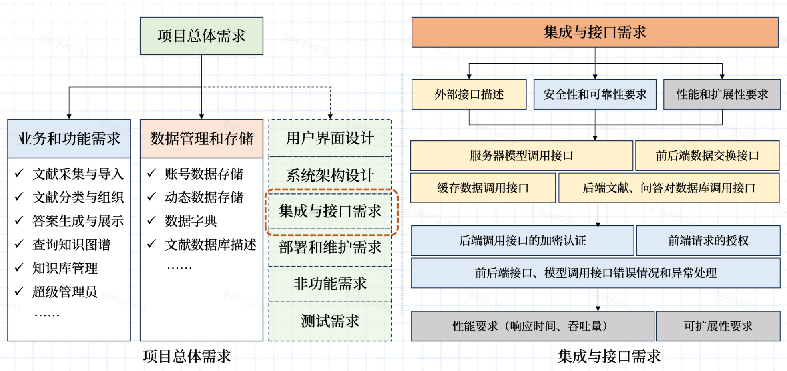
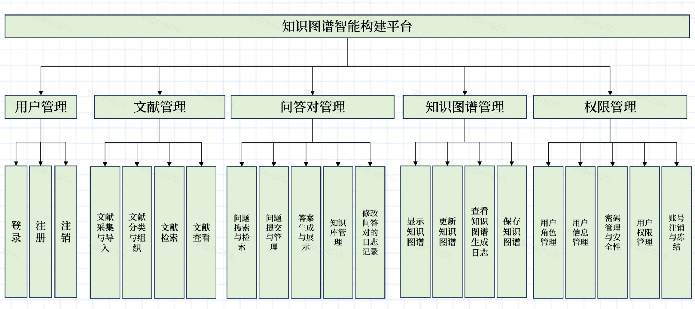
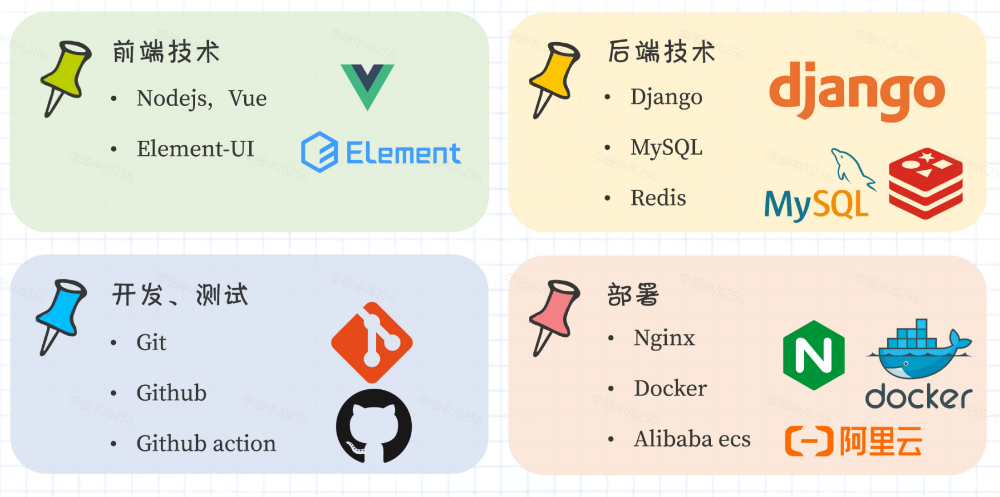
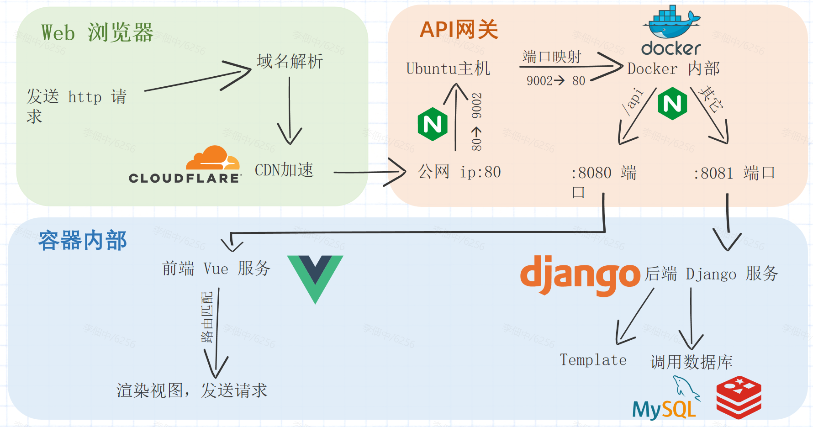

# 知识图谱智能构建系统

## 项目简介

本项目名为《知识图谱智能构建系统》,项目目标为通过搭建知识图谱智能更新平台，实现文本知识的自动抽取、整合和更新，提高知识图谱的准确性、完整性和实用性，提高学术研究的效率和准确性。

<!-- 

  
   

 -->

## 项目特点
依托知识图谱三元组抽取模型核心技术，结合大量数据源，构建一个庞大且全面的知识图谱网络，同时提供了一个清晰易用的操作平台，相比于当下的知识检索技术(百度、ChatGPT)有着自身的优势。

## 项目需求设计

## 项目技术架构

## 项目技术栈

## 部署架构

---

## 相关资源

**项目 Github 地址：[点此跳转](https://github.com/lidianzhong/KnowledgeGraph)**

**项目 API 文档：[点此跳转](https://apifox.com/apidoc/shared-fa0f1f57-5099-40f3-8a64-79c83fce82f6)**

**项目文档地址：[点此跳转](http://kg.hzau.top/)**