# 软件详细设计说明书

版本变更历史

| 版本 | 提交日期   | 主要编制人 | 审核人 | 版本说明                                                                   |
| ---- | ---------- | ---------- | ------ | -------------------------------------------------------------------------- |
| 1.0  | 2024.04.25 | 刘佳乐     | 李佃中 | 初始版本，包括了系统的基本架构和功能设计。                                 |
| 2.0  | 2024.04.26 | 刘佳乐     | 张黄钰 | 修复了一些初版中发现的缺陷和漏洞，增加了对用户界面的改进。                 |
| 3.0  | 2024.04.29 | 刘佳乐     | 袁笑   | 引入了新的功能模块，包括了用户身份验证和权限管理系统。                     |
| 4.0  | 2024.05.06 | 刘佳乐     | 李解放 | 优化了系统性能，修复了已知的安全漏洞，                                     |
| 5.0  | 2024.05.09 | 刘佳乐     | 李佃中 | 增加了对第三方集成的支持，修复了用户反馈的一些问题，并进行了一些界面美化。 |

# 1 引言

## 1.1 编写目的

说明编写这份详细设计说明书的目的，指出预期的读者。

本报告的目的是对本小组项目进行详细设计说明，以便用户及项目开发人员了解产品详细的设计与实现。为开发人员提供开发参考书。以下叙述将结合文字描述、图表等来描述本项目的详细设计和相关的模块描述。

本报告的预期读者有客户、项目经理、开发人员以及跟该项目相关的其他竞争人员。

## 项目背景

说明待开发软件系统的名称；

本项目的任务提出者、开发者、用户和运行该程序系统的计算中心。

随着信息时代的不断发展，人们对于获取最新、最准确的知识需求日益增加。然而，传统的信息检索系统往往存在着更新速度慢、准确度不高等问题，无法满足用户对于快速获取最新知识的迫切需求。为了解决这一难题，我们项目小组决定开发一款名为“知识图谱智能构建平台”的智能更新系统。

本系统旨在为用户提供一个高效、准确并且时刻更新的信息检索平台。通过构建和维护一个完善的知识图谱，系统将能够以更加智能的方式对信息进行组织、检索和更新，从而极大地改善当前信息检索系统的短板。与传统的基于关键词检索的系统相比，知识图谱系统能够更好地理解用户查询的意图，提供更加精准的搜索结果。

该系统的研发和应用将在多个方面产生积极影响。首先，它将推动知识的传播和共享，促进不同领域间的交叉融合和跨界合作，为社会的进步和发展提供有力支持。其次，通过提供时刻更新的信息检索服务，该系统将帮助用户及时获取最新的科研成果、行业动态等信息，为个人学习、工作和创新提供重要支持。

## 定义

> 列出本文件中用到专门术语的定义和外文首字母组词的原词组。

1\. E-R 图：Entity Relationship Diagram，提供了表示实体类型、属性和联系的方法，用来描述现实世界的概念模型。

2.UML 图：Unified Modeling Language，UML 是在开发阶段，说明、可视化、构建和书写一个面向对象软件密集系统的制品的开放方法。

## 1.4 参考资料

列出相关的参考资料，如本项目的经核准的计划任务书或合同、上级机关的批文；

属于本项目的其他已发表的文件；

本文件中各处引用的文件、资料、包括所要用到的软件开发标准。

列出这些文件资料的标题、文件编号、发表日期和出版单位，说明能够得到这些文件资料的来源。

1.窦万峰.软件工程方法与实践(第三版).北京：机械工业出版社，2016.

2.窦万峰，蒋锁良，杨俊 . 软件工程实验教程（第三版）. 北京：机械工业出版社，2016.

3.保罗 C.乔根森 . 软件测试（第四版）. 北京：机械工业出版社，2017.

4.陈定甲,淳鑫.基于 Vue 技术的通用知识图谱问答系统设计与实现\[J\].装备制造技术,2022,No.331(07):97-99.

# 2 总体设计

## 2.1 需求概述

**文献管理系统：**

1.  文献采集与导入：创建在线数据库，提供导入功能将文献信息整合到系统中。

2.  文献分类与组织：提供对文献进行分类、标签化或者建立文件夹等组织方式，以便用户可以根据需求进行管理和查找。（个人文献库和公共文献库）

3.  文献检索：具备强大的检索功能，使用户能够快速准确地找到需要的文献，支持关键词搜索。

4.  文献查看：提供文献阅读功能，允许用户在系统内直接阅读文献。

**账号管理系统：**

1.  用户注册、登录、退出与注销账号：允许用户进行注册账号，并提供登录功能，以便用户能够访问系统的各项功能。

2.  普通管理员登录、退出与注销账号。

3.  超级管理员登录与退出账号。

**权限管理系统：**

1\. 用户角色管理：超级管理员具有最高权限，可以创建、编辑和删除管理员账号， 管理员具有管理普通用户的权限，普通用户则只能访问系统提供的基本功能。

2.  用户信息管理：超级管理员和管理员可以查看和编辑用户的基本信息，如用户名、密码、邮箱等，以及用户的权限设置。

3.  密码管理与安全性：提供密码管理功能，包括密码修改、找回密码等，保障用户账号的安全性。

&nbsp;

4.  用户权限管理：超级管理员和管理员可以设置不同用户的权限，包括访问权限、操作权限等，以确保用户能够按照其角色的要求合理地使用系统。

5.  账号注销与冻结：超级管理员和管理员可以对用户账号进行注销或冻结操作，以应对违规行为或其他特殊情况。

**问答管理系统：**

1.  问题提交与管理：允许用户提交问题，并提供管理界面用于管理问题，包括发布、编辑、删除等操作。

2.  问题搜索与检索：提供强大的搜索功能，允许用户通过关键词、标签等方式快速定位到相关的问题。

3.  答案生成与展示：根据用户提出的问题，系统能够自动或者手动生成相应的答案，并将答案展示给用户。

4.  知识库管理： 管理系统中的知识库，包括添加、删除、编辑知识库内容等功能。

5.  修改问答对的日志记录

**知识图谱管理系统**

1.  查询知识图谱：该功能允许用户通过输入关键词或提出问题来查询知识图谱中的相关信息。系统将根据用户的查询意图，从知识图谱中智能地检索相关节点和关联信息，并将结果以易于理解和浏览的方式呈现给用户，帮助他们快速获取所需知识。

2.  手动更新知识图谱：该功能允许管理员或授权用户手动触发知识图谱的更新过程。用户可以选择指定更新的范围或特定的数据源，系统将根据用户的选择进行相应的更新操作。这样可以确保知识图谱中的信息始终保持最新和准确。

3.  保存知识图谱为图片：该功能允许用户将当前查看的知识图谱保存为图片格式。用户可以随时通过该功能将知识图谱快速保存下来，方便后续的分享、打印或进一步分析使用。保存的图片将保留图谱的完整结构和节点信息。

4.  查看图谱生成日志：该功能允许用户查看知识图谱生成过程的详细日志记录。系统将记录每次图谱更新的操作步骤、时间和相关信息，用户可以通过查看日志了解图谱生成的历史记录，包括成功生成的图谱数量、失败的原因等，以便及时调整和改进系统的运行。

## 2.2 软件结构

将概要设计说明书中的软件逻辑体系结构图展示在此处，并使用文字简要描述该图的结构组成。

此处还应补充相应的物理体系结构图，描述系统的部署及运行环境。可以借鉴面向对象的构件图和部署图来描述，例如构件组成（包、类到构件的映射）与运行拓扑（构件到物理设备的绑定）。

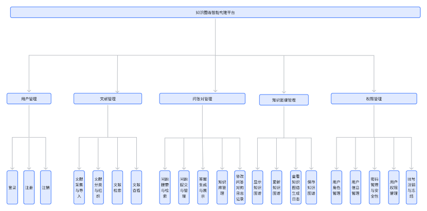

文献管理系统、账号管理系统、权限管理系统、问答管理系统以及知识图谱管理系统共同构成了知识图谱智能构建平台。

文献管理系统主要实现了文献的采集、导入、分类、检索和查看功能，使用户能够方便地构建和管理自己的文献库，并通过高效的检索工具快速找到所需文献。

账号管理系统为用户和管理员提供了注册、登录、退出和注销账号的功能，确保了系统的安全性和用户访问的便捷性。

权限管理系统则通过用户角色管理、用户信息管理、密码管理与安全性以及用户权限管理等功能，为系统提供了精细化的权限控制，确保不同用户只能访问和操作其被授权的内容。

问答管理系统允许用户提交问题，并提供问题的搜索、答案生成与展示以及知识库管理等功能，形成了一个互动式的问题解答和知识分享平台。

知识图谱管理系统则专注于知识图谱的查询、手动更新、保存为图片以及查看生成日志等功能，使用户能够方便地查询和理解知识图谱中的信息，并通过手动更新确保图谱的准确性和时效性。

# 3 模块描述

## 3.1 模块基本信息

对模块进行简要描述，包括名称、编号、设计者、所在文件、所在库。

采用表格形式描述。

可结合 2.2 中构件图进行描述。

### 用户管理模块

模块描述：

> 构件功能：

1.  用户注册、登录、退出与注销账号：允许用户进行注册账号，并提供登录功能，以便用户能够访问系统的各项功能。

2.  普通管理员登录、退出与注销账号。

3.  超级管理员登录与退出账号。

对外接口：无

### 文献库管理模块

模块描述：

> 构件功能

1.  文献采集与导入：创建在线数据库，提供导入功能将文献信息整合到系统中。

2.  文献分类与组织：提供对文献进行分类、标签化或者建立文件夹等组织方式，以便 用户可以根据需求进行管理和查找。（个人文献库和公共文献库）

3.  文献检索：具备强大的检索功能，使用户能够快速准确地找到需要的文献，支持关键词搜索。

4.  文献查看：提供文献阅读功能，允许用户在系统内直接阅读文献。

对外接口：权限管理

### 问答对管理模块

模块描述：

> 构件功能：

1.  问题提交与管理：允许用户提交问题，并提供管理界面用于管理问题，包括发布、编辑、删除等操作。

2.  问题搜索与检索：提供强大的搜索功能，允许用户通过关键词、标签等方式快速定位到相关的问题。

3.  答案生成与展示：根据用户提出的问题，系统能够自动或者手动生成相应的答案，并将答案展示给用户。

4.  知识库管理： 管理系统中的知识库，包括添加、删除、编辑知识库内容等功能。

5.  修改问答对的日志记录

> 对外接口：权限管理

### 知识图谱管理模块

模块描述：

构件功能：

1.  查询知识图谱：该功能允许用户通过输入关键词或提出问题来查询知识图谱中的相关信息。系统将根据用户的查询意图，从知识图谱中智能地检索相关节点和关联信息，并将结果以易于理解和浏览的方式呈现给用户，帮助他们快速获取所需知识。

2.  手动更新知识图谱：该功能允许管理员或授权用户手动触发知识图谱的更新过程。用户可以选择指定更新的范围或特定的数据源，系统将根据用户的选择进行相应的更新操作。这样可以确保知识图谱中的信息始终保持最新和准确。

3.  保存知识图谱为图片：该功能允许用户将当前查看的知识图谱保存为图片格式。用户可以随时通过该功能将知识图谱快速保存下来，方便后续的分享、打印或进一步分析使用。保存的图片将保留图谱的完整结构和节点信息。

4.  查看图谱生成日志：该功能允许用户查看知识图谱生成过程的详细日志记录。系统将记 录每次图谱更新的操作步骤、时间和相关信息，用户可以通过查看日志了解图谱生成的 历史记录，包括成功生成的图谱数量、失败的原因等，以便及时调整和改进系统的运行。

对外接口：无

### 权限管理模块

模块描述：

构件功能：

1. 用户角色管理：超级管理员具有最高权限，可以创建、编辑和删除管理员账号， 管理员具有管理普通用户的权限，普通用户则只能访问系统提供的基本功能。

2. 用户信息管理：超级管理员和管理员可以查看和编辑用户的基本信息，如用户名、密码、邮箱等，以及用户的权限设置。

3. 密码管理与安全性：提供密码管理功能，包括密码修改、找回密码等，保障用户账号的安全性。

4. 用户权限管理：超级管理员和管理员可以设置不同用户的权限，包括访问权限、操作权限等，以确保用户能够按照其角色的要求合理地使用系统。

5. 账号注销与冻结：超级管理员和管理员可以对用户账号进行注销或冻结操作，以应对违规行为或其他特殊情况。

对外接口：文献库管理，问答对管理

## 3.2 功能概述

简述该模块应具有的功能，可采用 IPO（即输入-处理-输出）的描述形式。

IPO 图：

| 模块名称：文献采集与导入                   | 模块编号：1.1 | 设计人：刘佳乐 |
| ------------------------------------------ | ------------- | -------------- |
| 直接调用本模块的上级模块名称：文献管理系统 |               |                |
| 本模块直接调用的模块名称：文献数据库       |               |                |
| 输入：文献（.pdf .docx .txt 格式均可）     |               |                |
| 输出：文献保存格式（txt 格式）             |               |                |
| 与本模块直接关联的数据结构：文献 id        |               |                |
| 处理描述： 将文献存储进文献数据库          |               |                |

| 模块名称：文献分类与组织                                | 模块编号：1.2 | 设计人：刘佳乐 |
| ------------------------------------------------------- | ------------- | -------------- |
| 直接调用本模块的上级模块名称：文献管理系统              |               |                |
| 本模块直接调用的模块名称：文献数据库                    |               |                |
| 输入：文献                                              |               |                |
| 输出：文献保存格式（txt 格式）                          |               |                |
| 与本模块直接关联的数据结构：文献 id                     |               |                |
| 处理描述： 将保存在文献数据库的文献进行分类和重新组织。 |               |                |

| 模块名称：文献检索                          | 模块编号：1.3 | 设计人：刘佳乐 |
| ------------------------------------------- | ------------- | -------------- |
| 直接调用本模块的上级模块名称：文献管理系统  |               |                |
| 本模块直接调用的模块名称：文献数据库        |               |                |
| 输入：检索关键词                            |               |                |
| 输出：检索信息                              |               |                |
| 与本模块直接关联的数据结构：文献关键词      |               |                |
| 处理描述： 根据文献关键词检索相关文献信息。 |               |                |

| 模块名称：文献查看                         | 模块编号：1.4 | 设计人：刘佳乐 |
| ------------------------------------------ | ------------- | -------------- |
| 直接调用本模块的上级模块名称：文献管理系统 |               |                |
| 本模块直接调用的模块名称：文献数据库       |               |                |
| 输入：文献名称                             |               |                |
| 输出：文献（txt 格式）                     |               |                |
| 与本模块直接关联的数据结构：文献 id        |               |                |
| 处理描述：提取并查看文献库里的文献         |               |                |

| 模块名称：注册                                                    | 模块编号：2.1 | 设计人：刘佳乐 |
| ----------------------------------------------------------------- | ------------- | -------------- |
| 直接调用本模块的上级模块名称：账号管理系统                        |               |                |
| 本模块直接调用的模块名称：用户信息数据库                          |               |                |
| 输入：注册信息（包括用户账号，密码，验证码）                      |               |                |
| 输出：注册成功信息，或者注册失败信息（信息缺失或错误）            |               |                |
| 与本模块直接关联的数据结构：id，password                          |               |                |
| 处理描述： 注册一个新用户账号，并把用户信息存储进用户信息数据库中 |               |                |

| 模块名称：登录                                                         | 模块编号：2.2 | 设计人：刘佳乐 |
| ---------------------------------------------------------------------- | ------------- | -------------- |
| 直接调用本模块的上级模块名称：账号管理系统                             |               |                |
| 本模块直接调用的模块名称：用户信息数据库                               |               |                |
| 输入：登录信息（包括用户账号，密码）                                   |               |                |
| 输出：登录成功信息，或者登录失败信息（账号或密码错误，或者用户未注册） |               |                |
| 与本模块直接关联的数据结构：id，password                               |               |                |
| 处理描述： 登录用户账号                                                |               |                |

| 模块名称：退出                             | 模块编号：2.3 | 设计人：刘佳乐 |
| ------------------------------------------ | ------------- | -------------- |
| 直接调用本模块的上级模块名称：账号管理系统 |               |                |
| 本模块直接调用的模块名称：用户信息数据库   |               |                |
| 输入：退出账号请求                         |               |                |
| 输出：退出账号成功                         |               |                |
| 与本模块直接关联的数据结构：用户 id        |               |                |
| 处理描述： 退出用户账号                    |               |                |

| 模块名称：注销                                         | 模块编号：2.4 | 设计人：刘佳乐 |
| ------------------------------------------------------ | ------------- | -------------- |
| 直接调用本模块的上级模块名称：账号管理系统             |               |                |
| 本模块直接调用的模块名称：用户信息数据库               |               |                |
| 输入：注销信息（用户账号）                             |               |                |
| 输出：注销成功信息，或者注销失败信息（用户无注销权限） |               |                |
| 与本模块直接关联的数据结构：id                         |               |                |
| 处理描述： 管理员或者超级管理员注销用户账号            |               |                |

| 模块名称：用户角色管理                                            | 模块编号：3.1 | 设计人：刘佳乐 |
| ----------------------------------------------------------------- | ------------- | -------------- |
| 直接调用本模块的上级模块名称：权限管理系统                        |               |                |
| 本模块直接调用的模块名称：用户信息数据库                          |               |                |
| 输入：注册信息（包括用户账号，密码，验证码）                      |               |                |
| 输出：注册成功信息，或者注册失败信息（信息缺失或错误）            |               |                |
| 与本模块直接关联的数据结构：id，password                          |               |                |
| 处理描述： 注册一个新用户账号，并把用户信息存储进用户信息数据库中 |               |                |

| 模块名称：用户信息管理                            | 模块编号：3.2 | 设计人：刘佳乐 |
| ------------------------------------------------- | ------------- | -------------- |
| 直接调用本模块的上级模块名称：权限管理系统        |               |                |
| 本模块直接调用的模块名称：用户信息数据库          |               |                |
| 输入：调整用户信息                                |               |                |
| 输出：调整成功信息                                |               |                |
| 与本模块直接关联的数据结构：用户 id，待调整的信息 |               |                |
| 处理描述： 调整用户信息，将调整的信息同步到数据库 |               |                |

| 模块名称：密码管理                                | 模块编号：3.3 | 设计人：刘佳乐 |
| ------------------------------------------------- | ------------- | -------------- |
| 直接调用本模块的上级模块名称：权限管理系统        |               |                |
| 本模块直接调用的模块名称：用户信息数据库          |               |                |
| 输入：用户 id，修改信息                           |               |                |
| 输出：修改信息，反馈到用户信息数据库              |               |                |
| 与本模块直接关联的数据结构：用户 id，密码修改信息 |               |                |
| 处理描述：密码管理功能，包括密码修改，找回密码等  |               |                |

| 模块名称：用户权限管理                                                                                                        | 模块编号：3.4 | 设计人：刘佳乐 |
| ----------------------------------------------------------------------------------------------------------------------------- | ------------- | -------------- |
| 直接调用本模块的上级模块名称：权限管理系统                                                                                    |               |                |
| 本模块直接调用的模块名称：用户信息数据库                                                                                      |               |                |
| 输入：权限调整信息                                                                                                            |               |                |
| 输出：将调整信息同步到用户信息数据库                                                                                          |               |                |
| 与本模块直接关联的数据结构：用户 id，调整信息                                                                                 |               |                |
| 处理描述： 超级管理员和管理员可以设置不同用户的权限，包括访问权限、操作权限等，以确保用户能够按照其角色的要求合理地使用系统。 |               |                |

| 模块名称：账号注销与冻结                                                                      | 模块编号：3.5 | 设计人：刘佳乐 |
| --------------------------------------------------------------------------------------------- | ------------- | -------------- |
| 直接调用本模块的上级模块名称：权限管理系统                                                    |               |                |
| 本模块直接调用的模块名称：用户信息数据库                                                      |               |                |
| 输入：账号信息（如待注销账号 id）                                                             |               |                |
| 输出：注销成功，冻结成功，或失败信息                                                          |               |                |
| 与本模块直接关联的数据结构：用户 id                                                           |               |                |
| 处理描述： 超级管理员和管理员可以对用户账号进行注销或冻结操作，以应对违规行为或其他特殊情况。 |               |                |

| 模块名称：问题提交与管理                                                              | 模块编号：4.1 | 设计人：刘佳乐 |
| ------------------------------------------------------------------------------------- | ------------- | -------------- |
| 直接调用本模块的上级模块名称：问答管理系统                                            |               |                |
| 本模块直接调用的模块名称：问答信息数据库                                              |               |                |
| 输入：问答对                                                                          |               |                |
| 输出：将输入的问答对同步到数据库中                                                    |               |                |
| 与本模块直接关联的数据结构：问答对信息                                                |               |                |
| 处理描述： 允许用户提交问题，并提供管理界面用于管理问题，包括发布、编辑、删除等操作。 |               |                |

| 模块名称：问题搜索与检索                                                            | 模块编号：4.2 | 设计人：刘佳乐 |
| ----------------------------------------------------------------------------------- | ------------- | -------------- |
| 直接调用本模块的上级模块名称：问答管理系统                                          |               |                |
| 本模块直接调用的模块名称：问答信息数据库                                            |               |                |
| 输入：问题关键词                                                                    |               |                |
| 输出：相关关键词的检索信息                                                          |               |                |
| 与本模块直接关联的数据结构：问答对信息                                              |               |                |
| 处理描述： 提供强大的搜索功能，允许用户通过关键词、标签等方式快速定位到相关的问题。 |               |                |

| 模块名称：答案生成与展示                                                                | 模块编号：4.3 | 设计人：刘佳乐 |
| --------------------------------------------------------------------------------------- | ------------- | -------------- |
| 直接调用本模块的上级模块名称：问答管理系统                                              |               |                |
| 本模块直接调用的模块名称：问答信息数据库                                                |               |                |
| 输入：问题                                                                              |               |                |
| 输出：答案                                                                              |               |                |
| 与本模块直接关联的数据结构：问答对信息                                                  |               |                |
| 处理描述： 根据用户提出的问题，系统能够自动或者手动生成相应的答案，并将答案展示给用户。 |               |                |

| 模块名称：知识库管理                                                  | 模块编号：4.4 | 设计人：刘佳乐 |
| --------------------------------------------------------------------- | ------------- | -------------- |
| 直接调用本模块的上级模块名称：问答管理系统                            |               |                |
| 本模块直接调用的模块名称：问答信息数据库                              |               |                |
| 输入：知识库修改请求                                                  |               |                |
| 输出：修改知识库中信息                                                |               |                |
| 与本模块直接关联的数据结构：知识库信息                                |               |                |
| 处理描述： 管理系统中的知识库，包括添加、删除、编辑知识库内容等功能。 |               |                |

| 模块名称：修改问答对的日志记录             | 模块编号：4.5 | 设计人：刘佳乐 |
| ------------------------------------------ | ------------- | -------------- |
| 直接调用本模块的上级模块名称：问答管理系统 |               |                |
| 本模块直接调用的模块名称：问答信息数据库   |               |                |
| 输入：待修改日志信息                       |               |                |
| 输出：修改日志记录                         |               |                |
| 与本模块直接关联的数据结构：日志日期 id    |               |                |
| 处理描述： 修改问答对的日志记录            |               |                |

| 模块名称：查询知识图谱                                                                                                                                                                                                | 模块编号：5.1 | 设计人：刘佳乐 |
| --------------------------------------------------------------------------------------------------------------------------------------------------------------------------------------------------------------------- | ------------- | -------------- |
| 直接调用本模块的上级模块名称：知识图谱管理系统                                                                                                                                                                        |               |                |
| 本模块直接调用的模块名称：知识图谱信息数据库                                                                                                                                                                          |               |                |
| 输入：查询请求                                                                                                                                                                                                        |               |                |
| 输出：知识图谱                                                                                                                                                                                                        |               |                |
| 与本模块直接关联的数据结构：知识图谱信息                                                                                                                                                                              |               |                |
| 处理描述： 该功能允许用户通过输入关键词或提出问题来查询知识图谱中的相关信息。系统将根据用户的查询意图，从知识图谱中智能地检索相关节点和关联信息，并将结果以易于理解和浏览的方式呈现给用户，帮助他们快速获取所需知识。 |               |                |
| 模块名称：手动更新知识图谱                                                                                                                                                                                            | 模块编号：5.2 | 设计人：刘佳乐 |
| ------------------------                                                                                                                                                                                              | ------------- | -------------- |
| 直接调用本模块的上级模块名称：知识图谱管理系统                                                                                                                                                                        |               |                |
| 本模块直接调用的模块名称：知识图谱信息数据库                                                                                                                                                                          |               |                |
| 输入：更新请求                                                                                                                                                                                                        |               |                |
| 输出：知识图谱更新                                                                                                                                                                                                    |               |                |
| 与本模块直接关联的数据结构：知识图谱信息，待更新信息                                                                                                                                                                  |               |                |
| 处理描述： 该功能允许管理员或授权用户手动触发知识图谱的更新过程。用户可以选择指定更新的范围或特定的数据源，系统将根据用户的选择进行相应的更新操作。这样可以确保知识图谱中的信息始终保持最新和准确。                   |               |                |

| 模块名称：保存知识图谱为图片                                                                                                                                                                | 模块编号：5.3 | 设计人：刘佳乐 |
| ------------------------------------------------------------------------------------------------------------------------------------------------------------------------------------------- | ------------- | -------------- |
| 直接调用本模块的上级模块名称：知识图谱管理系统                                                                                                                                              |               |                |
| 本模块直接调用的模块名称：知识图谱信息数据库                                                                                                                                                |               |                |
| 输入：保存请求                                                                                                                                                                              |               |                |
| 输出：知识图谱图片                                                                                                                                                                          |               |                |
| 与本模块直接关联的数据结构：知识图谱信息                                                                                                                                                    |               |                |
| 处理描述： 该功能允许用户将当前查看的知识图谱保存为图片格式。用户可以随时通过该功能将知识图谱快速保存下来，方便后续的分享、打印或进一步分析使用。保存的图片将保留图谱的完整结构和节点信息。 |               |                |

| 模块名称：查看知识图谱生成日志                                                                                                                                                                                                  | 模块编号：5.4 | 设计人：刘佳乐 |
| ------------------------------------------------------------------------------------------------------------------------------------------------------------------------------------------------------------------------------- | ------------- | -------------- |
| 直接调用本模块的上级模块名称：知识图谱管理系统                                                                                                                                                                                  |               |                |
| 本模块直接调用的模块名称：知识图谱信息数据库                                                                                                                                                                                    |               |                |
| 输入：查看请求                                                                                                                                                                                                                  |               |                |
| 输出：知识图谱生成日志                                                                                                                                                                                                          |               |                |
| 与本模块直接关联的数据结构：知识图谱日志信息                                                                                                                                                                                    |               |                |
| 处理描述： 该功能允许用户查看知识图谱生成过程的详细日志记录。系统将记录每次图谱更新的操作步骤、时间和相关信息，用户可以通过查看日志了解图谱生成的历史记录，包括成功生成的图谱数量、失败的原因等，以便及时调整和改进系统的运行。 |               |                |

## 3.3 算法

详细说明本模块所选用的算法，具体的计算公式和计算步骤。注意这里的算法主要是指一些科学计算公式。若没有，可不写。

## 3.4 模块处理逻辑

如果采用结构化设计方法，建议选择合适的图（如流程图、盒图、PAD 图）或者表（如判定表、判定树）或者伪代码来阐述本模块的处理逻辑。

如果采用面向对象设计方法，建议使用顺序图、通信图、活动图、状态图等动态模型之一来描述核心操作的处理逻辑。

### 用户管理

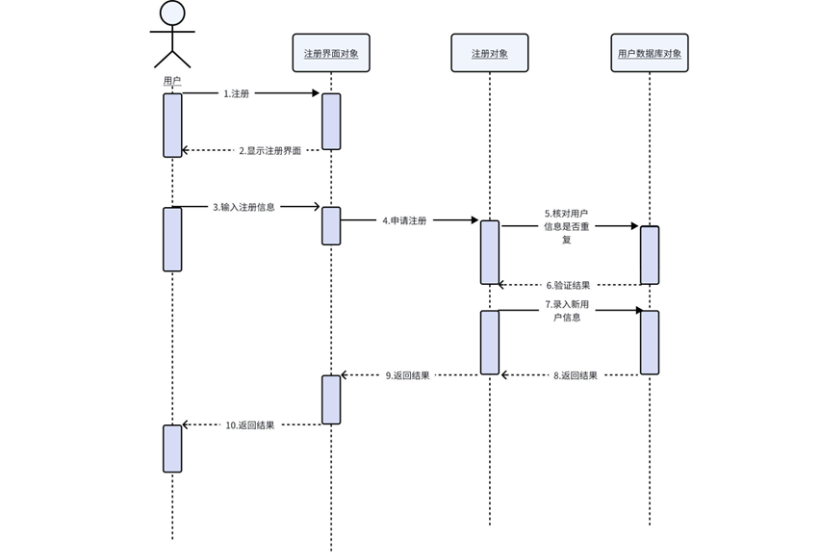

注册顺序图

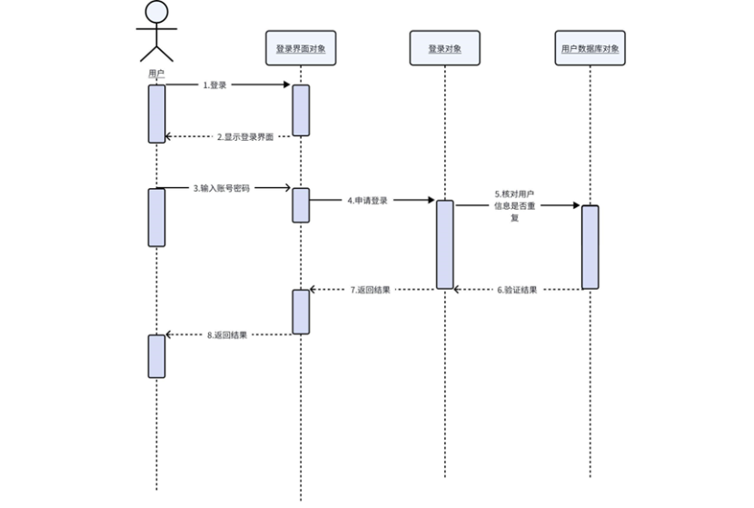

登陆顺序图

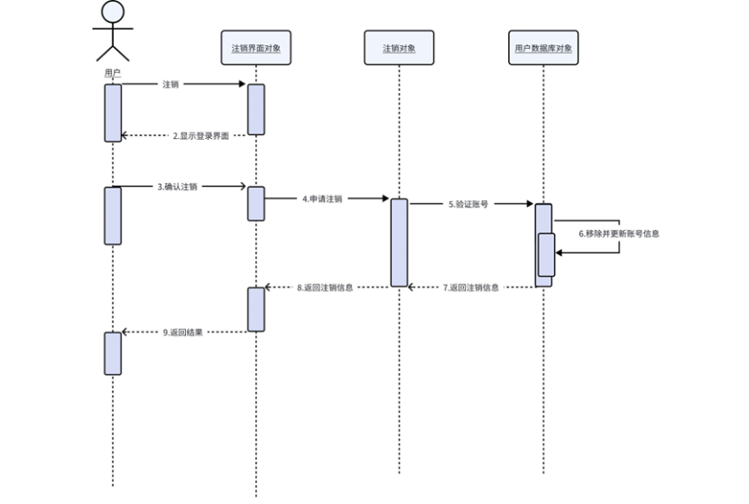

注销顺序图

### 文献库管理

查询文献顺序图

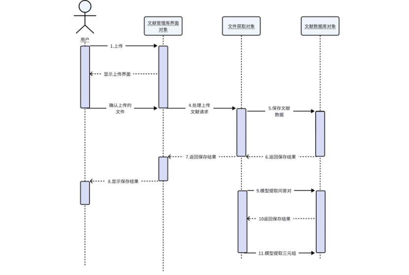

上传文献顺序图

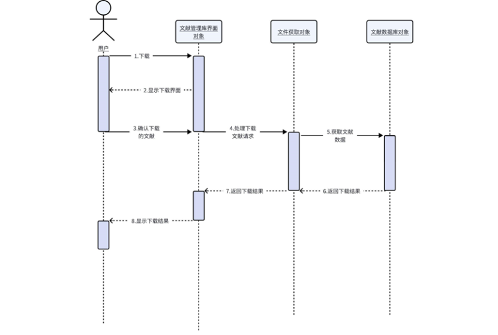

下载文献顺序图

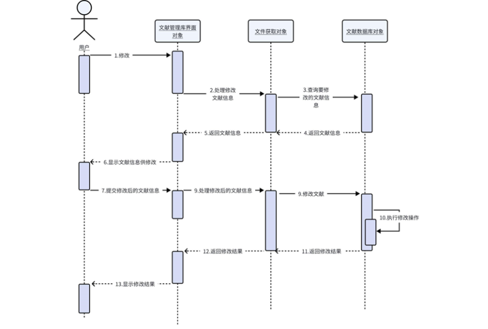

修改文献顺序图

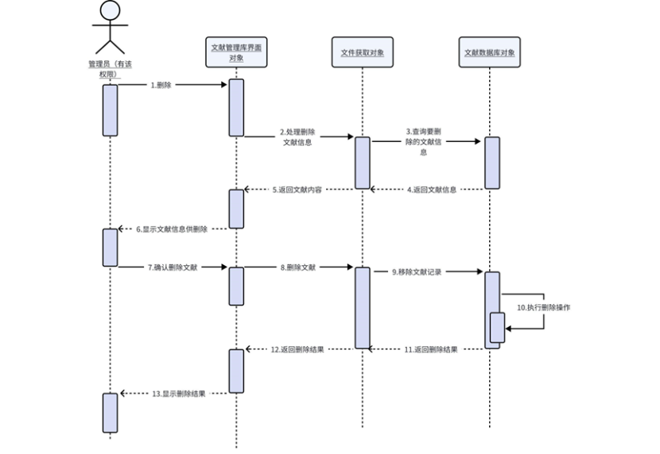

删除文献顺序图

### 问答对管理

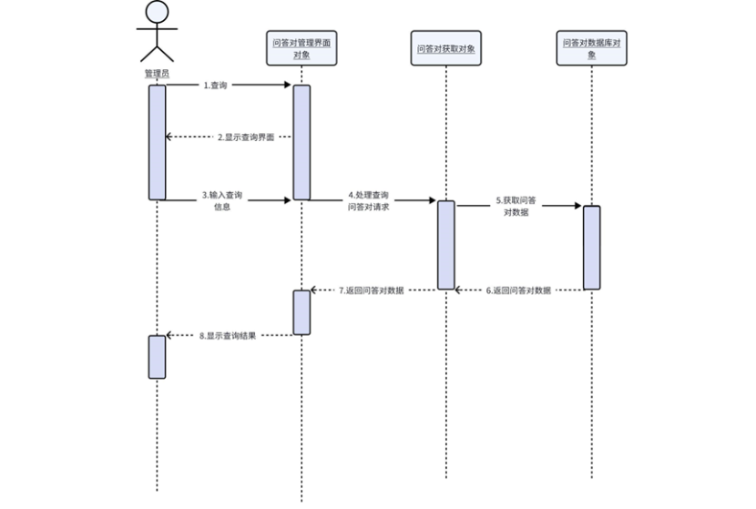

查询问答对顺序图

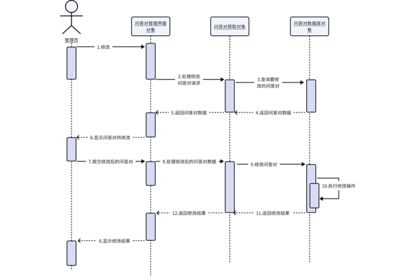

修改问答对顺序图

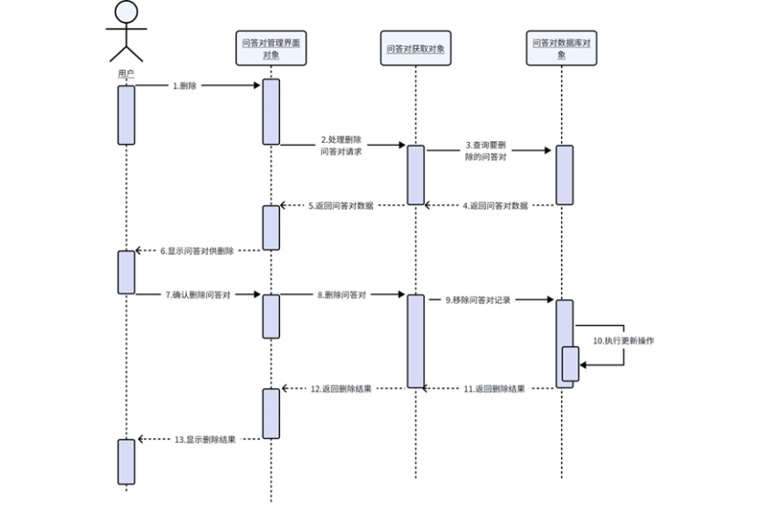

删除问答对顺序图

### 知识图谱管理

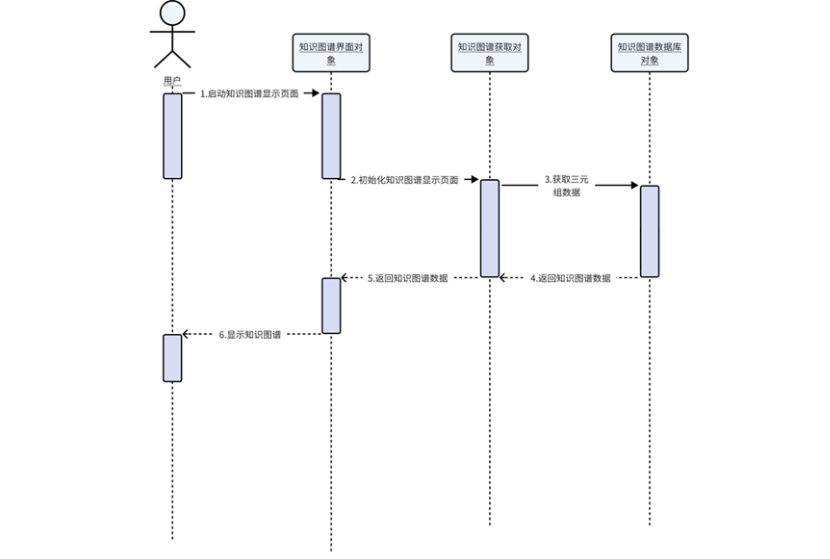

显示知识图谱顺序图

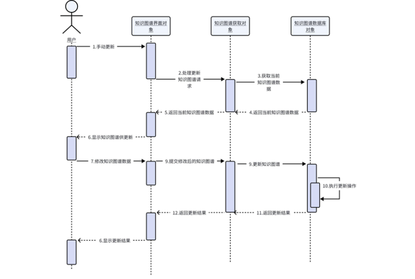

更新知识图谱顺序图

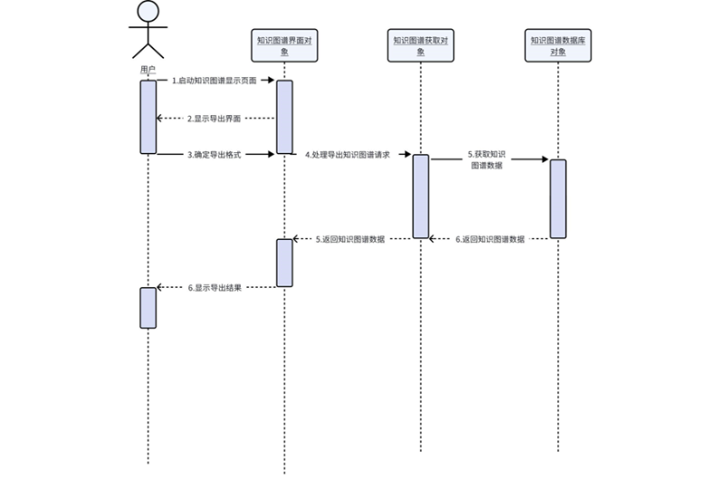

导出知识图谱顺序图

### 权限管理

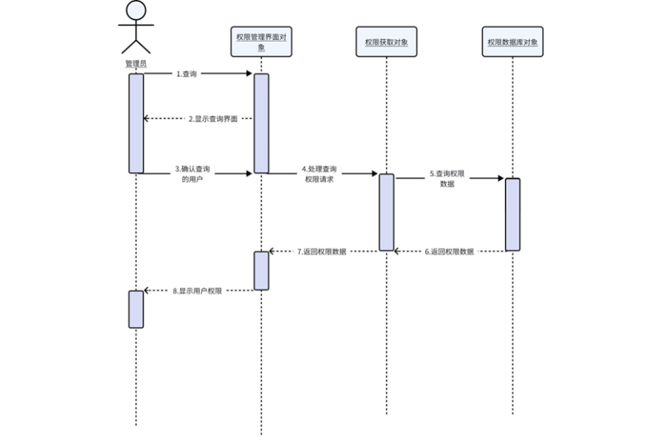

查询用户权限顺序图

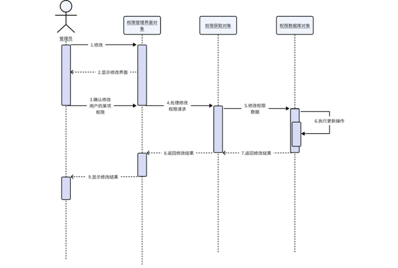

修改用户权限顺序图

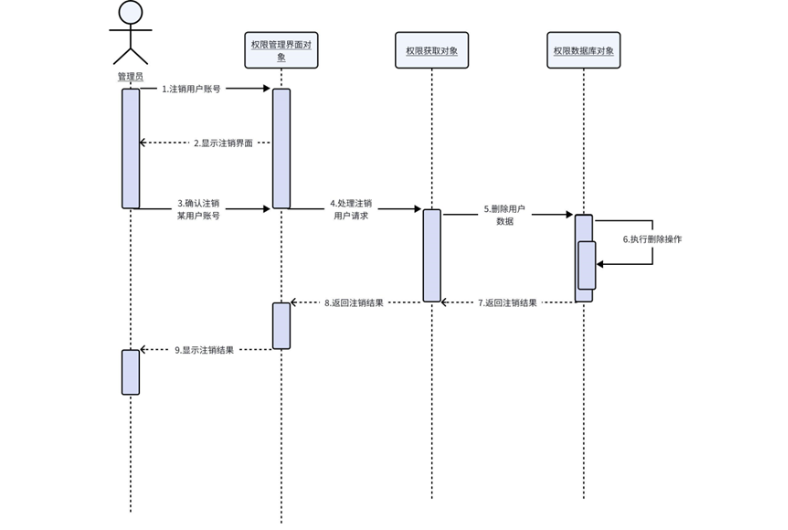

注销用户账号顺序图

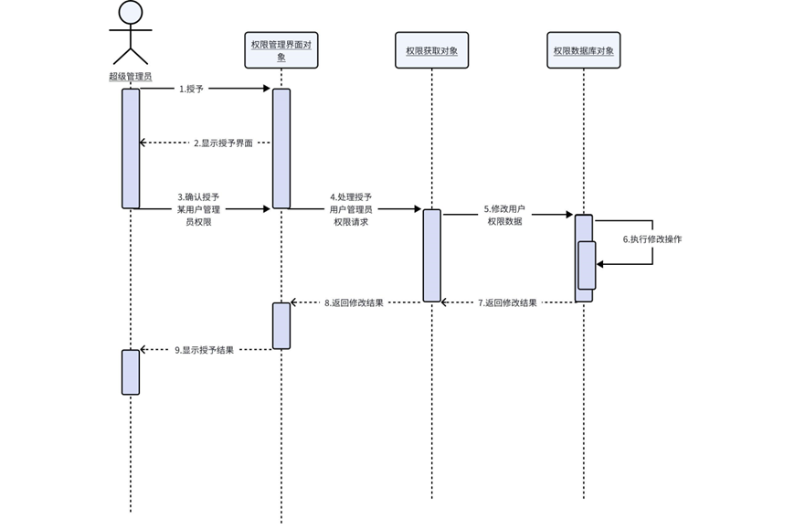

授予用户管理员权限顺序图

## 3.5 接口

模块或构件（类）的主要方法接口。接口数据结构需要详细描述（包括类型、含义）。

进一步细化概要设计中的接口描述，采用表格描述。

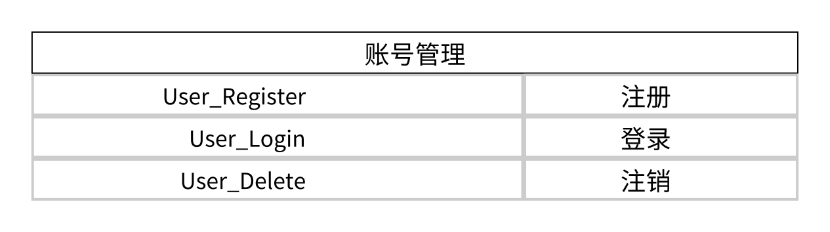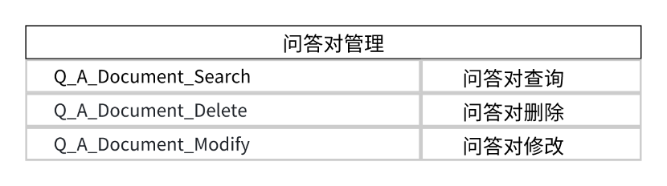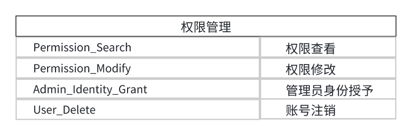

## 3.6 性能

说明对该模块的全部性能要求，包括对精度、灵活性和时间特性的要求。没有则不写。

### 3.6.1 数据精度

对于用户文件上传，问答对以及知识图谱等都要在短时间内迅速更新，数据准确无误，保证高精度。

### 3.6.2 时间特性

说明对于该软件的时间特性要求，如对响应时间、更新处理时间、数据的转换和传送时间以及计算时间等的要求。

响应时间：所有的查询操作、查询响应时间一般不超过 3 秒。

更新处理时间：由系统运行状态决定，一般审核期为 30 分钟。

数据的转换和传送时间：能够在 10s 内完成。

计算时间：依据系统运行状态与计算量决定。

## 3.7 测试计划

列出本模块的单元测试计划。

以测试用例形式给出：输入数据、预期结果。（可在测试报告中描述这部分内容）

表 24 登录\_第一组测试用例

| 测试用例编号 | LOGIN_001                                                              |
| ------------ | ---------------------------------------------------------------------- |
| 测试项目     | 登录                                                                   |
| 测试标题     | 输入账号、密码                                                         |
| 重要级别     | 高                                                                     |
| 预置条件     | 该用户名已注册过                                                       |
| 输入         | 账号123@gmail.com，密码 123456                                         |
| 操作步骤     | ○,1)1 打开登录界面；○,2)2 输入账号123@gmail.com；○,3)3 输入密码 123456 |
| 预期输出     | 提示用户登录成功                                                       |

表 25 登录\_第二组测试用例

| 测试用例编号 | LOGIN_002                                   |
| ------------ | ------------------------------------------- |
| 测试项目     | 登录                                        |
| 测试标题     | 输入账号、密码                              |
| 重要级别     | 高                                          |
| 预置条件     | 该用户名已注册过                            |
| 输入         | 密码 123456                                 |
| 操作步骤     | ○,1)1 打开登录界面；○,2)2 输入密码 123456； |
| 预期输出     | 提示用户输入数据不完整                      |

表 26 登录\_第三组测试用例

| 测试用例编号 | LOGIN_003                                         |
| ------------ | ------------------------------------------------- |
| 测试项目     | 登录                                              |
| 测试标题     | 输入账号、密码                                    |
| 重要级别     | 高                                                |
| 预置条件     | 该用户名已注册过                                  |
| 输入         | 账号123@gmail.com                                 |
| 操作步骤     | ○,1)1 打开登录界面；○,2)2 输入账号123@gmail.com； |
| 预期输出     | 提示用户输入数据不完整                            |

表 27 登录\_第四组测试用例

| 测试用例编号 | LOGIN_004                                                             |
| ------------ | --------------------------------------------------------------------- |
| 测试项目     | 登录                                                                  |
| 测试标题     | 输入账号、密码                                                        |
| 重要级别     | 高                                                                    |
| 预置条件     | 该用户名已注册过，账号为123@gmail.com，密码为 123456                  |
| 输入         | 账号12@gmail.com，密码 123456                                         |
| 操作步骤     | ○,1)1 打开登录界面；○,2)2 输入账号12@gmail.com；○,3)3 输入密码 123456 |
| 预期输出     | 提示用户不存在                                                        |

表 28 登录\_第五组测试用例

| 测试用例编号 | LOGIN_005                                                              |
| ------------ | ---------------------------------------------------------------------- |
| 测试项目     | 登录                                                                   |
| 测试标题     | 输入账号、密码                                                         |
| 重要级别     | 高                                                                     |
| 预置条件     | 该用户名已注册过，账号为123@gmail.com，密码为 123456                   |
| 输入         | 账号123@gmail.com，密码 abcdef                                         |
| 操作步骤     | ○,1)1 打开登录界面；○,2)2 输入账号123@gmail.com；○,3)3 输入密码 abcdef |
| 预期输出     | 提示用户登录密码错误                                                   |

表 29 注册\_第一组测试用例

| 测试用例编号 | REGISTER_001                                                                                                |
| ------------ | ----------------------------------------------------------------------------------------------------------- |
| 测试项目     | 注册                                                                                                        |
| 测试标题     | 输入邮箱、用户名、密码以及邮箱验证码                                                                        |
| 重要级别     | 高                                                                                                          |
| 预置条件     | 进入注册网页界面                                                                                            |
| 输入         | 邮箱1122334455@qq.com，用户名 123456，密码 123456，邮箱验证码                                               |
| 操作步骤     | ○,1)1 打开注册界面；○,2)2 输入邮箱1122334455@qq.com③ 输入用户名 123456；④ 输入密码 123456；⑤ 输入邮箱验证码 |
| 预期输出     | 提示用户注册成功                                                                                            |

表 30 注册\_第二组测试用例

| 测试用例编号 | REGISTER_002                                                                               |
| ------------ | ------------------------------------------------------------------------------------------ |
| 测试项目     | 注册                                                                                       |
| 测试标题     | 输入邮箱、用户名、密码以及邮箱验证码                                                       |
| 重要级别     | 高                                                                                         |
| 预置条件     | 进入注册网页界面                                                                           |
| 输入         | 邮箱1122334455@qq.com，用户名 null，密码 123456，邮箱验证码                                |
| 操作步骤     | ○,1)1 打开注册界面；○,2)2 输入邮箱1122334455@qq.com○,3)3 输入密码 123456；④ 输入邮箱验证码 |
| 预期输出     | 提示用户输入数据不完整                                                                     |

表 31 注册\_第三组测试用例

| 测试用例编号 | REGISTER_003                                                                           |
| ------------ | -------------------------------------------------------------------------------------- |
| 测试项目     | 注册                                                                                   |
| 测试标题     | 输入用户名、密码以及邮箱                                                               |
| 重要级别     | 高                                                                                     |
| 预置条件     | 进入注册网页界面                                                                       |
| 输入         | 用户名 123456，密码 null，邮箱 1122334455@qq.com                                       |
| 操作步骤     | ○,1)1 打开注册界面；○,2)2 输入邮箱1122334455@qq.com③ 输入账号 123456；④ 输入邮箱验证码 |
| 预期输出     | 提示用户输入数据不完整                                                                 |

表 32 注册\_第四组测试用例

| 测试用例编号 | REGISTER_004                                                                               |
| ------------ | ------------------------------------------------------------------------------------------ |
| 测试项目     | 注册                                                                                       |
| 测试标题     | 输入用户名、密码以及邮箱                                                                   |
| 重要级别     | 高                                                                                         |
| 预置条件     | 进入注册网页界面                                                                           |
| 输入         | 用户名 123456，密码 123456，邮箱 null                                                      |
| 操作步骤     | ○,1)1 打开注册界面；○,2)2 输入用户名 123456；○,3)3 输入密码 123456；                       |
| 预期输出     | ○,1)1 提示输入用户名；○,2)2 提示输入密码；○,3)3 提示用户输入邮箱；④ 提示用户输入数据不完整 |

表 33 注册\_第五组测试用例

| 测试用例编号 | REGISTER_007                                                                               |
| ------------ | ------------------------------------------------------------------------------------------ |
| 测试项目     | 注册                                                                                       |
| 测试标题     | 输入用户名、密码以及邮箱                                                                   |
| 重要级别     | 高                                                                                         |
| 预置条件     | 进入注册网页界面                                                                           |
| 输入         | 用户名 123456，密码 null，邮箱 null                                                        |
| 操作步骤     | ○,1)1 打开注册界面；○,2)2 输入账号 123456                                                  |
| 预期输出     | ○,1)1 提示输入用户名；○,2)2 提示输入密码；○,3)3 提示用户输入邮箱；④ 提示用户输入数据不完整 |

表 34 注册\_第六组测试用例

| 测试用例编号 | REGISTER_008                                                                                |
| ------------ | ------------------------------------------------------------------------------------------- |
| 测试项目     | 注册                                                                                        |
| 测试标题     | 输入用户名、密码以及邮箱                                                                    |
| 重要级别     | 高                                                                                          |
| 预置条件     | 已注册该用户，邮箱1122334455@qq.com，用户名 123456，密码 123456                             |
| 输入         | 用户名 123456，密码 123456，邮箱1122334455@qq.com                                           |
| 操作步骤     | ○,1)1 打开注册界面；○,2)2 输入用户名 123456；③ 输入密码 123456；④ 输入邮箱1122334455@qq.com |
| 预期输出     | ○,1)1 账号或用户名已存在                                                                    |

表 35 注销\_第一组测试用例

| 测试用例编号 | LOGOFF_001                               |
| ------------ | ---------------------------------------- |
| 测试项目     | 注销                                     |
| 测试标题     | 注销账号信息                             |
| 重要级别     | 高                                       |
| 预置条件     | 该用户名已注册过                         |
| 输入         | 无                                       |
| 操作步骤     | ○,1)1 打开主界面；○,2)2 点击注销账号按钮 |
| 预期输出     | 注销成功                                 |

表 36 注销\_第二组测试用例（用户一方未更新情况）

| 测试用例编号 | LOGOFF_002                           |
| ------------ | ------------------------------------ |
| 测试项目     | 注销                                 |
| 测试标题     | 注销账号信息                         |
| 重要级别     | 高                                   |
| 预置条件     | 该用户名未注册过                     |
| 输入         | 无                                   |
| 操作步骤     | ○,1)1 打开主界面；○,2)2 点击注销按钮 |
| 预期输出     | ○,1)1 提示用户不存在                 |

表 37 注销\_第三组测试用例

| 测试用例编号 | LOGOFF_003                               |
| ------------ | ---------------------------------------- |
| 测试项目     | 注销                                     |
| 测试标题     | 注销账号信息                             |
| 重要级别     | 高                                       |
| 预置条件     | 注销角色为管理员的账号                   |
| 输入         | 无                                       |
| 操作步骤     | ○,1)1 打开主界面；○,2)2 点击注销账号按钮 |
| 预期输出     | ○,1)1 提示管理员不可注销                 |

表 38 文献管理\_第一组测试用例

| 测试用例编号 | FILE_MANAGE_001                                               |
| ------------ | ------------------------------------------------------------- |
| 测试项目     | 文献管理                                                      |
| 测试标题     | 上传文献                                                      |
| 重要级别     | 中                                                            |
| 预置条件     | 成功登录，文献文件格式为 TXT                                  |
| 输入         | 文献标题，文献内容                                            |
| 操作步骤     | ○,1)1 打开文献管理界面；○,2)2 点击选择“+”按钮；③ 点击上传按钮 |
| 预期输出     | 提示文献上传成功，更新文献列表                                |

表 39 文献管理\_第二组测试用例

| 测试用例编号 | FILE_MANAGE_003                              |
| ------------ | -------------------------------------------- |
| 测试项目     | 文献管理                                     |
| 测试标题     | 查询某个文献详细内容                         |
| 重要级别     | 中                                           |
| 预置条件     | 所查文献已成功上传                           |
| 输入         | 无                                           |
| 操作步骤     | ○,1)1 打开文献管理界面；○,2)2 点击已上传文献 |
| 预期输出     | 显示文献详细信息                             |

表 40 文献管理\_第三组测试用例

| 测试用例编号 | FILE_MANAGE_004                                    |
| ------------ | -------------------------------------------------- |
| 测试项目     | 文献管理                                           |
| 测试标题     | 查询某个文献详细内容                               |
| 重要级别     | 中                                                 |
| 预置条件     | 进入文献管理界面，系统原因用户一方文献未来得及更新 |
| 输入         | 无                                                 |
| 操作步骤     | ○,1)1 打开文献管理界面；○,2)2 点击已上传文献       |
| 预期输出     | 标题名未知                                         |

表 41 文献管理\_第四组测试用例

| 测试用例编号 | FILE_MANAGE_005                        |
| ------------ | -------------------------------------- |
| 测试项目     | 文献管理                               |
| 测试标题     | 查询所有文献                           |
| 重要级别     | 中                                     |
| 预置条件     | 进入文献管理界面                       |
| 输入         | 无                                     |
| 操作步骤     | ○,1)1 打开文献管理界面；○,2)2 分页查看 |
| 预期输出     | 分页显示所有文献列表                   |

表 42 文献管理\_第五组测试用例

| 测试用例编号 | FILE_MANAGE_006                            |
| ------------ | ------------------------------------------ |
| 测试项目     | 文献管理                                   |
| 测试标题     | 查询所有文献                               |
| 重要级别     | 中                                         |
| 预置条件     | 进入文献管理界面，文献未上传               |
| 输入         | 无                                         |
| 操作步骤     | ○,1)1 打开文献管理界面；○,2)2 点击查询按钮 |
| 预期输出     | 提示页面不存在                             |

表 43 文献管理\_第六组测试用例

| 测试用例编号 | FILE_MANAGE_007                            |
| ------------ | ------------------------------------------ |
| 测试项目     | 文献管理                                   |
| 测试标题     | 删除文献                                   |
| 重要级别     | 中                                         |
| 预置条件     | 文献已上传                                 |
| 输入         | 无                                         |
| 操作步骤     | ○,1)1 打开文献管理界面；○,2)2 点击删除按钮 |
| 预期输出     | 提示文献删除成功                           |

表 44 文献管理\_第七组测试用例

| 测试用例编号 | FILE_MANAGE_008                            |
| ------------ | ------------------------------------------ |
| 测试项目     | 文献管理                                   |
| 测试标题     | 删除文献                                   |
| 重要级别     | 中                                         |
| 预置条件     | 进入文献管理界面，文献未上传               |
| 输入         | 无                                         |
| 操作步骤     | ○,1)1 打开文献管理界面；○,2)2 点击删除按钮 |
| 预期输出     | 提示该文献不存在                           |

表 45 文献管理\_第八组测试用例

| 测试用例编号 | FILE_MANAGE_009                                                                |
| ------------ | ------------------------------------------------------------------------------ |
| 测试项目     | 文献管理                                                                       |
| 测试标题     | 修改文献                                                                       |
| 重要级别     | 中                                                                             |
| 预置条件     | 进入文献管理界面                                                               |
| 输入         | 内容                                                                           |
| 操作步骤     | ○,1)1 打开文献管理界面；○,2)2 点击所选文献；○,3)3 输入修改内容；④ 点击修改按钮 |
| 预期输出     | 提示文献修改成功                                                               |

表 46 文献管理\_第九组测试用例

| 测试用例编号 | FILE_MANAGE_010                                                                |
| ------------ | ------------------------------------------------------------------------------ |
| 测试项目     | 文献管理                                                                       |
| 测试标题     | 修改文献                                                                       |
| 重要级别     | 中                                                                             |
| 预置条件     | 进入文献管理界面，系统原因用户一方文献未来得及更新                             |
| 输入         | 内容                                                                           |
| 操作步骤     | ○,1)1 打开文献管理界面；○,2)2 点击所选文献；○,3)3 输入修改内容；④ 点击修改按钮 |
| 预期输出     | 提示文献不存在                                                                 |

表 47 问答对管理\_第一组测试用例

| 测试用例编号 | QAPAIR_MANAGE_001                            |
| ------------ | -------------------------------------------- |
| 测试项目     | 问答对管理                                   |
| 测试标题     | 拉取问答对列表                               |
| 重要级别     | 中                                           |
| 预置条件     | 进入问答对管理界面                           |
| 输入         | 无                                           |
| 操作步骤     | ○,1)1 打开问答对管理界面；○,2)2 点击查询按钮 |
| 预期输出     | 分页显示问答对                               |

表 48 问答对管理\_第二组测试用例

| 测试用例编号 | QAPAIR_MANAGE_002                                            |
| ------------ | ------------------------------------------------------------ |
| 测试项目     | 问答对管理                                                   |
| 测试标题     | 匹配近似问答对                                               |
| 重要级别     | 中                                                           |
| 预置条件     | 进入问答对管理界面                                           |
| 输入         | 问题                                                         |
| 操作步骤     | ○,1)1 打开问答对管理界面；○,2)2 输入问题；○,3)3 点击查询按钮 |
| 预期输出     | 返回相似度前 10 的问题对列表                                 |

表 49 问答对管理\_第三组测试用例

| 测试用例编号 | QAPAIR_MANAGE_003                                                              |
| ------------ | ------------------------------------------------------------------------------ |
| 测试项目     | 问答对管理                                                                     |
| 测试标题     | 修改问答对                                                                     |
| 重要级别     | 中                                                                             |
| 预置条件     | 以管理员身份进入问答对管理界面                                                 |
| 输入         | 问答对                                                                         |
| 操作步骤     | ○,1)1 打开问答对管理界面；○,2)2 点击修改按钮；○,3)3 输入问答对；④ 点击确认按钮 |
| 预期输出     | 分页同时返回文献标题                                                           |

表 50 问答对管理\_第四组测试用例

| 测试用例编号 | QAPAIR_MANAGE_004                                                               |
| ------------ | ------------------------------------------------------------------------------- |
| 测试项目     | 问答对管理                                                                      |
| 测试标题     | 修改问答对                                                                      |
| 重要级别     | 中                                                                              |
| 预置条件     | 以管理员身份进入问答对管理界面                                                  |
| 输入         | 问答对                                                                          |
| 操作步骤     | ○,1)1 打开问答对管理界面；○,2)2 点击修改按钮；○,3)3 输入问答对； ④ 点击保存按钮 |
| 预期输出     | 提示修改成功                                                                    |

表 51 问答对管理\_第五组测试用例

| 测试用例编号 | QAPAIR_MANAGE_005                            |
| ------------ | -------------------------------------------- |
| 测试项目     | 问答对管理                                   |
| 测试标题     | 删除问答对                                   |
| 重要级别     | 中                                           |
| 预置条件     | 以管理员身份进入问答对管理界面               |
| 输入         | 无                                           |
| 操作步骤     | ○,1)1 打开问答对管理界面；○,2)2 点击删除按钮 |
| 预期输出     | 提示问答对删除成功                           |

表 52 问答对管理\_第六组测试用例

| 测试用例编号 | QAPAIR_MANAGE_006                            |
| ------------ | -------------------------------------------- |
| 测试项目     | 问答对管理                                   |
| 测试标题     | 删除问答对                                   |
| 重要级别     | 中                                           |
| 预置条件     | 以管理员身份进入问答对管理界面               |
| 输入         | 无                                           |
| 操作步骤     | ○,1)1 打开问答对管理界面；○,2)2 点击删除按钮 |
| 预期输出     | 提示问答对不存在                             |

表 53 知识图谱管理\_第一组测试用例

| 测试用例编号 | KG_MANAGE_001          |
| ------------ | ---------------------- |
| 测试项目     | 知识图谱管理           |
| 测试标题     | 显示知识图谱           |
| 重要级别     | 中                     |
| 预置条件     | 进入知识图谱管理界面   |
| 输入         | 无                     |
| 操作步骤     | ○,1)1 打开知识图谱界面 |
| 预期输出     | 显示图谱信息           |

表 54 知识图谱管理\_第二组测试用例

| 测试用例编号 | KG_MANAGE_002                              |
| ------------ | ------------------------------------------ |
| 测试项目     | 知识图谱管理                               |
| 测试标题     | 导出知识图谱                               |
| 重要级别     | 中                                         |
| 预置条件     | 进入知识图谱管理界面                       |
| 输入         | 无                                         |
| 操作步骤     | ○,1)1 打开知识图谱界面；○,2)2 点击导出按钮 |
| 预期输出     | 提示导出成功                               |

表 55 知识图谱管理\_第三组测试用例

| 测试用例编号 | KG_MANAGE_003                                                                  |
| ------------ | ------------------------------------------------------------------------------ |
| 测试项目     | 知识图谱管理                                                                   |
| 测试标题     | 导出知识图谱                                                                   |
| 重要级别     | 中                                                                             |
| 预置条件     | 进入知识图谱管理界面，网络断开连接                                             |
| 输入         | 无                                                                             |
| 操作步骤     | ○,1)1 打开知识图谱界面；○,2)2 点击导出按钮；○,3)3 选择导出格式；④ 点击确认按钮 |
| 预期输出     | 提示导出失败，请重新连接网络                                                   |

表 56 知识图谱管理\_第四组测试用例

| 测试用例编号 | KG_MANAGE_004                              |
| ------------ | ------------------------------------------ |
| 测试项目     | 知识图谱管理                               |
| 测试标题     | 手动更新知识图谱                           |
| 重要级别     | 中                                         |
| 预置条件     | 进入知识图谱管理界面                       |
| 输入         | 无                                         |
| 操作步骤     | ○,1)1 打开知识图谱界面；○,2)2 点击更新按钮 |
| 预期输出     | 提示更新成功                               |

表 57 知识图谱管理\_第五组测试用例

| 测试用例编号 | KG_MANAGE_005                              |
| ------------ | ------------------------------------------ |
| 测试项目     | 知识图谱管理                               |
| 测试标题     | 手动更新知识图谱，网络断开连接             |
| 重要级别     | 中                                         |
| 预置条件     | 进入知识图谱管理界面                       |
| 输入         | 无                                         |
| 操作步骤     | ○,1)1 打开知识图谱界面；○,2)2 点击更新按钮 |
| 预期输出     | 提示更新失败，请重新连接网络               |

表 58 权限管理\_第一组测试用例

| 测试用例编号 | PERMINSSION_MANAGE_001                     |
| ------------ | ------------------------------------------ |
| 测试项目     | 权限管理                                   |
| 测试标题     | 查看所有用户权限                           |
| 重要级别     | 高                                         |
| 预置条件     | 以管理员身份进入权限管理界面               |
| 输入         | 无                                         |
| 操作步骤     | ○,1)1 打开权限管理界面；○,2)2 点击查询按钮 |
| 预期输出     | 提示权限查询成功                           |

表 59 权限管理\_第二组测试用例

| 测试用例编号 | PERMINSSION_MANAGE_002                                        |
| ------------ | ------------------------------------------------------------- |
| 测试项目     | 权限管理                                                      |
| 测试标题     | 查看某一个用户权限                                            |
| 重要级别     | 高                                                            |
| 预置条件     | 以管理员身份进入权限管理界面                                  |
| 输入         | 无                                                            |
| 操作步骤     | ○,1)1 打开权限管理界面；○,2)2 输入用户 id；○,3)3 点击查询按钮 |
| 预期输出     | 显示用户权限                                                  |

表 60 权限管理\_第三组测试用例

| 测试用例编号 | PERMINSSION_MANAGE_003                     |
| ------------ | ------------------------------------------ |
| 测试项目     | 权限管理                                   |
| 测试标题     | 查看某一个用户权限                         |
| 重要级别     | 高                                         |
| 预置条件     | 以管理员身份进入权限管理界面               |
| 输入         | 无                                         |
| 操作步骤     | ○,1)1 打开权限管理界面；○,2)2 查询用户权限 |
| 预期输出     | 提示该用户不存在                           |

表 61 权限管理\_第四组测试用例

| 测试用例编号 | PERMINSSION_MANAGE_004                                                 |
| ------------ | ---------------------------------------------------------------------- |
| 测试项目     | 权限管理                                                               |
| 测试标题     | 修改用户某一个权限                                                     |
| 重要级别     | 高                                                                     |
| 预置条件     | 以管理员身份进入权限管理界面                                           |
| 输入         | 无                                                                     |
| 操作步骤     | ○,1)1 打开权限管理界面；○,2)2 点击 四种"授权" 开关；③ 点击 "确定" 按钮 |
| 预期输出     | 提示修改权限成功                                                       |

表 62 权限管理\_第五组测试用例

| 测试用例编号 | PERMINSSION_MANAGE_005                                             |
| ------------ | ------------------------------------------------------------------ |
| 测试项目     | 权限管理                                                           |
| 测试标题     | 注销用户账号                                                       |
| 重要级别     | 高                                                                 |
| 预置条件     | 以管理员身份进入权限管理界面                                       |
| 输入         | 无                                                                 |
| 操作步骤     | ○,1)1 打开权限管理界面；○,2)2 选择某一用户；○,3)3 点击 "注销" 按钮 |
| 预期输出     | 提示注销用户权限成功                                               |

表 63 权限管理\_第六组测试用例

| 测试用例编号 | PERMINSSION_MANAGE_005                       |
| ------------ | -------------------------------------------- |
| 测试项目     | 权限管理                                     |
| 测试标题     | 注销用户账号                                 |
| 重要级别     | 高                                           |
| 预置条件     | 以管理员身份进入权限管理界面，该用户为管理员 |
| 输入         | 无                                           |
| 操作步骤     | 打开权限管理界面，点击“注销”按钮             |
| 预期输出     | 提示此用户为管理员，账号不可注销             |

表 64 权限管理\_第七组测试用例

| 测试用例编号 | PERMINSSION_MANAGE_006                                             |
| ------------ | ------------------------------------------------------------------ |
| 测试项目     | 权限管理                                                           |
| 测试标题     | 授予用户管理员权限                                                 |
| 重要级别     | 高                                                                 |
| 预置条件     | 以管理员身份进入权限管理界面                                       |
| 输入         | 无                                                                 |
| 操作步骤     | ○,1)1 打开权限管理界面；○,2)2 选择某一用户；○,3)3 点击 "授权" 按钮 |
| 预期输出     | 提示用户授权成功                                                   |

具体见测试报告
