# 软件需求规格说明书

版本变更历史

| 版本 | 提交日期   | 主要编制人 | 审核人 | 版本说明                           |
| ---- | ---------- | ---------- | ------ | ---------------------------------- |
| v1.0 | 2024.03.28 | 张黄钰     | 刘佳乐 | 初始版本，基本完成了主要内容。     |
| v2.0 | 2024.04.04 | 张黄钰     | 袁笑   | 在初始版本的基础上进一步完善。     |
| v3.0 | 2024.04.11 | 张黄钰     | 李解放 | 过渡版本，进一步优化和完善了内容。 |
| v4.0 | 2024.04.18 | 张黄钰     | 李佃中 | 最终版本，敲定和优化了若干细节。   |

# 1 引言

## 1.1 编写目的

该软件需求说明书旨在确保用户、软件开发者、分析人员和测试人员对该软件的初始规范有一个共同的理解，包括功能需求、性能需求和数据需求的具体说明，功能的含义，使用背景和范围的阐述。

本文档的预期读者包括：需求分析人员、设计人员、开发人员、项目管理人员、测试人员、用户。

## 1.2 背景

随着信息时代的不断发展，人们对于获取最新、最准确的知识需求日益增加。然而，传统的信息检索系统往往存在着更新速度慢、准确度不高等问题，无法满足用户对于快速获取最新知识的迫切需求。为了解决这一难题，我们项目小组决定开发一款名为“知识图谱智能构建系统”的智能更新系统。

“知识图谱智能构建系统”旨在为用户提供一个高效、准确并且时刻更新的信息检索平台。通过构建和维护一个完善的知识图谱，系统将能够以更加智能的方式对信息进行组织、检索和更新，从而极大地改善当前信息检索系统的短板。与传统的基于关键词检索的系统相比，知识图谱系统能够更好地理解用户查询的意图，提供更加精准的搜索结果。

该系统的研发和应用将在多个方面产生积极影响。首先，它将推动知识的传播和共享，促进不同领域间的交叉融合和跨界合作，为社会的进步和发展提供有力支持。其次，通过提供时刻更新的信息检索服务，该系统将帮助用户及时获取最新的科研成果、行业动态等信息，为个人学习、工作和创新提供重要支持。

“知识图谱智能构建系统”的开发与应用将成为信息时代的重要里程碑，为用户提供更加智能、高效的知识获取体验，推动社会的发展和进步。

说明待开发的软件系统的名称，即项目名称；

本项目的任务提出者、开发者、用户及实施单位；

该软件系统同其他系统的关系。

该软件系统的开发目的，解决什么问题。

**注意：以上内容应成段叙述，不要列提纲。**

## 1.3 术语和缩略词

列出本文件中用到的专门术语的定义和缩略词的全称。

（1）文献：分为两类，一类是由用户上传，另一类是由系统后台提供。由用户上传的是每一个句子的文件，文件中可以包含多个句子，每个句子调用模型提取出最终显示到知识图谱中的实体和关系。后台提供的是文献库，用作候选段，当模型在用户提供的文件中无法解析出答案时，将在候选段中查找。

（2）问答对：由模型根据用户提供的文字，以及后台备用的文献库中查找，提取出一组问题和答案，称之为问答对。部分字段可能无法得到问答对。

（3）三元组：由问答对提取三元组，即实体 1——关系——实体 2，得到三元组即为模型调用的结束。三元组还需要经过处理，变为点集和边集才能够用于知识图谱的显示。

（4）知识图谱及自动更新：在前端显示的知识图谱是连接到三元组保存的.json 实现的。自动更新实现的原理是设置每隔固定时长反复调用文件，来更新图谱。图谱的显示由二维的三维的区别，三维比二维的可视化效果更好，更易于用户直观感受实体之间联系。

（5）权限管理：该功能模块主要用于系统管理员管理用户对数据库的操作权限。例如：是否允许删除文献，是否允许修改问答对，是否拥有管理员角色（当前系统最高权限）等。

（6）导出：在知识图谱模块，用户可以查看图谱的同时，也可以将图谱导出为 png 或 jpg 文件，便于用户具体地查看实体以及之间的联系。

（7）手动更新：当用户需要及时地查看图谱的更新状况时，系统提供了强制更新接口，使得三元组文件的最新状态可以立刻反馈到图谱可视化结果中。

## 1.4 参考资料

列出相关的参考资料，如本项目的经核准的计划任务书或合同、上级机关的批文；

属于本项目的其他已发表的文件；

本文件中各处引用的文件、资料、包括所要用到的软件开发标准。

列出这些文件资料的标题、文件编号、发表日期和出版单位，说明能够得到这些文件资料的来源。

**格式：请参照《华中农业大学学位（毕业）论文撰写规范-自然科学类》7.5 参考文献一节的要求。**

1.  窦万峰.软件工程方法与实践(第三版).北京：机械工业出版社，2016.

2.  窦万峰，蒋锁良，杨俊 . 软件工程实验教程（第三版）. 北京：机械工业出版社，2016.

3.  保罗 C.乔根森 . 软件测试（第四版）. 北京：机械工业出版社，2017.

4.  陈定甲,淳鑫.基于 Vue 技术的通用知识图谱问答系统设计与实现\[J\].装备制造技术,2022,No.331(07):97-99.

# 2 任务概述

## 2.1 项目概述

### 2.1.1 项目来源及背景

随着互联网的迅猛发展和信息爆炸式增长，人们在获取知识和信息方面面临了新的挑战。然而，当前的信息检索系统存在着一个显著的问题，即知识的时效性和准确性无法得到有效保证。对于涉及科技、医学、法律等领域的关键信息，其更新速度和变化频率极高，传统的数据库和搜索引擎已经无法满足用户的需求。

为了解决这一难题，本小组计划开发一款名为“知识图谱智能更新系统”的软件。该系统将利用人工智能和知识图谱等先进技术，旨在实现知识的实时更新和准确推送，帮助用户快速获得最新且可靠的信息。

该系统的核心技术是由指导老师——王颖带队的实验室所提供的知识图谱三元组抽取模型，该模型拥有强大的自然语言处理能力。通过结合大量的数据源，有望构建一个庞大且全面的知识图谱网络，将各种知识点以及它们之间的关系进行整合和归纳。该项目是基于知识图谱自动更新平台项目的延伸。通过搭建知识图谱智能更新平台，可以实现文本知识的自动抽取、整合和更新，提高知识图谱的准确性、完整性和实用性，该系统能够有效的帮助提高学术研究的效率和准确性。

在系统运行过程中，小组成员将不断收集、分析和更新相关领域的最新信息。通过对各种专业领域的权威性资源进行监测和挖掘，我们能够及时发现知识图谱中的过期或错误信息，并进行修正和更新。这样，无论用户查询何种信息，我们都可以确保他们获取到最新、最准确的答案。

“知识图谱智能更新系统”将为用户提供一个高效、准确并且时刻更新的信息检索平台。它将极大地改善当前信息检索系统的短板，满足用户在快速获取最新知识方面的需求。该系统的研发和应用，将推动知识的传播和共享，为社会进步和个人发展提供有力支持。

### 2.1.2 项目目标

指出项目要达到的目标，如市场目标、技术目标等。

进一步开发和维护知识图谱自动更新平台项目的功能。

> **具体目标：**

1.  加强系统文献的共享性和用户隐私性

- 增加了公共文献库，用户在选择上传文献时可以选择上传到公共文献库，所有用户都可以查看和检索公共文献库中的文献并在问答环节中基于它们生成回答

- 用户同样可以选择把文献上传到自己的私人库中

2.  增强系统的安全性和稳定性

- 增加了超级管理员，用于统一管理普通管理员的权限，消除了普通管理员身份无法被撤销的情况

- 用户的权限统一由普通管理员授予

- 对用户删除文献、修改问答对做了权限限制，保护系统文献库的安全和隐私

- 超级管理员可以授予管理员管理公共文献库的权限，用户无权限管理公共文献库

3.  增进系统问答结果的准确性

4.  优化界面以及增强用户的体验性

- 增添快捷方式，登录、注册、提问问题都可以由回车确认

- 问答环节增加历史访问功能，提问过得问答对可以在历史记录中查询

- 优化提示功能，用户上传文件、查询问答对成功与失败给与提示

- 美化系统主页面和登录、注册页面

5.  改进日志记录功能

### 2.1.3 系统概述

**系统的总体工程流程如图 1 所示**

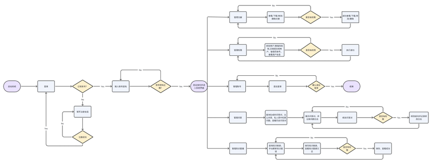

**图 1 总体工程流图**

**然后概述系统将完成的主要功能。注意：要与 3.1 部分的功能描述一致**

超级管理员和普通管理员有五大模块，如账号管理模块、文献库管理模块、问答对管理模块、知识图谱管理模块、权限管理模块，用户有四个模块，账号管理模块、文献库管理模块、问答对管理模块、知识图谱管理模块。用户可以通过注册获得一个账号，但是普通管理员是不能够注册的，只能由超级管理员授予管理员身份。用户可以且只可以注销自己的账号，普通管理员同用户一样；在超级管理员授权下，普通管理员可以注销用户的账号；超级管理员能够注销管理员账号。

用户可以在登录系统时选择已有帐号登录或者注册新账号，登录后首先可以上传文献，系统将该文献保存到文献库。然后调用模型提取问答对并保存到问答对数据库，再针对问答对提取三元组同时保存到三元组文件中，以备调用。用户最初可以查看过程中保存的文献库与问答对数据库中的数据，但是三元组对任何用户都不可见。之后获取到的三元组文件被调用到知识图谱显示模块，将三元组分出点集和边集可视化显示，并为用户提供手动刷新、导出图谱的接口。其他的权限需管理员授权后才可以使用。最后登出，用户也可以注销自己的账号。

管理员登陆后可以上传文献，操作与用户相同。但是普通管理员在被超级管理员赋予权限下享有对公共文献库和公共问答对数据库的增删查改权限。知识图谱显示模块中，管理员和用户享有相同的功能。最后，管理员特有的功能模块——权限管理，在该模块中，管理员可以查看和修改用户的权限，使得用户可以享有修改或删除自己文献数据库某记录的权限。

超级管理员在登录系统时，只能登录角色为超级管理员的账号，不能注册超级管理员账号。登陆后超级管理员可以上传文献，操作与普通管理员相同。享有对公共文献库和公共问答对修改和删除的特殊权限。知识图谱显示模块中，超级管理员和用户享有相同的功能。在超级管理员权限管理模块中，超级管理员可以查看和修改管理员权限，使管理员可以享有对公共文献库和公共问答对库的删除和修改权限。超级管理员也可以修改用户的身份，使普通用户转变成新的普通管理员。

## 2.2 用户特点

列出本软件的最终用户的特点，充分说明操作人员、维护人员的教育水平和技术专长，以及本软件的预期使用频度。

用户对像：科研工作者或是需要文献分析的学生，仅限于华中农业大学内部人员（要求能使用校园网）

用户需求：需要高效、准确并且时刻更新的信息检索平台

使用频度：预期操作人员会每天皆使用本系统

## 2.3 假定和约束

列出进行本软件开发工作的假定和约束，例如经费限制、开发期限、硬件限制等。即可行性分析，经济、技术可行性。

1.  经济可行性

- 预算限制：项目有一定的预算需求，需要调用学校服务器。

- 成本控制：对系统开发、测试、部署和维护过程中产生的成本进行控制，所有的软件和部署平台都在成本控制内

2.  技术可行性

- 技术栈选择：选择合适的技术栈和工具，包括 python 编程语言、mysql 数据库、知识图谱库。

- 技术团队能力：团队在所选择技术方面应有足够的经验和能力，以确保项目的顺利进行。

- 兼容性：需要确保系统与现有系统的兼容性，特别是与现有的数据存储、知识图谱等的兼容。

- 可扩展性：系统应具有良好的可扩展性，代码以模块化的方式编写，各司其职

# 3 功能需求

## 3.1 功能划分

### 3.1.1 系统功能组成

可以用文字叙述系统由哪些功能组成，需附图说明，如果采用结构化分析方法，可以**附上顶层和 0 层数据流图**，并给予解释说明。如果采用面向对象分析方法，可以附上系统的**总体用例图**，并给予解释说明。对图进行解释，可以在文中使用“xx 系统由 xx 功能组成，如图 2 所示，。。。。”进行叙述。

**文献管理系统：**

1.  文献采集与导入：创建在线数据库，提供导入功能将文献信息整合到系统中。

2.  文献分类与组织：提供对文献进行分类、标签化或者建立文件夹等组织方式，以便用户可以根据需求进行管理和查找。（个人文献库和公共文献库）

3.  文献检索：具备强大的检索功能，使用户能够快速准确地找到需要的文献，支持关键词搜索。

4.  文献查看：提供文献阅读功能，允许用户在系统内直接阅读文献。

**账号管理系统：**

1.  用户注册、登录、退出与注销账号：允许用户进行注册账号，并提供登录功能，以便用户能够访问系统的各项功能。

2.  普通管理员登录、退出与注销账号。

3.  超级管理员登录与退出账号。

**权限管理系统：**

1. 用户角色管理：超级管理员具有最高权限，可以创建、编辑和删除管理员账号，管理员具有管理普通用户的权限，普通用户则只能访问系统提供的基本功能。

2. 用户信息管理：超级管理员和管理员可以查看和编辑用户的基本信息，如用户名、密码、邮箱等，以及用户的权限设置。

3. 密码管理与安全性：提供密码管理功能，包括密码修改、找回密码等，保障用户账号的安全性。

4. 用户权限管理：超级管理员和管理员可以设置不同用户的权限，包括访问权限、操作权限等，以确保用户能够按照其角色的要求合理地使用系统。

5. 账号注销与冻结：超级管理员和管理员可以对用户账号进行注销或冻结操作，以应对违规行为或其他特殊情况。

**问答管理系统：**

1.  问题提交与管理：允许用户提交问题，并提供管理界面用于管理问题，包括发布、编辑、删除等操作。

2.  问题搜索与检索：提供强大的搜索功能，允许用户通过关键词、标签等方式快速定位到相关的问题。

3.  答案生成与展示：根据用户提出的问题，系统能够自动或者手动生成相应的答案，并将答案展示给用户。

4.  知识库管理： 管理系统中的知识库，包括添加、删除、编辑知识库内容等功能。

5.  修改问答对的日志记录

**知识图谱管理系统**

1.  查询知识图谱：该功能允许用户通过输入关键词或提出问题来查询知识图谱中的相关信息。系统将根据用户的查询意图，从知识图谱中智能地检索相关节点和关联信息，并将结果以易于理解和浏览的方式呈现给用户，帮助他们快速获取所需知识。

2.  手动更新知识图谱：该功能允许管理员或授权用户手动触发知识图谱的更新过程。用户可以选择指定更新的范围或特定的数据源，系统将根据用户的选择进行相应的更新操作。这样可以确保知识图谱中的信息始终保持最新和准确。

3.  保存知识图谱为图片：该功能允许用户将当前查看的知识图谱保存为图片格式。用户可以随时通过该功能将知识图谱快速保存下来，方便后续的分享、打印或进一步分析使用。保存的图片将保留图谱的完整结构和节点信息。

4.  查看图谱生成日志：该功能允许用户查看知识图谱生成过程的详细日志记录。系统将记录每次图谱更新的操作步骤、时间和相关信息，用户可以通过查看日志了解图谱生成的历史记录，包括成功生成的图谱数量、失败的原因等，以便及时调整和改进系统的运行。

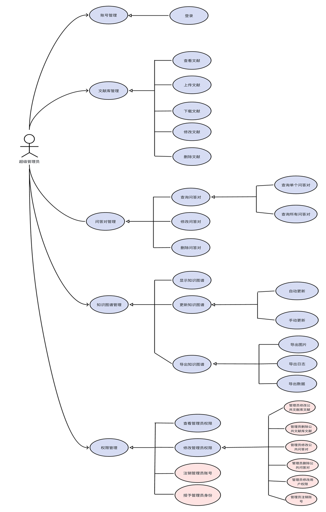

图 2 超级管理员总体用例图

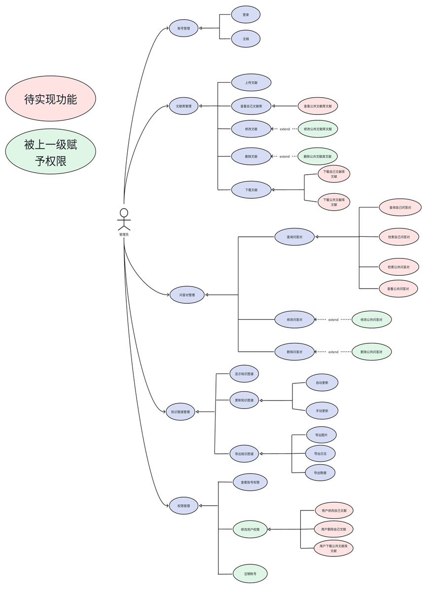

图 3 普通管理员用例图

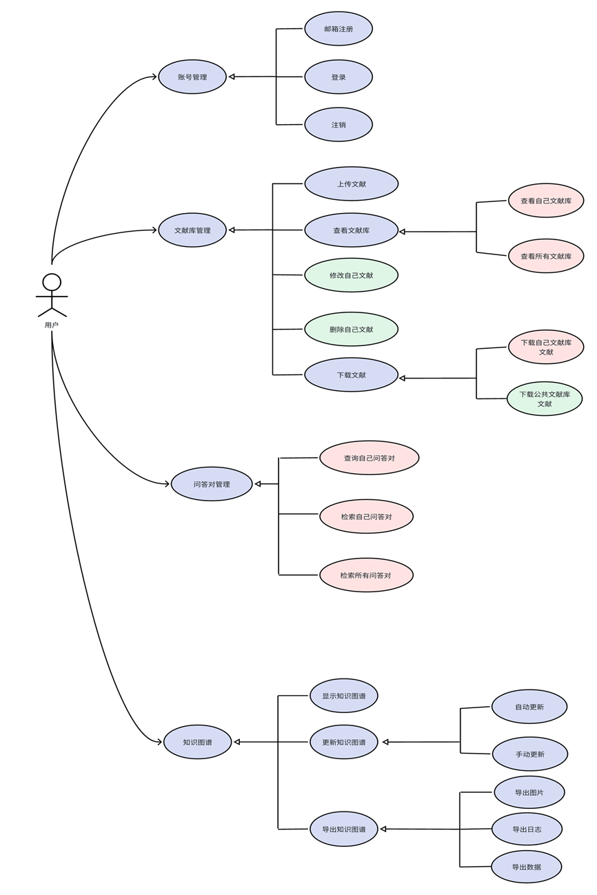

图 4 用户用例图

### 3.1.2 功能编号和优先级

表格形式给出，可参见教材实例的表格。**注意这里的每个功能需要与 3.1.1 的总体图中的功能名称保持一致。**

| 编号 | 名称                       | 优先级   | 描述                                                                                                                                                                                                                 |
| ---- | -------------------------- | -------- | -------------------------------------------------------------------------------------------------------------------------------------------------------------------------------------------------------------------- |
| 1.1  | 文献采集与导入             | 重要     | 创建在线数据库**，**提供导入功能将文献信息整合到系统中                                                                                                                                                               |
| 1.2  | 文献分类与组织             | 重要     | 提供对文献进行分类、标签化或者建立文件夹等组织方式，以便用户可以根据需求进行管理和查找。（个人文献库和公共文献库）                                                                                                   |
| 1.3  | 文献检索                   | 非常重要 | 具备强大的检索功能，使用户能够快速准确地找到需要的文献，支持关键词搜索。                                                                                                                                             |
| 1.4  | 文献查看                   | 重要     | 提供文献阅读功能，允许用户在系统内直接阅读文献。                                                                                                                                                                     |
| 2.1  | 用户注册登录退出注销账号   | 非常重要 | 用户注册、登录、退出与注销账号：允许用户进行注册账号，并提供登录功能，以便用户能够访问系统的各项功能。                                                                                                               |
| 2.2  | 普通管理员登录退出注销账号 | 非常重要 | 普通管理员登录、退出与注销账号。                                                                                                                                                                                     |
| 2.3  | 超级管理员登陆与退出账号   | 非常重要 | 超级管理员登录与退出账号。                                                                                                                                                                                           |
| 3.1  | 用户角色管理               | 一般     | 超级管理员具有最高权限，可以创建、编辑和删除管理员账号，管理员具有管理普通用户的权限，普通用户则只能访问系统提供的基本功能。                                                                                         |
| 3.2  | 用户信息管理               | 一般     | 超级管理员和管理员可以查看和编辑用户的基本信息，如用户名、密码、邮箱等，以及用户的权限设置。                                                                                                                         |
| 3.3  | 密码管理与安全性           | 重要     | 提供密码管理功能，包括密码修改、找回密码等，保障用户账号的安全性。                                                                                                                                                   |
| 3.4  | 用户权限管理               | 一般     | 超级管理员和管理员可以设置不同用户的权限，包括访问权限、操作权限等，以确保用户能够按照其角色的要求合理地使用系统。                                                                                                   |
| 3.5  | 账号注销与冻结             | 一般     | 超级管理员和管理员可以对用户账号进行注销或冻结操作，以应对违规行为或其他特殊情况。                                                                                                                                   |
| 4.1  | 问题提交与管理             | 重要     | 允许用户提交问题，并提供管理界面用于管理问题，包括发布、编辑、删除等操作。                                                                                                                                           |
| 4.2  | 问题搜索与检索             | 重要     | 提供强大的搜索功能，允许用户通过关键词、标签等方式快速定位到相关的问题。                                                                                                                                             |
| 4.3  | 答案生成与展示             | 重要     | 根据用户提出的问题，系统能够自动或者手动生成相应的答案，并将答案展示给用户。                                                                                                                                         |
| 4.4  | 知识库管理                 | 重要     | 管理系统中的知识库，包括添加、删除、编辑知识库内容等功能。                                                                                                                                                           |
| 4.5  | 修改问答对的日志记录       | 一般     | 修改问答对的日志记录                                                                                                                                                                                                 |
| 5.1  | 查询知识图谱               | 重要     | 该功能允许用户通过输入关键词或提出问题来查询知识图谱中的相关信息。系统将根据用户的查询意图，从知识图谱中智能地检索相关节点和关联信息，并将结果以易于理解和浏览的方式呈现给用户，帮助他们快速获取所需知识。           |
| 5.2  | 手动更新知识图谱           | 一般     | 该功能允许管理员或授权用户手动触发知识图谱的更新过程。用户可以选择指定更新的范围或特定的数据源，系统将根据用户的选择进行相应的更新操作。这样可以确保知识图谱中的信息始终保持最新和准确。                             |
| 5.3  | 保存知识图谱为图片         | 一般     | 该功能允许用户将当前查看的知识图谱保存为图片格式。用户可以随时通过该功能将知识图谱快速保存下来，方便后续的分享、打印或进一步分析使用。保存的图片将保留图谱的完整结构和节点信息。                                     |
| 5.4  | 查看知识图谱生成日志       | 一般     | 该功能允许用户查看知识图谱生成过程的详细日志记录。系统将记录每次图谱更新的操作步骤、时间和相关信息，用户可以通过查看日志了解图谱生成的历史记录，包括成功生成的图谱数量、失败的原因等，以便及时调整和改进系统的运行。 |

**表 1 功能编号与优先级表**

## 3.2 功能描述

依次对 3.1.1 的各个子功能详细描述。每个子功能分小节描述。

**每个子功能需要描述以下内容：首先用文字叙述该功能的定义（即该功能做什么），其次采取结构化分析方法或面向对象分析方法进行功能建模。**

**（1）xx 功能**

**对该功能的文字描述**

**采取结构化分析方法或面向对象分析方法进行功能建模的各种图例以及文字说明。**

**（2）xx 功能**

**…….**

**具体的建模方法：**

**结构化方法**：构建数据流图，需要逐级细化功能，构建子图。叶子加工（不能再分解的功能）采用 IPO（输入-处理-输出）方式给出具体的描述（数据字典中不再描述）；

**面向对象方法**：

1. 对功能建模：构建用例图，需要给出主要用例场景描述（正常、异常、替代分支），并辅以 UML 动态图（如活动图）给予补充说明。2. 对领域业务建模：从用例描述中应用名词抽取、CRC 卡片等方法建模实体类，建立业务类图模型（包括实体类、边界类、控制类等分析类，类的属性与操作，类与类之间的关系。注意：类的具体操作细节可以到设计阶段进行精化）。3. 系统动态行为建模：使用 UML 动态图（如顺序图、通信图等）对对象间交互行为进行动态建模，进一步精化用例实现。

<h3>场景描述——文献采集与导入</h3>

| 用例名称         | 文献采集与导入                         |
| ---------------- | -------------------------------------- |
| 范围             | 文献管理系统子模块                     |
| 级别             | 重要                                   |
| 主要参与者       | 用户                                   |
| 涉众及其关注点   | 将用户上传的文献导入到数据库中进行管理 |
| 前置条件         | 用户导入若干文献                       |
| 主成功场景       | 用户上传文献成功，并同步到文献数据库   |
| 拓展             | 文献上传失败，不支持的格式             |
| 技术和数据变元素 | 文献数据库                             |
| 发生频率         | 经常                                   |

<h3>场景描述——文献分类与组织</h3>

| 用例名称         | 文献分类与组织                                                                       |
| ---------------- | ------------------------------------------------------------------------------------ |
| 范围             | 文献管理系统子模块                                                                   |
| 级别             | 重要                                                                                 |
| 主要参与者       | 管理员                                                                               |
| 涉众及其关注点   | 管理员将用户上传的文献在文献数据库中进行分类管理                                     |
| 前置条件         | 用户导入若干文献                                                                     |
| 主成功场景       | 用户上传文献成功，并同步到文献数据库，管理员根据文献数据库中文献，进行重新分类与组织 |
| 拓展             | 1.将文献归到用户个人文献库                                                           |
|                  | 2.将文献归到系统公共文献库                                                           |
| 技术和数据变元素 | 文献数据库                                                                           |
| 发生频率         | 偶尔                                                                                 |

<h3>场景描述——文献检索</h3>

| 用例名称         | 文献检索                                                             |
| ---------------- | -------------------------------------------------------------------- |
| 范围             | 文献管理系统子模块                                                   |
| 级别             | 非常重要                                                             |
| 主要参与者       | 用户                                                                 |
| 涉众及其关注点   | 用户检索系统中的文献                                                 |
| 前置条件         | 用户输入文献关键词进行检索                                           |
| 主成功场景       | 用户在交互界面搜索框数据若干关键词，检索文献数据库信息，返回检索信息 |
| 拓展             | 若文献库中无相关文献，则返回“NULL”                                   |
| 技术和数据变元素 | 文献数据库                                                           |
| 发生频率         | 经常                                                                 |

<h3>场景描述——文献查看</h3>

| 用例名称         | 文献查看                       |
| ---------------- | ------------------------------ |
| 范围             | 文献管理系统子模块             |
| 级别             | 重要                           |
| 主要参与者       | 用户                           |
| 涉众及其关注点   | 允许用户直接在系统中查看文献   |
| 前置条件         | 文献数据中存在用户拟查看的文献 |
| 主成功场景       | 用户成功在系统中在线查看文献   |
| 拓展             | 无                             |
| 技术和数据变元素 | 文献数据库                     |
| 发生频率         | 经常                           |

<h3>场景描述——用户注册，登录，退出，注销账号</h3>

| 用例名称         | 用户注册                                                       |
| ---------------- | -------------------------------------------------------------- |
| 范围             | 账号管理系统子模块                                             |
| 级别             | 非常重要                                                       |
| 主要参与者       | 用户                                                           |
| 涉众及其关注点   | 用户                                                           |
| 前置条件         | 用户尚未注册账号                                               |
| 主成功场景       | 用户输入注册账号信息（账号，密码，验证码），提示注册成功信息。 |
| 拓展             | 1.账号已存在，重新设定账号                                     |
|                  | 2.验证码错误，重新收取验证码                                   |
| 技术和数据变元素 | 用户数据库                                                     |
| 发生频率         | 偶尔                                                           |

| 用例名称         | 用户登录                                       |
| ---------------- | ---------------------------------------------- |
| 范围             | 账号管理系统子模块                             |
| 级别             | 非常重要                                       |
| 主要参与者       | 用户                                           |
| 涉众及其关注点   | 用户                                           |
| 前置条件         | 用户已经注册账号                               |
| 主成功场景       | 用户输入登录账号信息（账号，密码），登录成功。 |
| 拓展             | 1.账号错误，检查账号拼写错误                   |
|                  | 2.密码错误，检查密码                           |
| 技术和数据变元素 | 用户数据库                                     |
| 发生频率         | 经常                                           |

| 用例名称         | 用户退出                   |
| ---------------- | -------------------------- |
| 范围             | 账号管理系统子模块         |
| 级别             | 一般                       |
| 主要参与者       | 用户                       |
| 涉众及其关注点   | 用户                       |
| 前置条件         | 用户已经登录账号           |
| 主成功场景       | 用户在交互界面点击退出按钮 |
| 拓展             | 退出失败，该用户已退出     |
| 技术和数据变元素 | 用户数据库                 |
| 发生频率         | 较少                       |

| 用例名称         | 用户注销                                               |
| ---------------- | ------------------------------------------------------ |
| 范围             | 账号管理系统子模块                                     |
| 级别             | 一般                                                   |
| 主要参与者       | 用户                                                   |
| 涉众及其关注点   | 用户                                                   |
| 前置条件         | 用户已经创建并登录账号                                 |
| 主成功场景       | 用户在交互界面点击注销账号，点击确认，注销用户账号成功 |
| 拓展             | 1.超级管理员账号不允许注销                             |
| 技术和数据变元素 | 用户数据库                                             |
| 发生频率         | 极少                                                   |

<h3>场景描述-用户角色管理</h3>

| 用例名称                     | 用户角色管理                               |
| ---------------------------- | ------------------------------------------ |
| 范围                         | 权限管理系统子模块                         |
| 级别                         | 一般                                       |
| 主要参与者                   | 超级管理员，管理员                         |
| 涉众及其关注点               | 用户，管理员，超级管理员                   |
| 前置条件                     | 登录超级管理员/管理员账号                  |
| 主成功场景                   | 1.超级管理员可以创建，编辑和删除管理员账号 |
| 2.管理员可以管理普通用户账号 |
| 拓展                         | 无法创建超级管理员和管理员账号             |
| 技术和数据变元素             | 角色数据库                                 |
| 发生频率                     | 较少                                       |

<h3>场景描述-用户信息管理</h3>

| 用例名称         | 用户信息管理                                                                               |
| ---------------- | ------------------------------------------------------------------------------------------ |
| 范围             | 权限管理系统子模块                                                                         |
| 级别             | 一般                                                                                       |
| 主要参与者       | 超级管理员，管理员                                                                         |
| 涉众及其关注点   | 用户，管理员，超级管理员                                                                   |
| 前置条件         | 登录超级管理员/管理员账号                                                                  |
| 主成功场景       | 超级管理员和管理员可以查看和编辑用户的基本信息，如用户名，密码，邮箱等，以及用户的权限设置 |
| 拓展             | 无法修改用户密码信息                                                                       |
| 技术和数据变元素 | 角色数据库                                                                                 |
| 发生频率         | 较少                                                                                       |

<h3>场景描述-密码管理</h3>

| 用例名称         | 密码管理                                         |
| ---------------- | ------------------------------------------------ |
| 范围             | 权限管理系统子模块                               |
| 级别             | 比较重要                                         |
| 主要参与者       | 所有用户                                         |
| 涉众及其关注点   | 无                                               |
| 前置条件         | 用户登录账号                                     |
| 主成功场景       | 在交互界面进行密码操作，包括密码修改，找回密码。 |
| 拓展             | 无                                               |
| 技术和数据变元素 | 角色数据库                                       |
| 发生频率         | 较少                                             |

<h3>场景描述-用户权限管理</h3>

| 用例名称         | 用户权限管理                                                         |
| ---------------- | -------------------------------------------------------------------- |
| 范围             | 权限管理系统子模块                                                   |
| 级别             | 比较重要                                                             |
| 主要参与者       | 超级管理员，管理员                                                   |
| 涉众及其关注点   | 用户，管理员，超级管理员                                             |
| 前置条件         | 登录超级管理员/管理员账号                                            |
| 主成功场景       | 超级管理员和管理员可以设置用户的不同权限，包括访问权限，操作权限等。 |
| 拓展             | 无                                                                   |
| 技术和数据变元素 | 角色数据库                                                           |

<h3>场景描述-账号注销与冻结</h3>

| 用例名称         | 账号注销与冻结                                         |
| ---------------- | ------------------------------------------------------ |
| 范围             | 权限管理系统子模块                                     |
| 级别             | 比较重要                                               |
| 主要参与者       | 超级管理员，管理员                                     |
| 涉众及其关注点   | 用户，管理员，超级管理员                               |
| 前置条件         | 登录超级管理员/管理员账号                              |
| 主成功场景       | 超级管理员和管理员可以对普通用户账号进行注销或冻结操作 |
| 拓展             | 无法注销和冻结超级管理员账号                           |
| 技术和数据变元素 | 角色数据库                                             |
| 发生频率         | 极少                                                   |

<h3>场景描述-问答管理</h3>

| 用例名称         | 问题提交与管理                                                       |
| ---------------- | -------------------------------------------------------------------- |
| 范围             | 问答管理系统子模块                                                   |
| 级别             | 重要                                                                 |
| 主要参与者       | 用户                                                                 |
| 涉众及其关注点   | 全体用户                                                             |
| 前置条件         | 用户有提交问题权限                                                   |
| 主成功场景       | 用户提交问题，并提供管理界面用于管理问题，包括发布，编辑，删除等操作 |
| 拓展             | 无                                                                   |
| 技术和数据变元素 | 问答数据库                                                           |
| 发生频率         | 经常                                                                 |

<h3>场景描述-问题检索与搜索</h3>

| 用例名称         | 问题检索与搜索                                 |
| ---------------- | ---------------------------------------------- |
| 范围             | 问答管理系统子模块                             |
| 级别             | 重要                                           |
| 主要参与者       | 用户                                           |
| 涉众及其关注点   | 全体用户                                       |
| 前置条件         | 用户有检索问题权限                             |
| 主成功场景       | 用户通过关键词，标签等方式快速定位到相关的问题 |
| 拓展             | 无                                             |
| 技术和数据变元素 | 问答数据库                                     |
| 发生频率         | 经常                                           |

<h3>场景描述-答案生成与展示</h3>

| 用例名称         | 答案生成与展示                                                             |
| ---------------- | -------------------------------------------------------------------------- |
| 范围             | 问答管理系统子模块                                                         |
| 级别             | 比较重要                                                                   |
| 主要参与者       | 用户                                                                       |
| 涉众及其关注点   | 系统                                                                       |
| 前置条件         | 用户提交问题                                                               |
| 主成功场景       | 根据用户提交的问题，系统能够自动或者手动生成相应的答案，并将答案展示给用户 |
| 拓展             | 查询不到相关问题，则返回“无”                                               |
| 技术和数据变元素 | 问答数据库                                                                 |
| 发生频率         | 经常                                                                       |

<h3>场景描述-知识库管理</h3>

| 用例名称         | 知识库管理                                               |
| ---------------- | -------------------------------------------------------- |
| 范围             | 问答管理系统子模块                                       |
| 级别             | 一般                                                     |
| 主要参与者       | 管理员                                                   |
| 涉众及其关注点   | 管理员管理知识库                                         |
| 前置条件         | 登录有相关权限账号                                       |
| 主成功场景       | 管理系统中的知识库，包括添加，删除，编辑知识库内容等功能 |
| 拓展             | 无法删除特定内容                                         |
| 技术和数据变元素 | 问答数据库                                               |
| 发生频率         | 偶尔                                                     |

<h3>场景描述-修改问答对的日志记录</h3>

| 用例名称         | 修改问答对的日志记录   |
| ---------------- | ---------------------- |
| 范围             | 问答管理系统子模块     |
| 级别             | 一般                   |
| 主要参与者       | 管理员                 |
| 涉众及其关注点   | 日志记录               |
| 前置条件         | 登录有相关权限账号     |
| 主成功场景       | 修改问答对的日志记录   |
| 拓展             | 修改失败，日期格式错误 |
| 技术和数据变元素 | 问答数据库             |
| 发生频率         | 极少                   |

<h3>场景描述-查询知识图谱</h3>

| 用例名称         | 查询知识图谱                                                                                                                                                         |
| ---------------- | -------------------------------------------------------------------------------------------------------------------------------------------------------------------- |
| 范围             | 知识图谱系统子模块                                                                                                                                                   |
| 级别             | 重要                                                                                                                                                                 |
| 主要参与者       | 用户                                                                                                                                                                 |
| 涉众及其关注点   | 全体用户                                                                                                                                                             |
| 前置条件         | 用户有查询知识图谱权限                                                                                                                                               |
| 主成功场景       | 用户通过输入关键词或提出问题来查询知识图谱中的相关信息。系统将根据用户的查询意图，从知识图谱中智能地检索相关节点和关联信息，并将结果以易于理解和浏览的方式呈现给用户 |
| 拓展             | 无                                                                                                                                                                   |
| 技术和数据变元素 | 知识图谱数据库                                                                                                                                                       |
| 发生频率         | 经常                                                                                                                                                                 |

<h3>场景描述-手动更新知识图谱</h3>

| 用例名称         | 手动更新知识图谱                                                                                                                                                               |
| ---------------- | ------------------------------------------------------------------------------------------------------------------------------------------------------------------------------ |
| 范围             | 知识图谱系统子模块                                                                                                                                                             |
| 级别             | 一般                                                                                                                                                                           |
| 主要参与者       | 用户                                                                                                                                                                           |
| 涉众及其关注点   | 有权限用户                                                                                                                                                                     |
| 前置条件         | 用户有相应的权限                                                                                                                                                               |
| 主成功场景       | 管理员或授权用户手动触发知识图谱的更新过程。用户可以选择指定更新的范围或特定的数据源，系统将根据用户的选择进行相应的更新操作。这样可以确保知识图谱中的信息始终保持最新和准确。 |
| 拓展             | 无                                                                                                                                                                             |
| 技术和数据变元素 | 知识图谱数据库                                                                                                                                                                 |
| 发生频率         | 经常                                                                                                                                                                           |

<h3>场景描述-保存知识图谱为图片</h3>

| 用例名称         | 保存知识图谱为图片                                                                                                                                                     |
| ---------------- | ---------------------------------------------------------------------------------------------------------------------------------------------------------------------- |
| 范围             | 知识图谱系统子模块                                                                                                                                                     |
| 级别             | 一般                                                                                                                                                                   |
| 主要参与者       | 用户                                                                                                                                                                   |
| 涉众及其关注点   | 所有用户                                                                                                                                                               |
| 前置条件         | 有相应的知识图谱                                                                                                                                                       |
| 主成功场景       | 用户将当前查看的知识图谱保存为图片格式。用户可以随时通过该功能将知识图谱快速保存下来，方便后续的分享、打印或进一步分析使用。保存的图片将保留图谱的完整结构和节点信息。 |
| 拓展             | 无                                                                                                                                                                     |
| 技术和数据变元素 | 知识图谱数据库                                                                                                                                                         |
| 发生频率         | 偶尔                                                                                                                                                                   |

<h3>场景描述-查看知识图谱生成日志</h3>

| 用例名称         | 查看知识图谱生成日志                                                                                                                                                                                       |
| ---------------- | ---------------------------------------------------------------------------------------------------------------------------------------------------------------------------------------------------------- |
| 范围             | 知识图谱系统子模块                                                                                                                                                                                         |
| 级别             | 一般                                                                                                                                                                                                       |
| 主要参与者       | 用户                                                                                                                                                                                                       |
| 涉众及其关注点   | 全体用户                                                                                                                                                                                                   |
| 前置条件         | 无                                                                                                                                                                                                         |
| 主成功场景       | 用户查看知识图谱生成过程的详细日志记录。系统将记录每次图谱更新的操作步骤、时间和相关信息，用户可以通过查看日志了解图谱生成的历史记录，包括成功生成的图谱数量、失败的原因等，以便及时调整和改进系统的运行。 |
| 拓展             | 无                                                                                                                                                                                                         |
| 技术和数据变元素 | 知识图谱数据库                                                                                                                                                                                             |
| 发生频率         | 较少                                                                                                                                                                                                       |

业务类图：

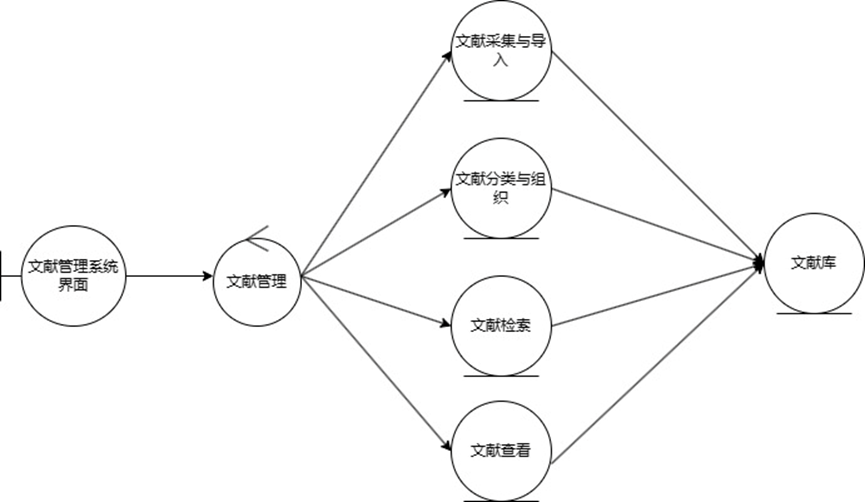

### 3.2.1 用户管理

**1.用户**

（1）用户注册：用户注册：用户可以在系统中注册一个新的账号。注册过 程中，用户需要提供必要的个人信息，并选择一个唯一的用户名和密码。

（2）用户登录：已注册的用户可以通过输入正确的用户名和密码进行登录。 登录功能通过核对用户提供的凭据来验证用户的身份。成功登录后，用 户将获得访问系统部分功能的权限。

（3）用户注销：用户可以选择注销系统中的账号。注销账号将会使用户失 去对系统的访问权限，并删除与其账号相关的全部个人信息。

**2.管理员**

（1）管理员登录：系统允许管理员通过输入正确的账号和密码进行登录。 管理员登录功能通过核对管理员提供的凭据来验证其身份。成功登录后， 管理员将获得系统中较高的权限和访问权，可以进行一系列管理操作。

（2）管理员注销：管理员具有注销用户账号的特殊权限。注销自己的账号 将会使管理员失去对系统的访问权限，并且相关的个人信息也会被删除， 该操作具有安全风险。当管理员发现某个用户账号存在违规行为、安全 风险或其他问题时，可以选择注销该用户的账号。注销账号的过程将会 使该用户失去对系统的访问权限，并删除与其账号相关的个人信息。

**3.超级管理员**

（1）超级管理员登录：系统允许超级管理员通过输入正确的账号和密码进 行登录。超级管理员登录功能通过核对超级管理员提供的凭据来验证其 身份。成功登录后，管理员将获得系统中最高的权限和访问权，可以进 行所有管理操作。

（2）超级管理员注销：超级管理员具有注销用户和管理员账号的特殊权限。 当超级管理员发现某个用户或者管理员账号存在违规行为、安全风险或 其他问题时，可以选择注销该用户或管理员的账号。注销账号的过程将 会使该用户失去对系统的访问权限，并删除与其账号相关的个人信息。

### 3.2.2 文献库管理

**1.用户**

（1）上传文献：注册用户可以通过系统界面将自己的文献上传到系统中。 上传的文献会被系统保存到文献库，并在后台调用模型，自动提取出问 答对和三元组进行保存，将数据提供给图谱显示模块。

（2）查询文献库：

查询自己文献库：用户可以在系统中进行查询，以获取所有自己上传的 文献。用户可以点击特定的单个文献，以查看该文献的具体信息， 例如文献名、文献内容等

查询所有文献库：用户可以在系统中进行查询，以获取所有已上传的文 献。由于文献数量可能很大，系统采用了分页显示的方式，每页显 示固定数量的文献结果，通过翻页查看更多文献。

（3）删除文献（需被管理员赋予）

用户仅有删除自己文献的权限，同时级联删除问答对数据库与三元组文 件。

（4）修改文献（需被管理员赋予）

用户仅有修改自己文献的权限，可对文献的信息和内容进行修改，以及 上传新的版本。

（5）下载文献

下载自己文献库文献：用户可以通过系统界面将自己文献库的文献 下载。

下载公共文献库文献（需被管理员赋予）：用户可以通过系统界面将公 共文献库的文献下载。

**2.管理员**

（1）上传文献：同用户

（2）查询文献：同用户

（3）删除文献：

删除自己文献：同用户

删除公共文献库文献（需被超级管理员赋予权限）：超级管理员可 以赋予管理员删除公共文献库文献的权限。当超级管理员认为某 个管理员有权删除公共文献库文献时，可以为该管理员授权。授 权后，管理员将能够删除相应的文献，同时级联删除问答对数据 库与三元组文件。

（4）修改文献：

修改自己文献：同用户

修改公共文献库文献（需被超级管理员赋予权限）：超级管理员具 备赋管理员修改公共文献库文献的权限。当管理员认为某个管理 员有权对公共库文献部分文献进行修改时，可以为该管理员授权。 授权后，管理员将获得相应的编辑权限，可以对文献的信息或内 容进行修改，以及上传新的版本。

（5）下载文献：同用户

**3.超级管理员**

（1）上传文献：同用户

（2）查询文献：同用户

（3）删除文献：

删除自己文献：同用户

删除公共文献库文献：超级管理员有删除文献的权限。可以删除相 应的文献，使文献及其相关的问答对、三元组从系统中彻底移除。

（4）修改文献：

修改自己文献：同用户。

修改公共文献库文献：超级管理员有相应的编辑权限，可以对文献 的信息或内容进行修改。

（5）下载文献：同用户

### 3.2.3 问答对管理

**1.用户**

（1）查询问答对：用户可以通过系统界面查询并浏览自己问答对的信息。 系统将这些问答对以分页的形式展示，便于用户进行查看和筛选。 用户可以翻页浏览问答对，全面了解自己问答对内容。

（2）检索问答对：

检索自己问答对：用户可以在系统界面上输入问题，并进行查询操作。 系统将根据输入的问题，在自己问答对库中进行匹配，并返回与问 题相关的问答对列表。为了方便管理和浏览，系统将结果以分页的 形式展示，用户可以逐页查看相关的自己问答对。

检索公共问答对：用户可以在系统界面上输入问题，并进行查询操作。 系统将根据输入的问题，在公共问答对库中进行匹配，并返回与问 题相关的问答对列表。为了方便管理和浏览，系统将结果以分页的 形式展示，用户可以逐页查看相关的公共问答对。

**2.管理员**

（1）查询问答对：同用户。

（2）检索问答对：同用户。

（3）删除问答对（需被超级管理员赋予权限）：超级管理员具备赋予管 理员删除问答对的权限。当超级管理员认为某个管理员有权删除 相关的问答对时，可以为该管理员授权。授权后，管理员将能够 删除问答对并级联修改相关的三元组。

（4）修改问答对（需被超级管理员赋予权限）：超级管理员还可以赋予 管理员修改问答对的权限。当超级管理员认为某个管理员有权修 改问答对时，可以为该管理员授权。授权后，管理员将获得相应 的编辑权限，可以对问答对和相应的三元组的信息或内容进行修 改，以及上传新的版本。

**3.超级管理员**

（1）查询问答对：同用户。

（2）检索问答对：同用户。

（3）删除问答对：超级管理员有删除问答对的权限。删除相应的问答 对，使该问答对和从该问答对该问答对提取的三元组从数据库中移 除。

（4）修改问答对：超级管理员有相应的编辑权限，可以对问答对的信 息或内容进行修改。

### 3.2.4 知识图谱管理

**1.用户**

（1）查看知识图谱：用户可以通过系统提供的知识图谱界面来浏览和查看 知识图谱。知识图谱以图形的形式展示，可以呈现知识之间的关联和连 接。用户可以使用界面上的操作按钮来进行放大、缩小、平移等操作， 以便更好地观察图谱中的内容。

（2）更新知识图谱

自动更新：系统内部会自动更新知识图谱，从相关数据源中拉取最新的 数据，并重新生成和显示知识图谱。

手动更新：用户可以选择手动更新知识图谱，以便获取最新的知识信息。 在知识图谱界面上，用户可以点击更新按钮触发手动更新操作。系 统将根据用户的请求，从相关数据源中拉取最新的数据，并重新生 成和显示知识图谱。这样，用户可以确保自己获取的知识图谱是最 新的

（3）导出知识图谱：用户可以选择将知识图谱导出为 PNG 或 JPG 格式的 图片文件，以便在其他应用或文档中使用。在知识图谱界面上，用户可 以点击导出按钮，并选择要导出的文件格式。系统将生成相应格式的图 片文件，使用户能够保存和使用知识图谱的静态快照。

2.  **管理员**

> 同用户。

**3.超级管理员**

> 同用户。

### 3.2.5 权限管理

**1.管理员**

（1）查看账号权限

管理员具有查看自己以及所有用户账号所具有权限

（2）修改用户权限（需被超级管理员赋予）

用户修改自己文献的权限：管理员可以赋予用户修改自己文献的权 限

用户删除自己文献的权限：管理员可以赋予用户删除自己文献的 权限

用户下载公共文献库文献的权限：管理员可以赋予用户下载公共文 献库文献的权限

（3）注销用户账户权限（需被超级管理员赋予）

当管理员被超级管理员赋予注用户权限后，管理员具有注销用户账 号的特殊权限。

**2.超级管理员**

（1）查看管理员权限：超级管理员能够查看所有管理员账号所具有权限

（2）修改管理员权限：超级管理员具有修改管理员权限的权限。当管理 员认为某个管理员的权限需要进行调整时，可以选择该管理员，并 在系统界面上进行修改，修改后的权限将立即生效，并影响管理员 在系统中的操作权限。

（3）注销管理员账户：超级管理员具有注销管理员账号的特殊权限。

（4）授予管理员身份：超级管理员可以将用户角色提升为管理员，赋予 其管理系统的权限。当管理员发现某个用户在系统中表现良好或需 要承担更多的管理责任时，可以给予其管理员权限。授予管理员权 限之后，该用户将能够执行更高级别的管理操作，如删改数据库、 修改用户权限等。

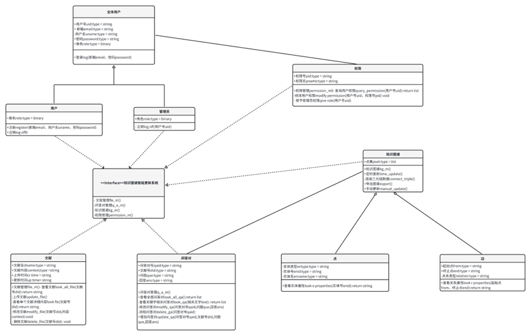

**文献管理系统类-A**

| **Class**：文献采集与导入类                                    |                  |
| -------------------------------------------------------------- | ---------------- |
| **说明**：创建在线数据库，提供导入功能将文献信息整合到系统中。 |                  |
| **职责**：                                                     | **协作类**：     |
| 创建在线数据库                                                 | 文献分类与组织类 |
| 导入文献信息                                                   |                  |

**文献管理系统类-B**

| **Class**：文献分类与组织类                                                                                                  |                  |
| ---------------------------------------------------------------------------------------------------------------------------- | ---------------- |
| **说明**：提供对文献进行分类、标签化或者建立文件夹等组织方式，以便用户可以根据需求进行管理和查找。（个人文献库和公共文献库） |                  |
| **职责**：                                                                                                                   | **协作类**：     |
| 文献分类，标签化                                                                                                             | 文献采集与导入类 |
| 组织管理文献存放                                                                                                             |                  |

**文献管理系统类-C**

| **Class**：文献检索类                                                              |              |
| ---------------------------------------------------------------------------------- | ------------ |
| **说明**：具备强大的检索功能，使用户能够快速准确地找到需要的文献，支持关键词搜索。 |              |
| **职责**：                                                                         | **协作类**： |
| 提供文献检索功能                                                                   | 无           |

**文献管理系统类-D**

| **Class**：文献查看类                                      |              |
| ---------------------------------------------------------- | ------------ |
| **说明**：提供文献阅读功能，允许用户在系统内直接阅读文献。 |              |
| **职责**：                                                 | **协作类**： |
| 提供文献阅读功能                                           | 文献检索类   |

**用户管理系统类-A**

| **Class**：用户注册与登录类                                                      |                |
| -------------------------------------------------------------------------------- | -------------- |
| **说明**：允许用户进行注册账号，并提供登录功能，以便用户能够访问系统的各项功能。 |                |
| **职责**：                                                                       | **协作类**：   |
| 管理用户注册                                                                     | 用户角色管理类 |
| 管理用户登录                                                                     |                |

\*\* \*\*

**用户管理系统类-B**

| **Class：用户信息管理类**                                                                              |                |
| ------------------------------------------------------------------------------------------------------ | -------------- |
| **说明：超级管理员和管理员可以查看和编辑用户的基本信息，如用户名、密码、邮箱等，以及用户的权限设置。** |                |
| **职责：**                                                                                             | **协作类：**   |
| **查看和编辑用户信息**                                                                                 | **密码管理类** |

\*\* \*\*

**用户管理系统类-C**

| **Class**：密码管理类                                                        |              |
| ---------------------------------------------------------------------------- | ------------ |
| **说明**：提供密码管理功能，包括密码修改、找回密码等，保障用户账号的安全性。 |              |
| **职责**：                                                                   | **协作类**： |
| 找回密码                                                                     | **无**       |
| 密码修改                                                                     |              |

**用户管理系统类-D**

| **Class**：用户注册与注销类                                                                  |              |
| -------------------------------------------------------------------------------------------- | ------------ |
| **说明**：超级管理员和管理员可以对用户账号进行注销或冻结操作，以应对违规行为或其他特殊情况。 |              |
| **职责**：                                                                                   | **协作类**： |
| 注销和冻结操作                                                                               | 无           |

**权限管理系统类-A**

| **Class**：用户角色管理类                                                                                                     |                  |
| ----------------------------------------------------------------------------------------------------------------------------- | ---------------- |
| 超级管理员具有最高权限，可以创建、编辑和删除管理员账号， 管理员具有管理普通用户的权限，普通用户则只能访问系统提供的基本功能。 |                  |
| **职责**：                                                                                                                    | **协作类**：     |
| 创建管理员账号                                                                                                                | 用户注册与登录类 |
| 编辑管理员账号                                                                                                                |                  |
| 删除管理员账号                                                                                                                |                  |

**权限管理系统类-B**

| **Class**：用户权限管理类                                                                                                    |                |
| ---------------------------------------------------------------------------------------------------------------------------- | -------------- |
| **说明**：超级管理员和管理员可以设置不同用户的权限，包括访问权限、操作权限等，以确保用户能够按照其角色的要求合理地使用系统。 |                |
| **职责**：                                                                                                                   | **协作类**：   |
| 设置不同用户权限                                                                                                             | 用户角色管理类 |

**问答管理系统类-A**

| **Class**：问题提交与管理类                                                          |              |
| ------------------------------------------------------------------------------------ | ------------ |
| **说明**：允许用户提交问题，并提供管理界面用于管理问题，包括发布、编辑、删除等操作。 |              |
| **职责**：                                                                           | **协作类**： |
| 管理用户问题提交                                                                     | 无           |

**问答管理系统类-B**

| **Class**：问题搜索与检索类                                              |              |
| ------------------------------------------------------------------------ | ------------ |
| 提供强大的搜索功能，允许用户通过关键词、标签等方式快速定位到相关的问题。 |              |
| **职责**：                                                               | **协作类**： |
| 问题检索                                                                 | 无           |

**问答管理系统类-C**

| **Class**：答案生成与展示类                                                            |                  |
| -------------------------------------------------------------------------------------- | ---------------- |
| **说明**：根据用户提出的问题，系统能够自动或者手动生成相应的答案，并将答案展示给用户。 |                  |
| **职责**：                                                                             | **协作类**：     |
| 生成答案并展示                                                                         | 问题搜索与检索类 |

**问答管理系统类-D**

| **Class**：知识库管理类                                              |                  |
| -------------------------------------------------------------------- | ---------------- |
| **说明**：管理系统中的知识库，包括添加、删除、编辑知识库内容等功能。 |                  |
| **职责**：                                                           | **协作类**：     |
| 管理知识库                                                           | 问题提交与管理类 |

**知识图谱管理系统类-A**

| **Class**：查询知识图谱类                                                                                                                                                                                            |              |
| -------------------------------------------------------------------------------------------------------------------------------------------------------------------------------------------------------------------- | ------------ |
| **说明**：该功能允许用户通过输入关键词或提出问题来查询知识图谱中的相关信息。系统将根据用户的查询意图，从知识图谱中智能地检索相关节点和关联信息，并将结果以易于理解和浏览的方式呈现给用户，帮助他们快速获取所需知识。 |              |
| **职责**：                                                                                                                                                                                                           | **协作类**： |
| 检索知识图谱                                                                                                                                                                                                         | 无           |

**知识图谱管理系统类-B**

| **Class**：手动更新知识图谱类                                                                                                                                                                      |                |
| -------------------------------------------------------------------------------------------------------------------------------------------------------------------------------------------------- | -------------- |
| **说明**：该功能允许管理员或授权用户手动触发知识图谱的更新过程。用户可以选择指定更新的范围或特定的数据源，系统将根据用户的选择进行相应的更新操作。这样可以确保知识图谱中的信息始终保持最新和准确。 |                |
| **职责**：                                                                                                                                                                                         | **协作类**：   |
| 更新知识图谱                                                                                                                                                                                       | 查询知识图谱类 |

**知识图谱管理系统类-C**

| **Class**：保存知识图谱为图片类                                                                                                                                                            |              |
| ------------------------------------------------------------------------------------------------------------------------------------------------------------------------------------------ | ------------ |
| **说明**：该功能允许用户将当前查看的知识图谱保存为图片格式。用户可以随时通过该功能将知识图谱快速保存下来，方便后续的分享、打印或进一步分析使用。保存的图片将保留图谱的完整结构和节点信息。 |              |
| **职责**：                                                                                                                                                                                 | **协作类**： |
| 将知识图谱保存为图片形式                                                                                                                                                                   | 无           |

**知识图谱管理系统类-D**

| **Class**：查看图谱生成日志类                                                                                                                                                                                                  |              |
| ------------------------------------------------------------------------------------------------------------------------------------------------------------------------------------------------------------------------------ | ------------ |
| **说明**：该功能允许用户查看知识图谱生成过程的详细日志记录。系统将记录每次图谱更新的操作步骤、时间和相关信息，用户可以通过查看日志了解图谱生成的历史记录，包括成功生成的图谱数量、失败的原因等，以便及时调整和改进系统的运行。 |              |
| **职责**：                                                                                                                                                                                                                     | **协作类**： |
| 查看日志文件                                                                                                                                                                                                                   | 无           |

开发活动图：

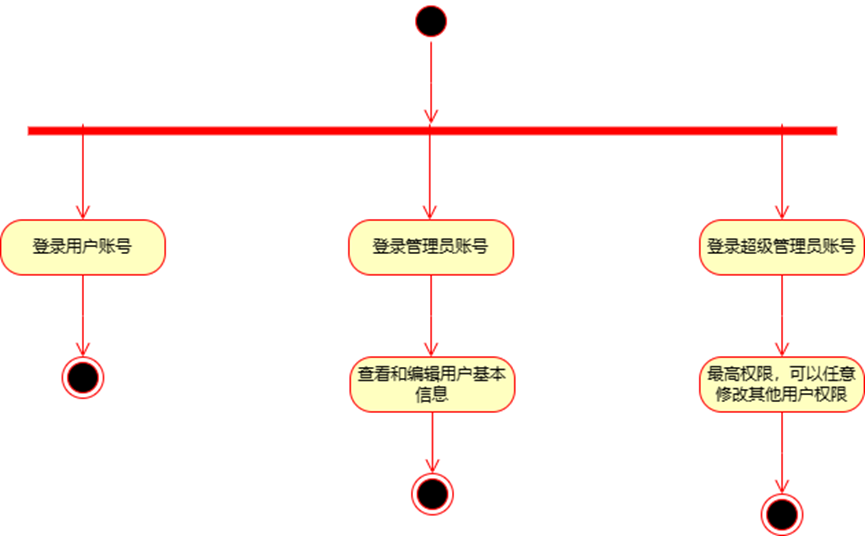

# 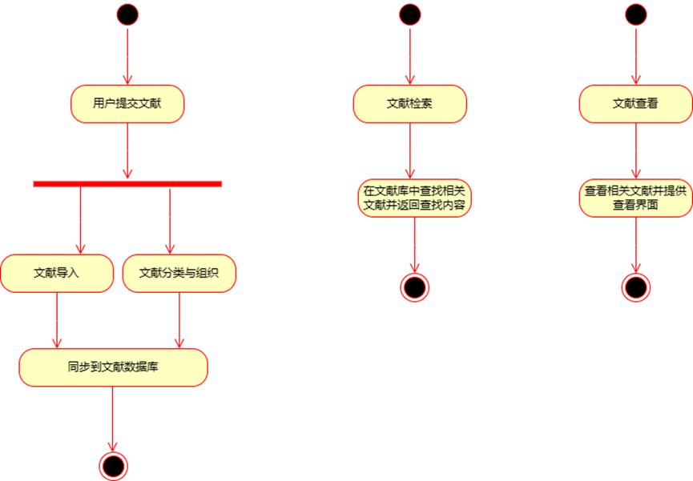

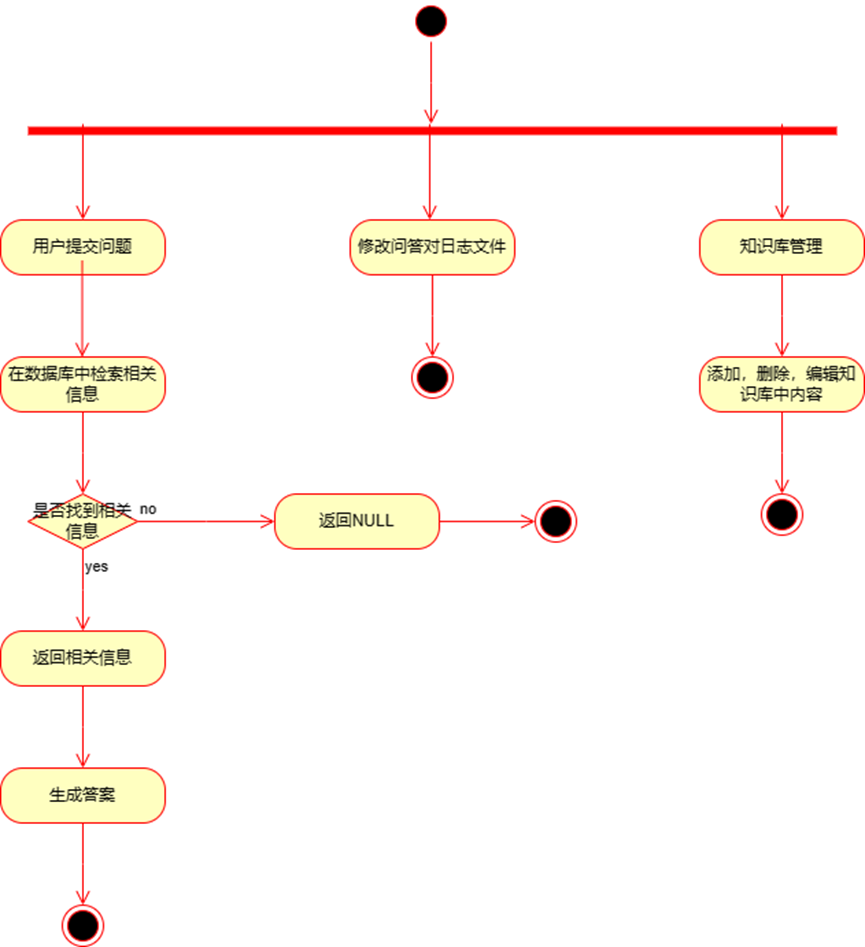

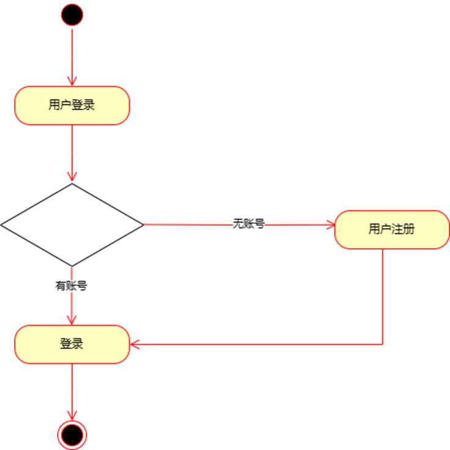

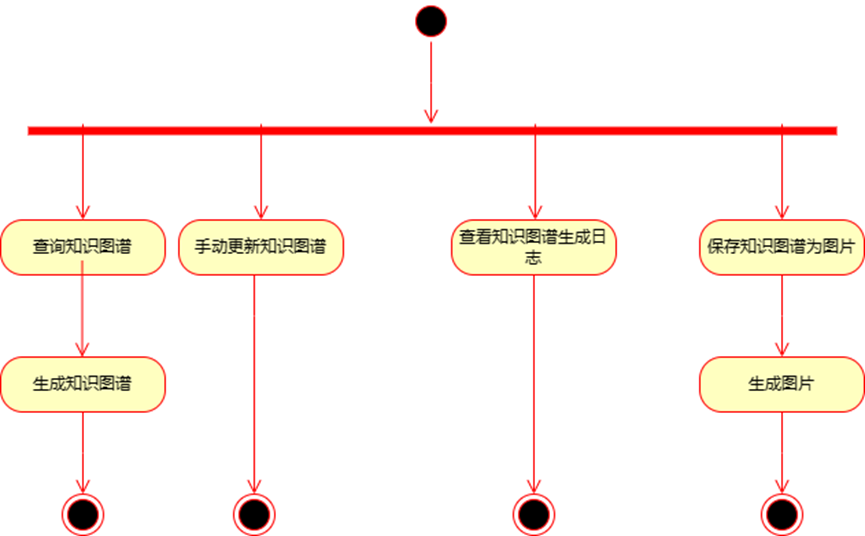

顺序图：（图显示有问题，后期转 word 就没事了）

**注册**

图图 8 注册顺序图

文字说明

① 顺序图综述

此顺序图描述了用户注册的过程

② 顺序图中的对象描述

用户为主动对象，其他对象为被动对象

表表 6 对象接收/发送信息的描述

| 消息名称           | 消息类型 | 发送消息的对象名称 | 接收消息的对象名称 |
| ------------------ | -------- | ------------------ | ------------------ |
| 注册               | 主动对象 | 用户               | 注册界面           |
| 显示注册界面       | 被动对象 | 注册界面           | 用户               |
| 输入注册信息       | 被动对象 | 用户               | 注册界面           |
| 申请注册           | 被动对象 | 注册界面           | 注册               |
| 核对用户名是否重复 | 被动对象 | 注册               | 用户信息           |
| 验证结果           | 被动对象 | 用户信息           | 注册               |
| 录入新用户信息     | 被动对象 | 注册               | 用户信息           |
| 返回结果           | 被动对象 | 用户信息           | 注册               |
| 返回结果           | 被动对象 | 注册               | 注册界面           |
| 返回结果           | 被动对象 | 注册界面           | 用户               |

**登录**

图图 9 登录顺序图

文字说明

① 顺序图综述

此顺序图描述了用户登录的过程

② 顺序图中的对象描述

用户为主动对象，其他对象为被动对象

表表 7 对象接收/发送信息的描述

| 消息名称       | 消息类型 | 发送消息的对象名称 | 接收消息的对象名称 |
| -------------- | -------- | ------------------ | ------------------ |
| 登录           | 主动对象 | 用户               | 登录界面           |
| 显示登录界面   | 被动对象 | 登录界面           | 用户               |
| 输入账号和密码 | 被动对象 | 用户               | 登录界面           |
| 申请登录       | 被动对象 | 登录界面           | 登录               |
| 验证账号       | 被动对象 | 登录               | 用户信息           |
| 验证结果       | 被动对象 | 用户信息           | 登录               |
| 返回结果       | 被动对象 | 登录               | 登录界面           |
| 返回结果       | 被动对象 | 登录界面           | 用户               |

**注销**

图图 10 注销顺序图

文字说明

① 顺序图综述

此顺序图描述了用户注销自己账号的过程

② 顺序图中的对象描述

用户为主动对象，其他对象为被动对象

表表 8 对象接收/发送信息的描述

| 消息名称           | 消息类型 | 发送消息的对象名称 | 接收消息的对象名称 |
| ------------------ | -------- | ------------------ | ------------------ |
| 注销               | 主动对象 | 用户               | 注销界面           |
| 显示注销界面       | 被动对象 | 注销界面           | 用户               |
| 确认注销           | 被动对象 | 用户               | 注销界面           |
| 申请注销           | 被动对象 | 注销界面           | 注销               |
| 验证账号           | 被动对象 | 注销               | 用户信息           |
| 移除并更新账号信息 | 被动对象 | 用户信息           | 用户信息           |
| 返回注销信息       | 被动对象 | 用户信息           | 注销               |
| 返回注销信息       | 被动对象 | 注销               | 注销界面           |
| 返回结果           | 被动对象 | 注销界面           | 用户               |

对象接收/发送信息的描述表

**文献库管理**

**查询文献**

图 图 11 查询文献顺序图

文字说明

① 顺序图综述

此顺序图描述了用户查询文献的过程

② 顺序图中的对象描述

用户为主动对象，其他对象为被动对象

表表 9 对象接收/发送信息的描述

| 消息名称         | 消息类型 | 发送消息的对象名称 | 接收消息的对象名称 |
| ---------------- | -------- | ------------------ | ------------------ |
| 查询             | 主动对象 | 用户               | 文献库管理界面     |
| 显示查询界面     | 被动对象 | 文献库管理界面     | 用户               |
| 输入查询信息     | 主动对象 | 用户               | 文献库管理界面     |
| 处理查询文献请求 | 被动对象 | 文献库管理界面     | 文献获取           |
| 查询文献数据     | 被动对象 | 文献获取           | 文献信息           |
| 返回查询结果     | 被动对象 | 文献信息           | 文献获取           |
| 返回查询结果     | 被动对象 | 文献获取           | 文献库管理界面     |
| 显示查询结果     | 被动对象 | 文献库管理界面     | 用户               |

对象接收/发送信息的描述表

**上传文献**

图图 12 上传文献顺序图

文字说明

① 顺序图综述

此顺序图描述了用户上传文献的过程

② 顺序图中的对象描述

用户为主动对象，其他对象为被动对象

表表 10 对象接收/发送信息的描述

| 消息名称         | 消息类型 | 发送消息的对象名称 | 接收消息的对象名称 |
| ---------------- | -------- | ------------------ | ------------------ |
| 上传             | 主动对象 | 用户               | 文献库管理界面     |
| 显示上传界面     | 被动对象 | 文献库管理界面     | 用户               |
| 确认上传的文件   | 被动对象 | 用户               | 文献库管理界面     |
| 处理上传文献请求 | 被动对象 | 文献库管理界面     | 上传业务逻辑       |
| 保存文献数据     | 被动对象 | 文献上传           | 文献信息           |
| 返回保存结果     | 被动对象 | 文献信息           | 文献上传           |
| 返回保存结果     | 被动对象 | 文献上传           | 文献库管理界面     |
| 显示保存结果     | 被动对象 | 文献库管理界面     | 用户               |

对象接收/发送信息的描述表

**下载文献**

图 图 13 下载文献顺序图

文字说明

① 顺序图综述

此顺序图描述了用户下载文献的过程

② 顺序图中的对象描述

用户为主动对象，其他对象为被动对象

表表 11 对象接收/发送信息的描述

| 消息名称         | 消息类型 | 发送消息的对象名称 | 接收消息的对象名称 |
| ---------------- | -------- | ------------------ | ------------------ |
| 下载             | 主动对象 | 用户               | 文献库管理界面     |
| 显示下载界面     | 被动对象 | 文献库管理界面     | 用户               |
| 确认下载的文件   | 被动对象 | 用户               | 文献库管理界面     |
| 处理下载文献请求 | 被动对象 | 文献库管理界面     | 文献下载           |
| 获取文献数据     | 被动对象 | 文献下载           | 文献信息           |
| 返回下载结果     | 被动对象 | 文献信息           | 文献下载           |
| 返回下载结果     | 被动对象 | 文献下载           | 文献库管理界面     |
| 显示下载结果     | 被动对象 | 文献库管理界面     | 用户               |

对象接收/发送信息的描述

**修改文献**

图图 14 修改文献顺序图

文字说明

① 顺序图综述

此顺序图描述了用户修改文献的过程

② 顺序图中的对象描述

用户为主动对象，其他对象为被动对象

表表 12 对象接收/发送信息的描述

| 消息名称             | 消息类型 | 发送消息的对象名称 | 接收消息的对象名称 |
| -------------------- | -------- | ------------------ | ------------------ |
| 修改                 | 主动对象 | 用户               | 文献库管理界面     |
| 处理修改文献请求     | 被动对象 | 文献库管理界面     | 文献获取           |
| 查询要修改的文献信息 | 被动对象 | 文献获取           | 文献信息           |
| 返回文献信息         | 被动对象 | 文献信息           | 文献获取           |
| 返回文献信息         | 被动对象 | 文献获取           | 文献库管理界面     |
| 显示文献信息供修改   | 被动对象 | 文献库管理界面     | 用户               |
| 提交修改后的文献信息 | 主动对象 | 用户               | 文献库管理界面     |
| 处理修改后的文献信息 | 被动对象 | 文献库管理界面     | 文献修改           |
| 修改文献             | 被动对象 | 文献修改           | 文献信息           |
| 更新文献信息         | 被动对象 | 文献信息           | 文献信息           |
| 返回修改结果         | 被动对象 | 文献信息           | 文献修改           |
| 返回修改结果         | 被动对象 | 文献修改           | 文献库管理界面     |
| 显示修改结果         | 被动对象 | 文献库管理界面     | 用户               |

对象接收/发送信息的描述表

**删除文献**

图图 15 删除文献顺序图

文字说明

① 顺序图综述

此顺序图描述了用户删除文献的过程

② 顺序图中的对象描述

用户为主动对象，其他对象为被动对象

表表 13 对象接收/发送信息的描述

| 消息名称             | 消息类型 | 发送消息的对象名称 | 接收消息的对象名称 |
| -------------------- | -------- | ------------------ | ------------------ |
| 删除                 | 主动对象 | 用户               | 文献库管理界面     |
| 处理删除文献请求     | 被动对象 | 文献库管理界面     | 文献获取           |
| 查询要删除的文献信息 | 被动对象 | 文献获取           | 文献信息           |
| 返回文献信息         | 被动对象 | 文献信息           | 文献获取           |
| 返回文献信息         | 被动对象 | 文献获取           | 文献库管理界面     |
| 显示文献信息供删除   | 被动对象 | 文献库管理界面     | 用户               |
| 确认删除文献         | 主动对象 | 用户               | 文献库管理界面     |
| 删除文献             | 被动对象 | 文献库管理界面     | 文献删除           |
| 移除文献记录         | 被动对象 | 文献删除           | 文献信息           |
| 更新文献信息         | 被动对象 | 文献信息           | 文献信息           |
| 返回删除结果         | 被动对象 | 文献信息           | 文献删除           |
| 返回删除结果         | 被动对象 | 文献删除           | 文献库管理界面     |
| 显示删除结果         | 被动对象 | 文献库管理界面     | 用户               |

对象接收/发送信息的描述表

**问答对管理**

**查询问答对**

图 图 16 查询问答对顺序图

文字说明

① 顺序图综述

此顺序图描述了管理员查询问答对的过程

② 顺序图中的对象描述

管理员为主动对象，其他对象为被动对象

表表 14 对象接收/发送信息的描述

| 消息名称         | 消息类型 | 发送消息的对象名称 | 接收消息的对象名称 |
| ---------------- | -------- | ------------------ | ------------------ |
| 查询             | 主动对象 | 管理员             | 问答对管理界面     |
| 显示查询界面     | 被动对象 | 问答对管理界面     | 管理员             |
| 输入查询信息     | 主动对象 | 管理员             | 问答对管理界面     |
| 处理查询文献请求 | 被动对象 | 问答对管理界面     | 问答对获取         |
| 查询文献数据     | 被动对象 | 问答对获取         | 问答对信息         |
| 返回查询结果     | 被动对象 | 问答对信息         | 问答对获取         |
| 返回查询结果     | 被动对象 | 问答对获取         | 问答对管理界面     |
| 显示查询结果     | 被动对象 | 问答对管理界面     | 管理员             |

对象接收/发送信息的描述表

**修改问答对**

图 图 17 修改问答对顺序图

文字说明

① 顺序图综述

此顺序图描述了管理员修改问答对的过程

② 顺序图中的对象描述

管理员为主动对象，其他对象为被动对象

表表 15 对象接收/发送信息的描述

| 消息名称           | 消息类型 | 发送消息的对象名称 | 接收消息的对象名称 |
| ------------------ | -------- | ------------------ | ------------------ |
| 修改               | 主动对象 | 管理员             | 问答对管理界面     |
| 处理修改问答对请求 | 被动对象 | 问答对管理界面     | 问答对获取         |
| 查询要修改的问答对 | 被动对象 | 问答对获取         | 问答对信息         |
| 返回问答对数据     | 被动对象 | 问答对信息         | 问答对获取         |
| 返回问答对数据     | 被动对象 | 问答对获取         | 问答对管理界面     |
| 显示问答对供修改   | 被动对象 | 问答对管理界面     | 管理员             |
| 提交修改后的问答对 | 主动对象 | 管理员             | 问答对管理界面     |
| 处理修改后的问答对 | 被动对象 | 问答对管理界面     | 问答对修改         |
| 修改问答对         | 被动对象 | 问答对修改         | 问答对信息         |
| 执行更新操作       | 被动对象 | 问答对信息         | 问答对信息         |
| 返回修改结果       | 被动对象 | 问答对信息         | 问答对修改         |
| 返回修改结果       | 被动对象 | 问答对修改         | 问答对管理界面     |
| 显示修改结果       | 被动对象 | 问答对管理界面     | 管理员             |

对象接收/发送信息的描述表

**删除问答对**

图图 18 删除问答对顺序图

文字说明

① 顺序图综述

此顺序图描述了管理员删除问答对的过程

② 顺序图中的对象描述

管理员为主动对象，其他对象为被动对象

表表 16 对象接收/发送信息的描述

| 消息名称           | 消息类型 | 发送消息的对象名称 | 接收消息的对象名称 |
| ------------------ | -------- | ------------------ | ------------------ |
| 删除               | 主动对象 | 管理员             | 问答对管理界面     |
| 处理删除问答对请求 | 被动对象 | 问答对管理界面     | 问答对获取         |
| 查询要删除的问答对 | 被动对象 | 问答对获取         | 问答对信息         |
| 返回问答对数据     | 被动对象 | 问答对信息         | 问答对获取         |
| 返回问答对数据     | 被动对象 | 问答对获取         | 问答对管理界面     |
| 显示问答对供删除   | 被动对象 | 问答对管理界面     | 管理员             |
| 确认删除问答对     | 主动对象 | 管理员             | 问答对管理界面     |
| 删除问答对         | 被动对象 | 问答对管理界面     | 问答对删除         |
| 移除问答对记录     | 被动对象 | 问答对删除         | 问答对信息         |
| 执行更新操作       | 被动对象 | 问答对信息         | 问答对信息         |
| 返回删除结果       | 被动对象 | 问答对信息         | 问答对删除         |
| 返回删除结果       | 被动对象 | 问答对删除         | 问答对管理界面     |
| 显示删除结果       | 被动对象 | 问答对管理界面     | 管理员             |

对象接收/发送信息的描述表

**知识图谱**

**显示知识图谱**

图图 19 显示知识图谱顺序图

文字说明

① 顺序图综述

此顺序图描述了页面显示知识图谱的过程

② 顺序图中的对象描述

用户为主动对象，其他对象为被动对象

表表 17 对象接收/发送信息的描述

| 消息名称               | 消息类型 | 发送消息的对象名称 | 接收消息的对象名称 |
| ---------------------- | -------- | ------------------ | ------------------ |
| 启动知识图谱显示页面   | 主动对象 | 用户               | 知识图谱界面       |
| 初始化知识图谱显示页面 | 被动对象 | 知识图谱界面       | 知识图谱获取       |
| 获取三元组数据         | 被动对象 | 知识图谱获取       | 知识图谱信息       |
| 返回知识图谱数据       | 被动对象 | 知识图谱信息       | 知识图谱获取       |
| 返回知识图谱数据       | 被动对象 | 知识图谱获取       | 知识图谱界面       |
| 显示知识图谱           | 被动对象 | 知识图谱界面       | 用户               |

对象接收/发送信息的描述表

**更新知识图谱**

图图 20 更新知识图谱顺序图

文字说明

① 顺序图综述

此顺序图描述了用户手动更新知识图谱的过程

② 顺序图中的对象描述

用户为主动对象，其他对象为被动对象

表表 18 对象接收/发送信息的描述

[TABLE]

**导出知识图谱**

图图 21 导出知识图谱顺序图

文字说明

① 顺序图综述

此顺序图描述了用户导出特定格式的知识图谱的过程

② 顺序图中的对象描述

用户为主动对象，其他对象为被动对象 ③ 对象接收/发送信息的描述

表表 19 对象接收/发送信息的描述

[TABLE]

**权限管理**

**查询用户权限**

图图 22 查询用户权限顺序图

文字说明

① 顺序图综述

此顺序图描述了管理员查询用户权限的过程

② 顺序图中的对象描述

管理员为主动对象，其他对象为被动对象

表表 20 对象接收/发送信息的描述

| 消息名称         | 消息类型 | 发送消息的对象名称 | 接收消息的对象名称 |
| ---------------- | -------- | ------------------ | ------------------ |
| 查询             | 主动对象 | 管理员             | 权限管理界面       |
| 显示查询界面     | 被动对象 | 权限管理界面       | 管理员             |
| 确认查询的用户   | 主动对象 | 管理员             | 权限管理界面       |
| 处理查询权限请求 | 被动对象 | 权限管理界面       | 权限获取           |
| 获取权限数据     | 被动对象 | 权限获取           | 用户权限信息       |
| 返回权限数据     | 被动对象 | 用户权限信息       | 权限获取           |
| 返回权限数据     | 被动对象 | 权限获取           | 权限管理界面       |
| 显示用户权限     | 被动对象 | 权限管理界面       | 管理员             |

**修改用户权限**

图图 23 修改用户权限顺序图

文字说明

① 顺序图综述

此顺序图描述了管理员修改某项用户权限的过程

② 顺序图中的对象描述

管理员为主动对象，其他对象为被动对象 ③ 对象接收/发送信息的描述

表表 21 对象接收/发送信息的描述

[TABLE]

**注销用户账号**

图图 24 注销用户账号顺序图

文字说明

① 顺序图综述

此顺序图描述了管理员注销用户账号的过程

② 顺序图中的对象描述

管理员为主动对象，其他对象为被动对象

表表 22 对象接收/发送信息的描述

| 消息名称           | 消息类型 | 发送消息的对象名称 | 接收消息的对象名称 |
| ------------------ | -------- | ------------------ | ------------------ |
| 注销用户账号       | 主动对象 | 管理员             | 权限管理界面       |
| 显示注销界面       | 被动对象 | 权限管理界面       | 管理员             |
| 确认注销某用户账号 | 主动对象 | 管理员             | 权限管理界面       |
| 处理注销账户请求   | 被动对象 | 权限管理界面       | 注销用户           |
| 删除用户数据       | 被动对象 | 注销用户           | 用户权限信息       |
| 执行删除操作       | 被动对象 | 用户权限信息       | 用户权限信息       |
| 返回注销结果       | 被动对象 | 用户权限信息       | 注销用户           |
| 返回注销结果       | 被动对象 | 注销用户           | 权限管理界面       |
| 显示注销结果       | 被动对象 | 权限管理界面       | 管理员             |

对象接收/发送信息的描述表

**授予用户管理员权限**

图图 25 授予用户管理员权限顺序图

文字说明

① 顺序图综述

此顺序图描述了管理员授予用户管理员权限的过程

② 顺序图中的对象描述

管理员为主动对象，其他对象为被动对象

表表 23 对象接收/发送信息的描述

| 消息名称               | 消息类型 | 发送消息的对象名称 |              | 接收消息的对象名称 |
| ---------------------- | -------- | ------------------ | ------------ | ------------------ |
| 授予用户管理员权限     | 主动对象 | 管理员             | 权限管理界面 |                    |
| 显示授予界面           | 被动对象 | 权限管理界面       | 管理员       |                    |
| 确认授予管理员权限     | 主动对象 | 管理员             | 权限管理界面 |                    |
| 处理授予管理员身份请求 | 被动对象 | 权限管理界面       | 授权         |                    |
| 修改用户权限数据       | 被动对象 | 授权               | 用户信息     |                    |
| 执行修改操作           | 被动对象 | 用户信息           | 用户信息     |                    |
| 返回修改结果           | 被动对象 | 用户权限信息       | 授权         |                    |
| 返回修改结果           | 被动对象 | 授权               | 权限管理界面 |                    |
| 显示授予结果           | 被动对象 | 权限管理界面       | 管理员       |                    |

# 4 数据需求

## 4.1 静态数据

需要存储在磁盘上的文件、数据表等。

数据库中的静态数据包括用户账户信息等具体信息，这些信息生成后基本不发生变化，归于静态数据类。

## 4.2 动态数据

运行过程需要临时输入的数据和输出的数据等。

数据库中知识图谱等具体信息为动态信息，会随着业务过程和业务积累而发生改变，对于这类数据我们要把它归于动态数据类。

## 4.3 数据字典

采用结构化分析方法时，需要对数据流图中的数据流、数据存储以及它们的数据项进行详细定义，对实体-关系图中的实体、关系属性进行详细定义。

表表 1 用户表

| 数据名称 | 含义   | 数据类型 | 长度 | 约束        |
| -------- | ------ | -------- | ---- | ----------- |
| user_id  | 用户号 | int      | 10   | primary key |
| username | 用户名 | varchar  | 50   |             |
| password | 密码   | varchar  | 50   |             |
| e_mail   | 邮箱   | varchar  | 50   |             |
| role     | 角色   | bite     | 1    |             |

表表 2 权限表

| 数据名称        | 含义   | 数据类型 | 长度 | 约束        |
| --------------- | ------ | -------- | ---- | ----------- |
| permission_id   | 权限号 | int      | 10   | primary key |
| permission_name | 权限名 | varchar  | 50   |             |

表表 3 用户权限表

| 数据名称           | 含义       | 数据类型 | 长度 | 约束        |
| ------------------ | ---------- | -------- | ---- | ----------- |
| user_permission_id | 用户权限号 | int      | 10   | primary key |
| user_id            | 用户号     | int      | 10   | foreign key |
| permission_id      | 权限号     | int      | 10   | foreign key |
| is_allowed         | 允许状态   | bite     | 1    |             |

表表 4 文献表

| 数据名称    | 含义       | 数据类型 | 长度 | 约束        |
| ----------- | ---------- | -------- | ---- | ----------- |
| document_id | 文献号     | int      | 10   | primary key |
| username    | 上传用户名 | varchar  | 50   |             |
| title       | 标题       | varchar  | 50   |             |
| context     | 内容       | varchar  | 50   |             |
| creat_time  | 上传时间   | varchar  | 50   |             |
| update_time | 更新时间   | varchar  | 50   |             |

表表 5 问答对表

| 数据名称    | 含义     | 数据类型 | 长度 | 约束        |
| ----------- | -------- | -------- | ---- | ----------- |
| q_a_id      | 问答对号 | int      | 10   | primary key |
| question    | 问题     | varchar  | 50   |             |
| answer      | 答案     | varchar  | 50   |             |
| document_id | 文献号   | int      | 10   | foreign key |

## 4.4 数据库描述

若系统使用数据库，采用实体-关系图（E-R 图）建模数据库概念模型。

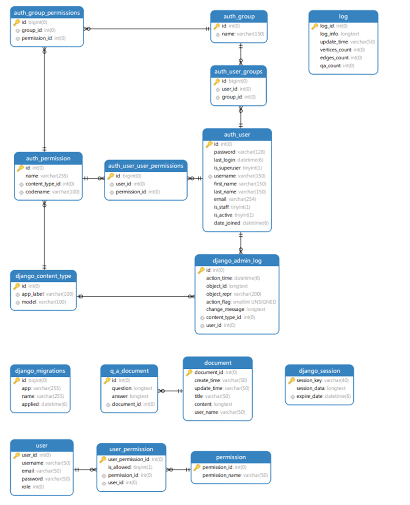

# 5 性能需求

### 5.1 数据精度

说明对该软件的输入、输出数据精度的要求，可能包括传输过程中的精度。

对于用户文件上传，问答对以及知识图谱等都要在短时间内迅速更新，数据准确无误，保证高精度。

### 5.2 时间特性

说明对于该软件的时间特性要求，如对响应时间、更新处理时间、数据的转换和传送时间以及计算时间等的要求。

响应时间：所有的查询操作、查询响应时间一般不超过 3 秒。

更新处理时间：由系统运行状态决定，一般审核期为 30 分钟。

数据的转换和传送时间：能够在 10s 内完成。

计算时间：依据系统运行状态与计算量决定。

# 6 运行需求

## 6.1 用户界面

描述对该系统用户界面的基本要求，可以给出用户界面原型方案。

注意：根据系统功能来推断需要哪些用户界面，依次陈述每个界面的功能，界面接收的输入数据，界面输出的数据。**陈述逻辑应与 3.2 的功能描述的功能对应。**

**本部分不用画出具体的界面设计图，设计图放到《概要设计说明书》的用户界面来画。**

## 6.2 软件接口

描述与该系统实施相关的软件环境的要求。若系统需要与外部软件系统交互，则需给出相应接口说明。

客户：

1.  Web 浏览器: Chrome、 Safari、 Firefox、Microsoft Edge 及任何支持 HTML5 标准 的浏览器。

2.  2\. 分辨率选择：1440\*900、1920\*1080、2k、4k。

管理端：

1.  操作系统：Microsoft Windows 11、MacOs、Linux。

2.  软件设备：Pycharm、VScode、MySQL8.0。

## 6.3 硬件接口

描述与该系统实施相关硬件环境的要求。若系统需要与外部硬件系统交互，则需给出相应接口说明。

1.  数据中心服务器。

2.  通信接口：使用人员必须在局域网环境下使用系统，而学生则可以在外部网进行访 问系统。

# 7 其他需求

## 7.1 验收标准

1.加强系统安全性：受到恶意攻击的情形下依然能够继续正确运行及确保在授权范围内合法使用

2.异常处理的提示：前端显示上传成功/失败；校园网连接成功提示

3.优化检索速率：非正则表达

**明确指出系统需完成哪些功能则能够满足用户需求。此处应与第 3 部分的功能需求对应。**若有非功能需求，也应满足。

推荐以表格形式列出。
