# 软件概要设计说明书

版本变更历史

| 版本 | 提交日期   | 主要编制人 | 审核人 | 版本说明             |
| ---- | ---------- | ---------- | ------ | -------------------- |
| v1.0 | 2024.04.24 | 李解放     | 刘佳乐 | 完成文档主体内容设计 |
| v2.0 | 2024.04.25 | 李解放     | 张黄钰 | 完善和优化部分内容   |
| v3.0 | 2024.05.08 | 李解放     | 袁笑   | 进一步补充了相关细节 |

# 1 引言

## 1.1 编写目的

本文档的目的是详细介绍分析本项目的需求，让相关开发人员准确了解开发方向，进行规范高效的后期编码以及安全可靠的维护；让用户准确了解软件的功能需求及服务思路，有助更加深入全面地了解软件使用软件，得到最佳的用户体验。该文档将通过书面文字、系统结构图、数据流图、数据字典、UML 图展示本项目的功能、性能、用户界面、运行环境、外部环境以及各种接口。

本文档面向全体开发人员与用户，部分内容需要一定的软件工程基础。

## 1.2 范围

### 1.2.1 系统目标

“知识图谱智能构建系统”旨在为用户提供一个高效、准确并且时刻更新的信息检索平台。通过构建和维护一个完善的知识图谱，系统将能够以更加智能的方式对信息进行组织、检索和更新，从而极大地改善当前信息检索系统的短板。与传统的基于关键词检索的系统相比，知识图谱系统能够更好地理解用户查询的意图，提供更加精准的搜索结果。

### 1.2.2 主要软件需求

#### 1.2.2.1.功能需求

> **文献管理系统：**

1.  文献采集与导入：创建在线数据库，提供导入功能将文献信息整合到系统中。

2.  文献分类与组织：提供对文献进行分类、标签化或者建立文件夹等组织方式，以便用户可以根据需求进行管理和查找。（个人文献库和公共文献库）

3.  文献检索：具备强大的检索功能，使用户能够快速准确地找到需要的文献，支持关键词搜索。

4.  文献查看：提供文献阅读功能，允许用户在系统内直接阅读文献。

> **账号管理系统：**

1.  用户注册、登录、退出与注销账号：允许用户进行注册账号，并提供登录功能，以便用户能够访问系统的各项功能。

2.  普通管理员登录、退出与注销账号。

3.  超级管理员登录与退出账号。

> **权限管理系统：**

1. 用户角色管理：超级管理员具有最高权限，可以创建、编辑和删除管理员账号，管理员具有管理普通用户的权限，普通用户则只能访问系统提供的基本功能。

2. 用户信息管理：超级管理员和管理员可以查看和编辑用户的基本信息，如用户名、密码、邮箱等，以及用户的权限设置。

3. 密码管理与安全性：提供密码管理功能，包括密码修改、找回密码等，保障用户账号的安全性.

&nbsp;

4.  用户权限管理：超级管理员和管理员可以设置不同用户的权限，包括访问权限、操作权限等，以确保用户能够按照其角色的要求合理地使用系统。

5.  账号注销与冻结：超级管理员和管理员可以对用户账号进行注销或冻结操作，以应对违规行为或其他特殊情况。

> **问答管理系统：**

1.  问题提交与管理：允许用户提交问题，并提供管理界面用于管理问题，包括发布、编辑、删除等操作。

2.  问题搜索与检索：提供强大的搜索功能，允许用户通过关键词、标签等方式快速定位到相关的问题。

3.  答案生成与展示：根据用户提出的问题，系统能够自动或者手动生成相应的答案，并将答案展示给用户。

4.  知识库管理： 管理系统中的知识库，包括添加、删除、编辑知识库内容等功能。

5.  修改问答对的日志记录

> **知识图谱管理系统:**

1.  查询知识图谱：该功能允许用户通过输入关键词或提出问题来查询知识图谱中的相关信息。系统将根据用户的查询意图，从知识图谱中智能地检索相关节点和关联信息，并将结果以易于理解和浏览的方式呈现给用户，帮助他们快速获取所需知识。

2.  手动更新知识图谱：该功能允许管理员或授权用户手动触发知识图谱的更新过程。用户可以选择指定更新的范围或特定的数据源，系统将根据用户的选择进行相应的更新操作。这样可以确保知识图谱中的信息始终保持最新和准确。

3.  保存知识图谱为图片：该功能允许用户将当前查看的知识图谱保存为图片格式。用户可以随时通过该功能将知识图谱快速保存下来，方便后续的分享、打印或进一步分析使用。保存的图片将保留图谱的完整结构和节点信息。

**查看图谱生成日志**：

该功能允许用户查看知识图谱生成过程的详细日志记录。系统将记录每次图谱更新的操作步骤、时间和相关信息，用户可以通过查看日志了解图谱生成的历史记录，包括成功生成的图谱数量、失败的原因等，以便及时调整和改进系统的运行。

####

#### 1.2.2.2 非功能需求

性能需求：对于用户文件上传，问答对以及知识图谱等都要在短时间内迅速更新，数据准确无误，保证高精度。（优化检索速率：非正则表达）

安全需求：受到恶意攻击的情形下依然能够继续正确运行及确保在授权范围内合法使用。

界面需求：前端显示上传成功/失败；校园网连接成功提示

### 1.2.3 软件设计约束、限制

经济、技术、环境等各种约束。

1.经济可行性

● 预算限制：项目有一定的预算需求，需要调用学校服务器。

● 成本控制：对系统开发、测试、部署和维护过程中产生的成本进行控制，所有的软件 和部署平台都在成本控制内

2.技术可行性

● 技术栈选择：选择合适的技术栈和工具，包括 python 编程语言、mysql 数据库、知识图谱库。

● 技术团队能力：团队在所选择技术方面应有足够的经验和能力，以确保项目的顺利进行。

● 兼容性：需要确保系统与现有系统的兼容性，特别是与现有的数据存储、知识图谱等的兼容。

● 可扩展性：系统应具有良好的可扩展性，代码以模块化的方式编写，各司其职

## 1.3 术语和缩略词

列出本文件中用到的专门术语的定义和缩略词的全称。

（1）文献：分为两类，一类是由用户上传，另一类是由系统后台提供。由用户上传的是每一个句子的文件，文件中可以包含多个句子，每个句子调用模型提取出最终显示到知识图谱中的实体和关系。后台提供的是文献库，用作候选段，当模型在用户提供的文件中无法解析出答案时，将在候选段中查找。

（2）问答对：由模型根据用户提供的文字，以及后台备用的文献库中查找，提取出一组问题和答案，称之为问答对。部分字段可能无法得到问答对。

（3）三元组：由问答对提取三元组，即实体 1——关系——实体 2，得到三元组即为模型调用的结束。三元组还需要经过处理，变为点集和边集才能够用于知识图谱的显示。

（4）知识图谱及自动更新：在前端显示的知识图谱是连接到三元组保存的.json 实现的。自动更新实现的原理是设置每隔固定时长反复调用文件，来更新图谱。图谱的显示由二维的三维的区别，三维比二维的可视化效果更好，更易于用户直观感受实体之间联系。

（5）权限管理：该功能模块主要用于系统管理员管理用户对数据库的操作权限。例如：是否允许删除文献，是否允许修改问答对，是否拥有管理员角色（当前系统最高权限）等。

（6）导出：在知识图谱模块，用户可以查看图谱的同时，也可以将图谱导出为 png 或 jpg 文件，便于用户具体地查看实体以及之间的联系。

（7）手动更新：当用户需要及时地查看图谱的更新状况时，系统提供了强制更新接口，使得三元组文件的最新状态可以立刻反馈到图谱可视化结果中。

## 1.4 参考资料

列出相关的参考资料，如本项目的经核准的计划任务书或合同、上级机关的批文；

属于本项目的其他已发表的文件；

本文件中各处引用的文件、资料、包括所要用到的软件开发标准。

列出这些文件资料的标题、文件编号、发表日期和出版单位，说明能够得到这些文件资料的来源。

1.窦万峰.软件工程方法与实践(第三版).北京：机械工业出版社，2016.

2.窦万峰，蒋锁良，杨俊 . 软件工程实验教程（第三版）. 北京：机械工业出版社，2016.

3.保罗 C.乔根森 . 软件测试（第四版）. 北京：机械工业出版社，2017.

4.陈定甲,淳鑫.基于 Vue 技术的通用知识图谱问答系统设计与实现\[J\].装备制造技术,2022,No.331(07):97-99.

# 2 体系结构设计

## 2.1 需求复审

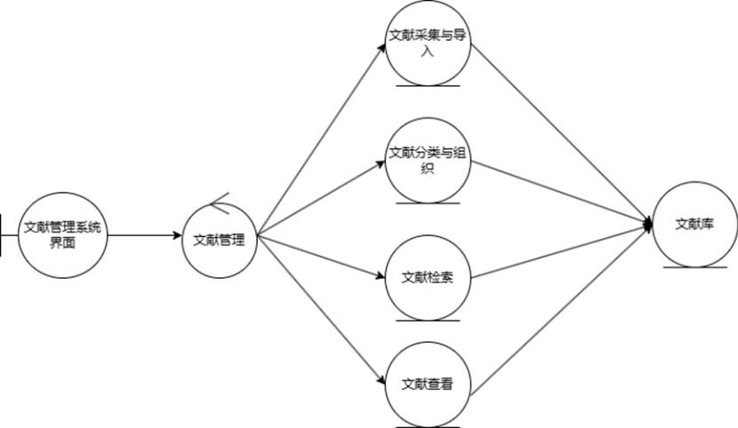

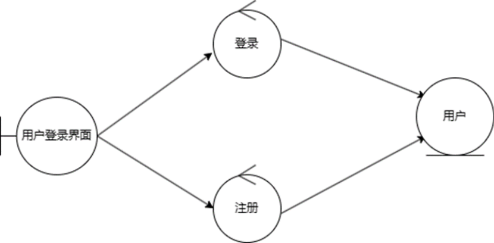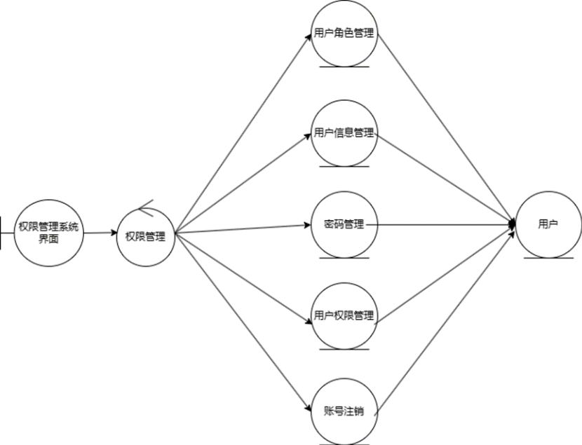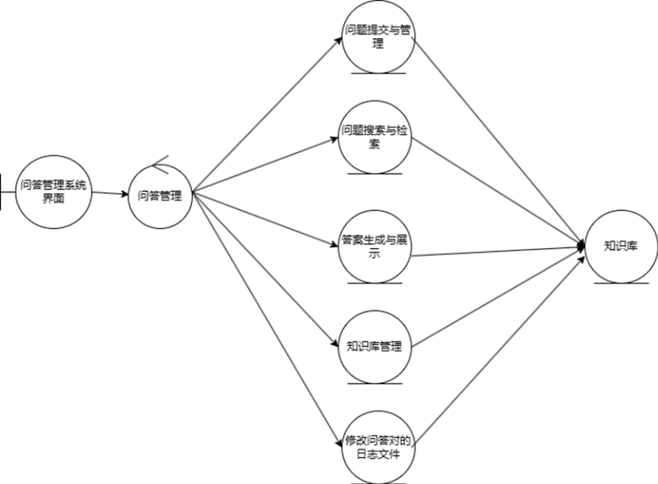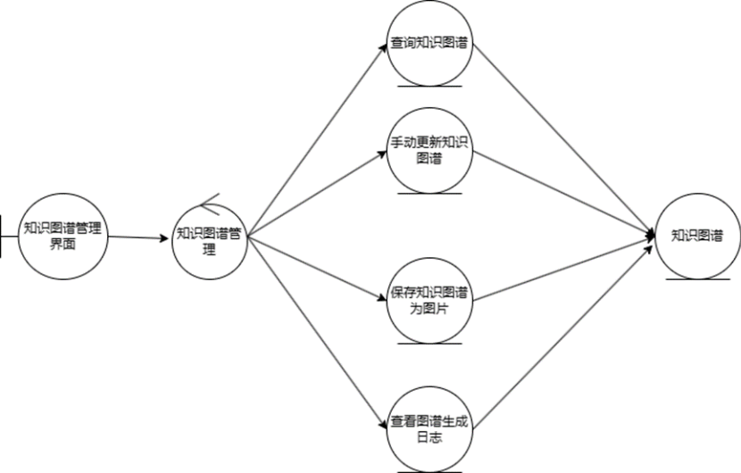

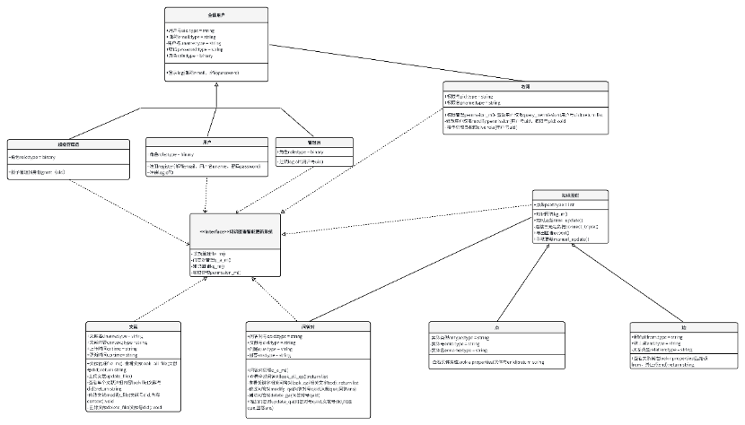

## 2.2 软件体系结构

## 2.3 模块设计

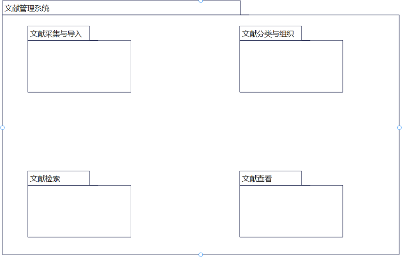

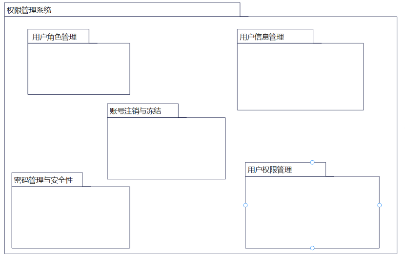

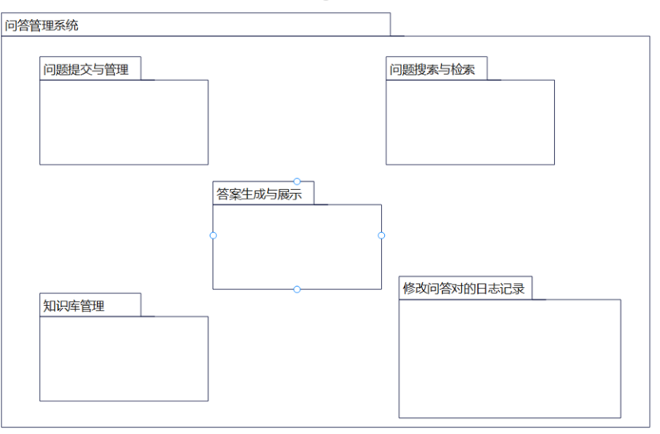

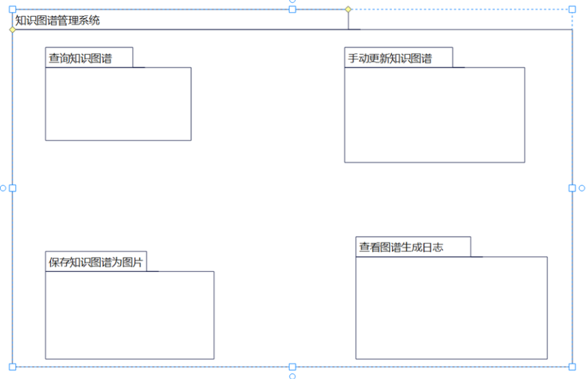

### 用户管理模块

模块描述：

> 构件功能：

1.  用户注册、登录、退出与注销账号：允许用户进行注册账号，并提供登录功能，以便用户能够访问系统的各项功能。

2.  普通管理员登录、退出与注销账号。

3.  超级管理员登录与退出账号。

对外接口：无

### 文献库管理模块

模块描述：

> 构件功能

1.  文献采集与导入：创建在线数据库，提供导入功能将文献信息整合到系统中。

2.  文献分类与组织：提供对文献进行分类、标签化或者建立文件夹等组织方式，以便 用户可以根据需求进行管理和查找。（个人文献库和公共文献库）

3.  文献检索：具备强大的检索功能，使用户能够快速准确地找到需要的文献，支持关键词搜索。

4.  文献查看：提供文献阅读功能，允许用户在系统内直接阅读文献。

对外接口：权限管理

### 问答对管理模块

模块描述：

> 构件功能：

1.  问题提交与管理：允许用户提交问题，并提供管理界面用于管理问题，包括发布、编辑、删除等操作。

2.  问题搜索与检索：提供强大的搜索功能，允许用户通过关键词、标签等方式快速定位到相关的问题。

3.  答案生成与展示：根据用户提出的问题，系统能够自动或者手动生成相应的答案，并将答案展示给用户。

4.  知识库管理： 管理系统中的知识库，包括添加、删除、编辑知识库内容等功能。

5.  修改问答对的日志记录

> 对外接口：权限管理

### 知识图谱管理模块

模块描述：

构件功能：

1.  查询知识图谱：该功能允许用户通过输入关键词或提出问题来查询知识图谱中的相关信息。系统将根据用户的查询意图，从知识图谱中智能地检索相关节点和关联信息，并将结果以易于理解和浏览的方式呈现给用户，帮助他们快速获取所需知识。

2.  手动更新知识图谱：该功能允许管理员或授权用户手动触发知识图谱的更新过程。用户可以选择指定更新的范围或特定的数据源，系统将根据用户的选择进行相应的更新操作。这样可以确保知识图谱中的信息始终保持最新和准确。

3.  保存知识图谱为图片：该功能允许用户将当前查看的知识图谱保存为图片格式。用户可以随时通过该功能将知识图谱快速保存下来，方便后续的分享、打印或进一步分析使用。保存的图片将保留图谱的完整结构和节点信息。

4.  查看图谱生成日志：该功能允许用户查看知识图谱生成过程的详细日志记录。系统将记 录每次图谱更新的操作步骤、时间和相关信息，用户可以通过查看日志了解图谱生成的 历史记录，包括成功生成的图谱数量、失败的原因等，以便及时调整和改进系统的运行。

对外接口：无

### 权限管理模块

模块描述：

构件功能：

1. 用户角色管理：超级管理员具有最高权限，可以创建、编辑和删除管理员账号，管理员具有管理普通用户的权限，普通用户则只能访问系统提供的基本功能。

2. 用户信息管理：超级管理员和管理员可以查看和编辑用户的基本信息，如用户名、密码、邮箱等，以及用户的权限设置。

3. 密码管理与安全性：提供密码管理功能，包括密码修改、找回密码等，保障用户账号的安全性。

4. 用户权限管理：超级管理员和管理员可以设置不同用户的权限，包括访问权限、操作权限等，以确保用户能够按照其角色的要求合理地使用系统。

5. 账号注销与冻结：超级管理员和管理员可以对用户账号进行注销或冻结操作，以应对违规行为或其他特殊情况。

对外接口：文献库管理，问答对管理

# 3 接口设计

## 3.1 用户接口

**登录界面：**

功能：实现用户登录

输入：用户账号密码

输出：提示用户登录成功/提示用户输入数据不完整/提示用户不存在/提示用户登录密码错误

**注册界面：**

功能：实现用户注册

输入：邮箱、用户名、密码以及邮箱验证码

输出：提示用户注册成功/提示用户输入数据不完整/提示用户不存在/账号或用户名已存在

**注销界面：**

功能：实现用户注销

输入：无

输出：提示用户不存在/提示管理员不可注销/

**文献管理界面：**

功能一：上传文献

输入：文献标题，文献内容

输出：提示文献上传成功，更新文献列表

功能二：查询某个文献详细内容

输入：无

输出：显示文献详细信息/标题名未知/分页显示所有文献列表/提示页面不存在

功能三：删除文献

输入：无

输出：提示文献删除成功/提示该文献不存在

功能四：修改文献

输入：修改文献内容

输出：提示文献修改成功/提示文献不存在

**问答对管理界面：**

功能一：匹配近似问答对

输入：问题

输出：返回相似度前 10 的问题对列表

功能二：修改问答对

输入：问答对

输出：提示修改成功

功能三：删除问答对

输入：无

输出：提示问答对删除成功/提示问答对不存在

**知识图谱管理界面：**

功能一：显示知识图谱

输入：无

输出：显示图谱信息

功能二：导出知识图谱

输入：无

输出：提示导出成功/提示导出失败，请重新连接网络

功能三：手动更新知识图谱

输入：无

输出：提示更新成功/提示更新失败，请重新连接网络

**权限管理界面：**

功能一：查看所有用户权限

输入：无

输出：提示权限查询成功，显示查看所有用户权限

功能二：查看某一个用户权限

输入：无

输出：显示用户权限/提示该用户不存在

功能三：修改用户某一个权限

输入：无

输出：提示修改权限成功

功能四：注销用户账号

输入：无

输出：提示注销用户权限成功/提示此用户为管理员，账号不可注销

功能五：超级管理员授予用户管理员权限

输入：无

输出：提示用户授权成功

## 3.2 外部接口

3.2.1 软件接口

\- 数据平台可以通过 java 提供的对 sql server 的接口，进行对数据库的所有访问。

\- 数据平台可以通过 sql server 的接口，对数据库的备份指令，对知识图谱，知识库的数据进行保存。

\- 在网络软件接口方面，使用一种无差别的传输协议，采用滑动窗口方式对数据进行网络传输及接收

\- 客户端：Web 浏览器:Chrome、Opera、 Safari、 Firefox 及任何支持 HTML5 标准的浏览器。

\- 标准分辨率: 1024X768、1920X1080、 2K。

\- 管理端:需要 MySQL 数据库;运行于 Window XP/7/8/10/Linux 操作系统之上。

3.2.2 标准硬件连接接口

\- 硬件接口移动终端硬件配置应遵循如下原则:具有高可靠性，可用性和安全性。

\- 外部硬件的接口必须是标准 USB 接口，支持一般的微机、电脑、手机。需要服务器一台。

\- 在输入方面，对于键盘、鼠标的输入，可用 VISUAL C++的标准输入/输出， 对输入进行处理。

\- 在输出方面，也可用 VISUAL C++的标准输入/输出对其进行处理。

## 3.3 内部接口

### 3.3.1 内部模块间关系

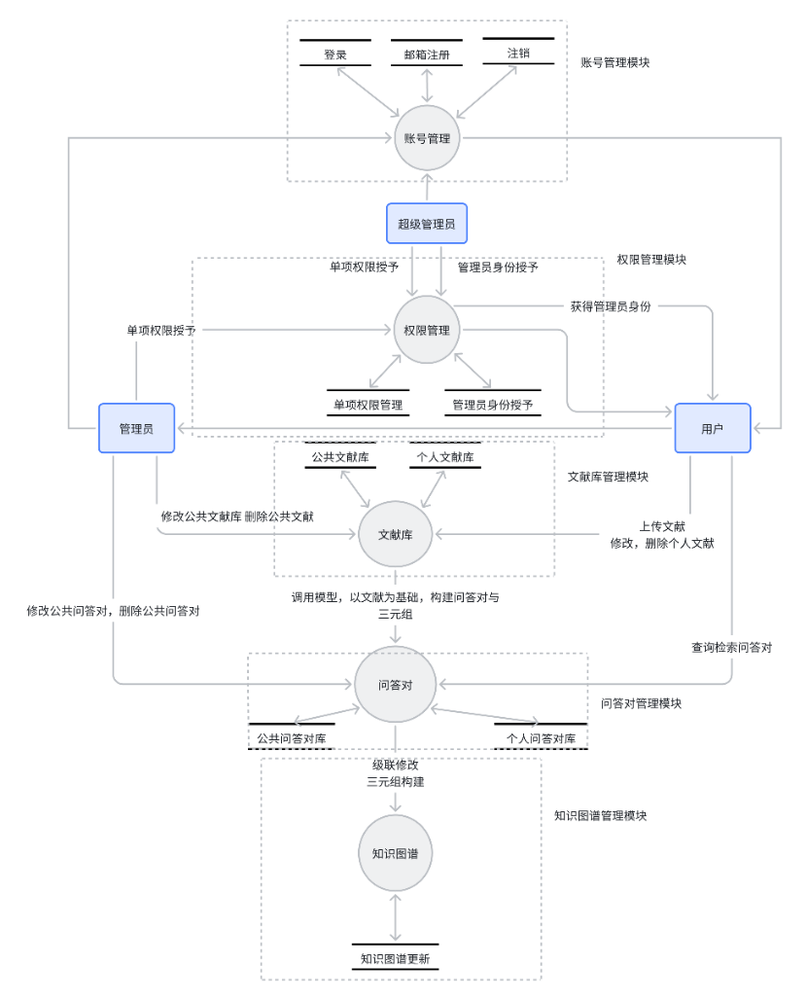

### 3.3.2 接口数据描述

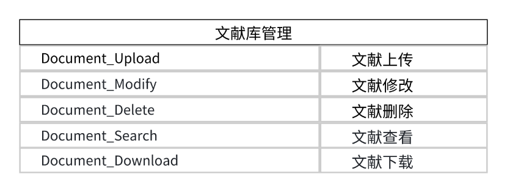

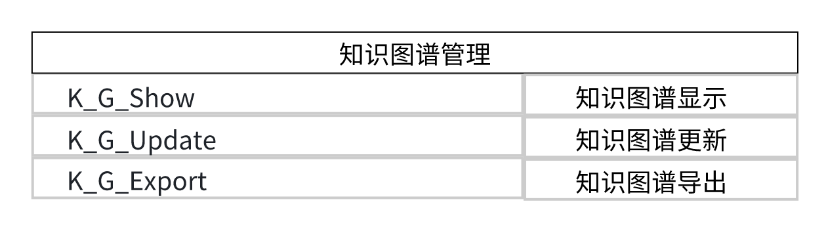

# 4 数据设计

## 4.1 数据结构

表 1 用户表

| 数据名称 | 含义   | 数据类型 | 长度 | 约束        |
| -------- | ------ | -------- | ---- | ----------- |
| user_id  | 用户号 | int      | 10   | primary key |
| username | 用户名 | varchar  | 50   |             |
| password | 密码   | varchar  | 50   |             |
| e_mail   | 邮箱   | varchar  | 50   |             |
| role     | 角色   | bite     | 1    |             |

表 2 权限表

| 数据名称        | 含义   | 数据类型 | 长度 | 约束        |
| --------------- | ------ | -------- | ---- | ----------- |
| permission_id   | 权限号 | int      | 10   | primary key |
| permission_name | 权限名 | varchar  | 50   |             |

表 3 用户权限表

| 数据名称           | 含义       | 数据类型 | 长度 | 约束        |
| ------------------ | ---------- | -------- | ---- | ----------- |
| user_permission_id | 用户权限号 | int      | 10   | primary key |
| user_id            | 用户号     | int      | 10   | foreign key |
| permission_id      | 权限号     | int      | 10   | foreign key |
| is_allowed         | 允许状态   | bite     | 1    |             |

表 4 文献表

| 数据名称    | 含义       | 数据类型 | 长度 | 约束        |
| ----------- | ---------- | -------- | ---- | ----------- |
| document_id | 文献号     | int      | 10   | primary key |
| username    | 上传用户名 | varchar  | 50   |             |
| title       | 标题       | varchar  | 50   |             |
| context     | 内容       | varchar  | 50   |             |
| creat_time  | 上传时间   | varchar  | 50   |             |
| update_time | 更新时间   | varchar  | 50   |             |

表 5 问答对表

| 数据名称    | 含义     | 数据类型 | 长度 | 约束        |
| ----------- | -------- | -------- | ---- | ----------- |
| q_a_id      | 问答对号 | int      | 10   | primary key |
| question    | 问题     | varchar  | 50   |             |
| answer      | 答案     | varchar  | 50   |             |
| document_id | 文献号   | int      | 10   | foreign key |

## 4.2 文件和数据库结构

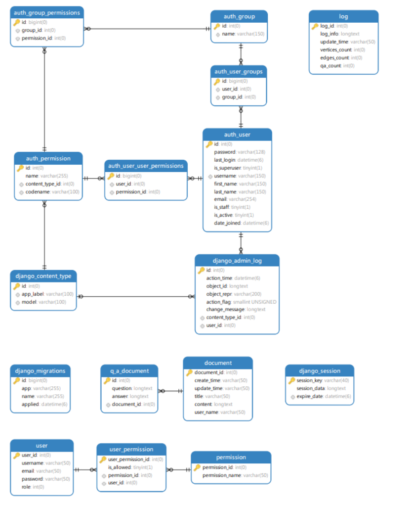

## 5 需求交叉索引

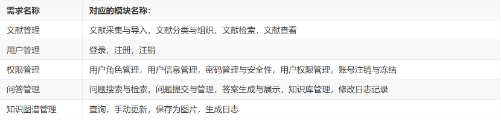

## 6 测试部分

<h3>测试用例设计</h3>

表 24 登录\_第一组测试用例

| 测试用例编号 | LOGIN_001                                                              |
| ------------ | ---------------------------------------------------------------------- |
| 测试项目     | 登录                                                                   |
| 测试标题     | 输入账号、密码                                                         |
| 重要级别     | 高                                                                     |
| 预置条件     | 该用户名已注册过                                                       |
| 输入         | 账号123@gmail.com，密码 123456                                         |
| 操作步骤     | ○,1)1 打开登录界面；○,2)2 输入账号123@gmail.com；○,3)3 输入密码 123456 |
| 预期输出     | 提示用户登录成功                                                       |

表 25 登录\_第二组测试用例

| 测试用例编号 | LOGIN_002                                   |
| ------------ | ------------------------------------------- |
| 测试项目     | 登录                                        |
| 测试标题     | 输入账号、密码                              |
| 重要级别     | 高                                          |
| 预置条件     | 该用户名已注册过                            |
| 输入         | 密码 123456                                 |
| 操作步骤     | ○,1)1 打开登录界面；○,2)2 输入密码 123456； |
| 预期输出     | 提示用户输入数据不完整                      |

表 26 登录\_第三组测试用例

| 测试用例编号 | LOGIN_003                                         |
| ------------ | ------------------------------------------------- |
| 测试项目     | 登录                                              |
| 测试标题     | 输入账号、密码                                    |
| 重要级别     | 高                                                |
| 预置条件     | 该用户名已注册过                                  |
| 输入         | 账号123@gmail.com                                 |
| 操作步骤     | ○,1)1 打开登录界面；○,2)2 输入账号123@gmail.com； |
| 预期输出     | 提示用户输入数据不完整                            |

表 27 登录\_第四组测试用例

| 测试用例编号 | LOGIN_004                                                             |
| ------------ | --------------------------------------------------------------------- |
| 测试项目     | 登录                                                                  |
| 测试标题     | 输入账号、密码                                                        |
| 重要级别     | 高                                                                    |
| 预置条件     | 该用户名已注册过，账号为123@gmail.com，密码为 123456                  |
| 输入         | 账号12@gmail.com，密码 123456                                         |
| 操作步骤     | ○,1)1 打开登录界面；○,2)2 输入账号12@gmail.com；○,3)3 输入密码 123456 |
| 预期输出     | 提示用户不存在                                                        |

表 28 登录\_第五组测试用例

| 测试用例编号 | LOGIN_005                                                              |
| ------------ | ---------------------------------------------------------------------- |
| 测试项目     | 登录                                                                   |
| 测试标题     | 输入账号、密码                                                         |
| 重要级别     | 高                                                                     |
| 预置条件     | 该用户名已注册过，账号为123@gmail.com，密码为 123456                   |
| 输入         | 账号123@gmail.com，密码 abcdef                                         |
| 操作步骤     | ○,1)1 打开登录界面；○,2)2 输入账号123@gmail.com；○,3)3 输入密码 abcdef |
| 预期输出     | 提示用户登录密码错误                                                   |

表 29 注册\_第一组测试用例

| 测试用例编号 | REGISTER_001                                                                                                |
| ------------ | ----------------------------------------------------------------------------------------------------------- |
| 测试项目     | 注册                                                                                                        |
| 测试标题     | 输入邮箱、用户名、密码以及邮箱验证码                                                                        |
| 重要级别     | 高                                                                                                          |
| 预置条件     | 进入注册网页界面                                                                                            |
| 输入         | 邮箱1122334455@qq.com，用户名 123456，密码 123456，邮箱验证码                                               |
| 操作步骤     | ○,1)1 打开注册界面；○,2)2 输入邮箱1122334455@qq.com③ 输入用户名 123456；④ 输入密码 123456；⑤ 输入邮箱验证码 |
| 预期输出     | 提示用户注册成功                                                                                            |

表 30 注册\_第二组测试用例

| 测试用例编号 | REGISTER_002                                                                               |
| ------------ | ------------------------------------------------------------------------------------------ |
| 测试项目     | 注册                                                                                       |
| 测试标题     | 输入邮箱、用户名、密码以及邮箱验证码                                                       |
| 重要级别     | 高                                                                                         |
| 预置条件     | 进入注册网页界面                                                                           |
| 输入         | 邮箱1122334455@qq.com，用户名 null，密码 123456，邮箱验证码                                |
| 操作步骤     | ○,1)1 打开注册界面；○,2)2 输入邮箱1122334455@qq.com○,3)3 输入密码 123456；④ 输入邮箱验证码 |
| 预期输出     | 提示用户输入数据不完整                                                                     |

表 31 注册\_第三组测试用例

| 测试用例编号 | REGISTER_003                                                                           |
| ------------ | -------------------------------------------------------------------------------------- |
| 测试项目     | 注册                                                                                   |
| 测试标题     | 输入用户名、密码以及邮箱                                                               |
| 重要级别     | 高                                                                                     |
| 预置条件     | 进入注册网页界面                                                                       |
| 输入         | 用户名 123456，密码 null，邮箱 1122334455@qq.com                                       |
| 操作步骤     | ○,1)1 打开注册界面；○,2)2 输入邮箱1122334455@qq.com③ 输入账号 123456；④ 输入邮箱验证码 |
| 预期输出     | 提示用户输入数据不完整                                                                 |

表 32 注册\_第四组测试用例

| 测试用例编号 | REGISTER_004                                                                               |
| ------------ | ------------------------------------------------------------------------------------------ |
| 测试项目     | 注册                                                                                       |
| 测试标题     | 输入用户名、密码以及邮箱                                                                   |
| 重要级别     | 高                                                                                         |
| 预置条件     | 进入注册网页界面                                                                           |
| 输入         | 用户名 123456，密码 123456，邮箱 null                                                      |
| 操作步骤     | ○,1)1 打开注册界面；○,2)2 输入用户名 123456；○,3)3 输入密码 123456；                       |
| 预期输出     | ○,1)1 提示输入用户名；○,2)2 提示输入密码；○,3)3 提示用户输入邮箱；④ 提示用户输入数据不完整 |

表 33 注册\_第五组测试用例

| 测试用例编号 | REGISTER_007                                                                               |
| ------------ | ------------------------------------------------------------------------------------------ |
| 测试项目     | 注册                                                                                       |
| 测试标题     | 输入用户名、密码以及邮箱                                                                   |
| 重要级别     | 高                                                                                         |
| 预置条件     | 进入注册网页界面                                                                           |
| 输入         | 用户名 123456，密码 null，邮箱 null                                                        |
| 操作步骤     | ○,1)1 打开注册界面；○,2)2 输入账号 123456                                                  |
| 预期输出     | ○,1)1 提示输入用户名；○,2)2 提示输入密码；○,3)3 提示用户输入邮箱；④ 提示用户输入数据不完整 |

表 34 注册\_第六组测试用例

| 测试用例编号 | REGISTER_008                                                                                |
| ------------ | ------------------------------------------------------------------------------------------- |
| 测试项目     | 注册                                                                                        |
| 测试标题     | 输入用户名、密码以及邮箱                                                                    |
| 重要级别     | 高                                                                                          |
| 预置条件     | 已注册该用户，邮箱1122334455@qq.com，用户名 123456，密码 123456                             |
| 输入         | 用户名 123456，密码 123456，邮箱1122334455@qq.com                                           |
| 操作步骤     | ○,1)1 打开注册界面；○,2)2 输入用户名 123456；③ 输入密码 123456；④ 输入邮箱1122334455@qq.com |
| 预期输出     | ○,1)1 账号或用户名已存在                                                                    |

表 35 注销\_第一组测试用例

| 测试用例编号 | LOGOFF_001                               |
| ------------ | ---------------------------------------- |
| 测试项目     | 注销                                     |
| 测试标题     | 注销账号信息                             |
| 重要级别     | 高                                       |
| 预置条件     | 该用户名已注册过                         |
| 输入         | 无                                       |
| 操作步骤     | ○,1)1 打开主界面；○,2)2 点击注销账号按钮 |
| 预期输出     | 注销成功                                 |

表 36 注销\_第二组测试用例（用户一方未更新情况）

| 测试用例编号 | LOGOFF_002                           |
| ------------ | ------------------------------------ |
| 测试项目     | 注销                                 |
| 测试标题     | 注销账号信息                         |
| 重要级别     | 高                                   |
| 预置条件     | 该用户名未注册过                     |
| 输入         | 无                                   |
| 操作步骤     | ○,1)1 打开主界面；○,2)2 点击注销按钮 |
| 预期输出     | ○,1)1 提示用户不存在                 |

表 37 注销\_第三组测试用例

| 测试用例编号 | LOGOFF_003                               |
| ------------ | ---------------------------------------- |
| 测试项目     | 注销                                     |
| 测试标题     | 注销账号信息                             |
| 重要级别     | 高                                       |
| 预置条件     | 注销角色为管理员的账号                   |
| 输入         | 无                                       |
| 操作步骤     | ○,1)1 打开主界面；○,2)2 点击注销账号按钮 |
| 预期输出     | ○,1)1 提示管理员不可注销                 |

表 38 文献管理\_第一组测试用例

| 测试用例编号 | FILE_MANAGE_001                                               |
| ------------ | ------------------------------------------------------------- |
| 测试项目     | 文献管理                                                      |
| 测试标题     | 上传文献                                                      |
| 重要级别     | 中                                                            |
| 预置条件     | 成功登录，文献文件格式为 TXT                                  |
| 输入         | 文献标题，文献内容                                            |
| 操作步骤     | ○,1)1 打开文献管理界面；○,2)2 点击选择“+”按钮；③ 点击上传按钮 |
| 预期输出     | 提示文献上传成功，更新文献列表                                |

表 39 文献管理\_第二组测试用例

| 测试用例编号 | FILE_MANAGE_003                              |
| ------------ | -------------------------------------------- |
| 测试项目     | 文献管理                                     |
| 测试标题     | 查询某个文献详细内容                         |
| 重要级别     | 中                                           |
| 预置条件     | 所查文献已成功上传                           |
| 输入         | 无                                           |
| 操作步骤     | ○,1)1 打开文献管理界面；○,2)2 点击已上传文献 |
| 预期输出     | 显示文献详细信息                             |

表 40 文献管理\_第三组测试用例

| 测试用例编号 | FILE_MANAGE_004                                    |
| ------------ | -------------------------------------------------- |
| 测试项目     | 文献管理                                           |
| 测试标题     | 查询某个文献详细内容                               |
| 重要级别     | 中                                                 |
| 预置条件     | 进入文献管理界面，系统原因用户一方文献未来得及更新 |
| 输入         | 无                                                 |
| 操作步骤     | ○,1)1 打开文献管理界面；○,2)2 点击已上传文献       |
| 预期输出     | 标题名未知                                         |

表 41 文献管理\_第四组测试用例

| 测试用例编号 | FILE_MANAGE_005                        |
| ------------ | -------------------------------------- |
| 测试项目     | 文献管理                               |
| 测试标题     | 查询所有文献                           |
| 重要级别     | 中                                     |
| 预置条件     | 进入文献管理界面                       |
| 输入         | 无                                     |
| 操作步骤     | ○,1)1 打开文献管理界面；○,2)2 分页查看 |
| 预期输出     | 分页显示所有文献列表                   |

表 42 文献管理\_第五组测试用例

| 测试用例编号 | FILE_MANAGE_006                            |
| ------------ | ------------------------------------------ |
| 测试项目     | 文献管理                                   |
| 测试标题     | 查询所有文献                               |
| 重要级别     | 中                                         |
| 预置条件     | 进入文献管理界面，文献未上传               |
| 输入         | 无                                         |
| 操作步骤     | ○,1)1 打开文献管理界面；○,2)2 点击查询按钮 |
| 预期输出     | 提示页面不存在                             |

表 43 文献管理\_第六组测试用例

| 测试用例编号 | FILE_MANAGE_007                            |
| ------------ | ------------------------------------------ |
| 测试项目     | 文献管理                                   |
| 测试标题     | 删除文献                                   |
| 重要级别     | 中                                         |
| 预置条件     | 文献已上传                                 |
| 输入         | 无                                         |
| 操作步骤     | ○,1)1 打开文献管理界面；○,2)2 点击删除按钮 |
| 预期输出     | 提示文献删除成功                           |

表 44 文献管理\_第七组测试用例

| 测试用例编号 | FILE_MANAGE_008                            |
| ------------ | ------------------------------------------ |
| 测试项目     | 文献管理                                   |
| 测试标题     | 删除文献                                   |
| 重要级别     | 中                                         |
| 预置条件     | 进入文献管理界面，文献未上传               |
| 输入         | 无                                         |
| 操作步骤     | ○,1)1 打开文献管理界面；○,2)2 点击删除按钮 |
| 预期输出     | 提示该文献不存在                           |

表 45 文献管理\_第八组测试用例

| 测试用例编号 | FILE_MANAGE_009                                                                |
| ------------ | ------------------------------------------------------------------------------ |
| 测试项目     | 文献管理                                                                       |
| 测试标题     | 修改文献                                                                       |
| 重要级别     | 中                                                                             |
| 预置条件     | 进入文献管理界面                                                               |
| 输入         | 内容                                                                           |
| 操作步骤     | ○,1)1 打开文献管理界面；○,2)2 点击所选文献；○,3)3 输入修改内容；④ 点击修改按钮 |
| 预期输出     | 提示文献修改成功                                                               |

表 46 文献管理\_第九组测试用例

| 测试用例编号 | FILE_MANAGE_010                                                                |
| ------------ | ------------------------------------------------------------------------------ |
| 测试项目     | 文献管理                                                                       |
| 测试标题     | 修改文献                                                                       |
| 重要级别     | 中                                                                             |
| 预置条件     | 进入文献管理界面，系统原因用户一方文献未来得及更新                             |
| 输入         | 内容                                                                           |
| 操作步骤     | ○,1)1 打开文献管理界面；○,2)2 点击所选文献；○,3)3 输入修改内容；④ 点击修改按钮 |
| 预期输出     | 提示文献不存在                                                                 |

表 47 问答对管理\_第一组测试用例

| 测试用例编号 | QAPAIR_MANAGE_001                            |
| ------------ | -------------------------------------------- |
| 测试项目     | 问答对管理                                   |
| 测试标题     | 拉取问答对列表                               |
| 重要级别     | 中                                           |
| 预置条件     | 进入问答对管理界面                           |
| 输入         | 无                                           |
| 操作步骤     | ○,1)1 打开问答对管理界面；○,2)2 点击查询按钮 |
| 预期输出     | 分页显示问答对                               |

表 48 问答对管理\_第二组测试用例

| 测试用例编号 | QAPAIR_MANAGE_002                                            |
| ------------ | ------------------------------------------------------------ |
| 测试项目     | 问答对管理                                                   |
| 测试标题     | 匹配近似问答对                                               |
| 重要级别     | 中                                                           |
| 预置条件     | 进入问答对管理界面                                           |
| 输入         | 问题                                                         |
| 操作步骤     | ○,1)1 打开问答对管理界面；○,2)2 输入问题；○,3)3 点击查询按钮 |
| 预期输出     | 返回相似度前 10 的问题对列表                                 |

表 49 问答对管理\_第三组测试用例

| 测试用例编号 | QAPAIR_MANAGE_003                                                              |
| ------------ | ------------------------------------------------------------------------------ |
| 测试项目     | 问答对管理                                                                     |
| 测试标题     | 修改问答对                                                                     |
| 重要级别     | 中                                                                             |
| 预置条件     | 以管理员身份进入问答对管理界面                                                 |
| 输入         | 问答对                                                                         |
| 操作步骤     | ○,1)1 打开问答对管理界面；○,2)2 点击修改按钮；○,3)3 输入问答对；④ 点击确认按钮 |
| 预期输出     | 分页同时返回文献标题                                                           |

表 50 问答对管理\_第四组测试用例

| 测试用例编号 | QAPAIR_MANAGE_004                                                               |
| ------------ | ------------------------------------------------------------------------------- |
| 测试项目     | 问答对管理                                                                      |
| 测试标题     | 修改问答对                                                                      |
| 重要级别     | 中                                                                              |
| 预置条件     | 以管理员身份进入问答对管理界面                                                  |
| 输入         | 问答对                                                                          |
| 操作步骤     | ○,1)1 打开问答对管理界面；○,2)2 点击修改按钮；○,3)3 输入问答对； ④ 点击保存按钮 |
| 预期输出     | 提示修改成功                                                                    |

表 51 问答对管理\_第五组测试用例

| 测试用例编号 | QAPAIR_MANAGE_005                            |
| ------------ | -------------------------------------------- |
| 测试项目     | 问答对管理                                   |
| 测试标题     | 删除问答对                                   |
| 重要级别     | 中                                           |
| 预置条件     | 以管理员身份进入问答对管理界面               |
| 输入         | 无                                           |
| 操作步骤     | ○,1)1 打开问答对管理界面；○,2)2 点击删除按钮 |
| 预期输出     | 提示问答对删除成功                           |

表 52 问答对管理\_第六组测试用例

| 测试用例编号 | QAPAIR_MANAGE_006                            |
| ------------ | -------------------------------------------- |
| 测试项目     | 问答对管理                                   |
| 测试标题     | 删除问答对                                   |
| 重要级别     | 中                                           |
| 预置条件     | 以管理员身份进入问答对管理界面               |
| 输入         | 无                                           |
| 操作步骤     | ○,1)1 打开问答对管理界面；○,2)2 点击删除按钮 |
| 预期输出     | 提示问答对不存在                             |

表 53 知识图谱管理\_第一组测试用例

| 测试用例编号 | KG_MANAGE_001          |
| ------------ | ---------------------- |
| 测试项目     | 知识图谱管理           |
| 测试标题     | 显示知识图谱           |
| 重要级别     | 中                     |
| 预置条件     | 进入知识图谱管理界面   |
| 输入         | 无                     |
| 操作步骤     | ○,1)1 打开知识图谱界面 |
| 预期输出     | 显示图谱信息           |

表 54 知识图谱管理\_第二组测试用例

| 测试用例编号 | KG_MANAGE_002                              |
| ------------ | ------------------------------------------ |
| 测试项目     | 知识图谱管理                               |
| 测试标题     | 导出知识图谱                               |
| 重要级别     | 中                                         |
| 预置条件     | 进入知识图谱管理界面                       |
| 输入         | 无                                         |
| 操作步骤     | ○,1)1 打开知识图谱界面；○,2)2 点击导出按钮 |
| 预期输出     | 提示导出成功                               |

表 55 知识图谱管理\_第三组测试用例

| 测试用例编号 | KG_MANAGE_003                                                                  |
| ------------ | ------------------------------------------------------------------------------ |
| 测试项目     | 知识图谱管理                                                                   |
| 测试标题     | 导出知识图谱                                                                   |
| 重要级别     | 中                                                                             |
| 预置条件     | 进入知识图谱管理界面，网络断开连接                                             |
| 输入         | 无                                                                             |
| 操作步骤     | ○,1)1 打开知识图谱界面；○,2)2 点击导出按钮；○,3)3 选择导出格式；④ 点击确认按钮 |
| 预期输出     | 提示导出失败，请重新连接网络                                                   |

表 56 知识图谱管理\_第四组测试用例

| 测试用例编号 | KG_MANAGE_004                              |
| ------------ | ------------------------------------------ |
| 测试项目     | 知识图谱管理                               |
| 测试标题     | 手动更新知识图谱                           |
| 重要级别     | 中                                         |
| 预置条件     | 进入知识图谱管理界面                       |
| 输入         | 无                                         |
| 操作步骤     | ○,1)1 打开知识图谱界面；○,2)2 点击更新按钮 |
| 预期输出     | 提示更新成功                               |

表 57 知识图谱管理\_第五组测试用例

| 测试用例编号 | KG_MANAGE_005                              |
| ------------ | ------------------------------------------ |
| 测试项目     | 知识图谱管理                               |
| 测试标题     | 手动更新知识图谱，网络断开连接             |
| 重要级别     | 中                                         |
| 预置条件     | 进入知识图谱管理界面                       |
| 输入         | 无                                         |
| 操作步骤     | ○,1)1 打开知识图谱界面；○,2)2 点击更新按钮 |
| 预期输出     | 提示更新失败，请重新连接网络               |

表 58 权限管理\_第一组测试用例

| 测试用例编号 | PERMINSSION_MANAGE_001                     |
| ------------ | ------------------------------------------ |
| 测试项目     | 权限管理                                   |
| 测试标题     | 查看所有用户权限                           |
| 重要级别     | 高                                         |
| 预置条件     | 以管理员身份进入权限管理界面               |
| 输入         | 无                                         |
| 操作步骤     | ○,1)1 打开权限管理界面；○,2)2 点击查询按钮 |
| 预期输出     | 提示权限查询成功                           |

表 59 权限管理\_第二组测试用例

| 测试用例编号 | PERMINSSION_MANAGE_002                                        |
| ------------ | ------------------------------------------------------------- |
| 测试项目     | 权限管理                                                      |
| 测试标题     | 查看某一个用户权限                                            |
| 重要级别     | 高                                                            |
| 预置条件     | 以管理员身份进入权限管理界面                                  |
| 输入         | 无                                                            |
| 操作步骤     | ○,1)1 打开权限管理界面；○,2)2 输入用户 id；○,3)3 点击查询按钮 |
| 预期输出     | 显示用户权限                                                  |

表 60 权限管理\_第三组测试用例

| 测试用例编号 | PERMINSSION_MANAGE_003                     |
| ------------ | ------------------------------------------ |
| 测试项目     | 权限管理                                   |
| 测试标题     | 查看某一个用户权限                         |
| 重要级别     | 高                                         |
| 预置条件     | 以管理员身份进入权限管理界面               |
| 输入         | 无                                         |
| 操作步骤     | ○,1)1 打开权限管理界面；○,2)2 查询用户权限 |
| 预期输出     | 提示该用户不存在                           |

表 61 权限管理\_第四组测试用例

| 测试用例编号 | PERMINSSION_MANAGE_004                                                 |
| ------------ | ---------------------------------------------------------------------- |
| 测试项目     | 权限管理                                                               |
| 测试标题     | 修改用户某一个权限                                                     |
| 重要级别     | 高                                                                     |
| 预置条件     | 以管理员身份进入权限管理界面                                           |
| 输入         | 无                                                                     |
| 操作步骤     | ○,1)1 打开权限管理界面；○,2)2 点击 四种"授权" 开关；③ 点击 "确定" 按钮 |
| 预期输出     | 提示修改权限成功                                                       |

表 62 权限管理\_第五组测试用例

| 测试用例编号 | PERMINSSION_MANAGE_005                                             |
| ------------ | ------------------------------------------------------------------ |
| 测试项目     | 权限管理                                                           |
| 测试标题     | 注销用户账号                                                       |
| 重要级别     | 高                                                                 |
| 预置条件     | 以管理员或超级管理员身份进入权限管理界面                           |
| 输入         | 无                                                                 |
| 操作步骤     | ○,1)1 打开权限管理界面；○,2)2 选择某一用户；○,3)3 点击 "注销" 按钮 |
| 预期输出     | 提示注销用户权限成功                                               |

表 63 权限管理\_第六组测试用例

| 测试用例编号 | PERMINSSION_MANAGE_005                       |
| ------------ | -------------------------------------------- |
| 测试项目     | 权限管理                                     |
| 测试标题     | 注销用户账号                                 |
| 重要级别     | 高                                           |
| 预置条件     | 以管理员身份进入权限管理界面，该用户为管理员 |
| 输入         | 无                                           |
| 操作步骤     | 打开权限管理界面，点击“注销”按钮             |
| 预期输出     | 提示此用户为管理员，账号不可注销             |

表 64 权限管理\_第七组测试用例

| 测试用例编号 | PERMINSSION_MANAGE_006                                             |
| ------------ | ------------------------------------------------------------------ |
| 测试项目     | 权限管理                                                           |
| 测试标题     | 授予用户管理员权限                                                 |
| 重要级别     | 高                                                                 |
| 预置条件     | 以超级管理员身份进入权限管理界面                                   |
| 输入         | 无                                                                 |
| 操作步骤     | ○,1)1 打开权限管理界面；○,2)2 选择某一用户；○,3)3 点击 "授权" 按钮 |
| 预期输出     | 提示用户授权成功                                                   |
